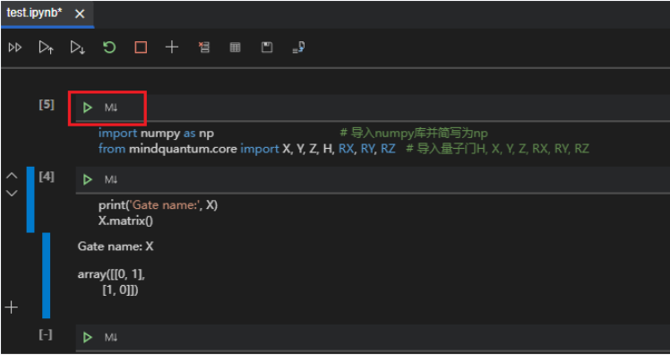
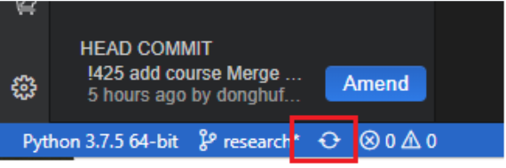

# MindQuantum开源活动指导

- [MindQuantum开源活动指导](#mindquantum开源活动指导)
  - [MindQuantum开发指导](#mindquantum开发指导)
    - [准备MindQuantum代码仓](#准备mindQuantun代码仓)
	- [登录HiQ量子计算云服务](#登录hiq量子计算云服务)
	- [新建CloudIDE实例](#新建cloudide实例)
    - [导入MindQuantum的代码仓](#导入mindquantum的代码仓)
    - [开发示例：开发量子变分线路](#开发示例：开发量子变分线路)
  - [参与开源互动热身](#参与开源互动热身)
    - [参与开源热身（参与线上会议实操互动）](#参与开源热身参与线上会议实操互动)
    - [PR贡献奖（会议中/后）](#pr贡献奖会议中后)
    - [需要大家邮件反馈如下内容](#需要大家邮件反馈如下内容)
  - [部分奖品展示](#部分奖品展示)


## MindQuantum开发指导


### 准备MindQuantun代码仓


1. 登录Gitee官网

访问Gitee官网[https://gitee.com/signup](https://gitee.com/signup)并登录，如未注册Gitee账号，需要先注册账号。

2. Fork MindQuantum的主仓到个人空间

访问MindQuantum主仓库[https://gitee.com/mindspore/mindquantum](https://gitee.com/mindspore/mindquantum)  ，点击右上角【Fork】按钮，欢迎Watch和Star。如果之前已经Fork过代码仓，请先同步个人代码仓到最新版本。


3. 复制MindQuantum个人代码仓地址

获取个人空间Forked的代码仓链接地址，点击【克隆/下载】按钮，再点击【复制】按钮，在CloudIDE实例里导入代码仓时需要使用。


### 登录HiQ量子计算云服务

点击HiQ量子计算云服务[https://hiq.huaweicloud.com/portal/home](https://hiq.huaweicloud.com/portal/home) 链接跳转至登录入口（华为云账号登录，若没有华为云账号，请先注册华为云账号并实名认证）


### 新建CloudIDE实例

新建CloudIDE实例[https://hiq.huaweicloud.com/portal/programming/cloudide](https://hiq.huaweicloud.com/portal/programming/cloudide)。 选择默认参数创建即可。


### 导入MIndQuantum代码仓

1. 在菜单中选择“文件/导入项目”


2. 弹出“导入项目”的窗口。填写已Forked的MindQuantum的 URl、Gitee的账号和密码。


3. 导入成功后，选择“打开项目”


4. 在CloudIDE左下角 点击master，切换到research分支。


5. 打开终端


6. 将如下命令 复制粘贴到CloudIDE的Terminal终端里面，安装最新版本mindquantum。

```bash
pip install https://hiq.huaweicloud.com/download/mindquantum/newest/linux/mindquantum-master-cp37-cp37m-linux_x86_64.whl -i https://pypi.tuna.tsinghua.edu.cn/simple
```
检查mindquantum-master包是否安装成功，显示“Version: 0.5.0”（当前基线版本），则说明安装成功。

```bash
pip show mindquantum
```
7. 在终端设置提交代码时附带的提交信息，包括用户名和邮箱，注意需要跟gitee个人信息页面上的一致。

```bash
git config --global user.name "Your Name"
git config --global user.email"you@example.com"
```


### 开发示例：开发量子变分线路

1. 新建Notebook文件

在左侧目录树创建或者选择存放代码的文件夹，新建一个Jupyter Notebook(.ipynb)文件。


2. 导入数据包

导入本教程锁依赖的模块，点击按钮运行。

```bash
import numpy as np                                    # 导入numpy库并简写为np
from mindquantum.core import X, Y, Z, H, RX, RY, RZ   # 导入量子门H, X, Y, Z, RX, RY, RZ
```



2. 编写量子线路代码

```bash
print('Gate name:', X)
X.matrix()
```

```bash
print('Gate name:', Y)
Y.matrix()
```

```bash
print('Gate name:', Z)
Z.matrix()
```

```bash
print('Gate name:', H)
H.matrix()
```

```bash
cnot = X.on(0, 1)   # X门作用在第0位量子比特且受第1位量子比特控制
print(cnot)
```

```bash
rx = RX('theta')
print('Gate name:', rx)
rx.matrix({'theta': 0})   # 赋予theta的值为0
```

```bash
ry = RY('theta')
print('Gate name:', ry)
ry.matrix({'theta': np.pi/2})   # pi需要从np中导入，赋予theta的值为pi/2
```

```bash
rz = RZ('theta')
print('Gate name:', rz)
np.round(rz.matrix({'theta': np.pi}))   # 赋予theta的值为pi，由于计算机中存在浮点数不精确的问题，因此通过函数np.round返回浮点数的四舍五入值。
```

```bash
from mindquantum.core import Circuit     # 导入Circuit模块，用于搭建量子线路

encoder = Circuit()                      # 初始化量子线路
encoder += H.on(0)                       # H门作用在第0位量子比特
encoder += X.on(1, 0)                    # X门作用在第1位量子比特且受第0位量子比特控制
encoder += RY('theta').on(2)             # RY(theta)门作用在第2位量子比特

print(encoder)                           # 打印Encoder
encoder.summary()                        # 总结Encoder量子线路
```

### 提交代码到个人仓

开发完成后保存文件


通过CloudIDE提交修改到远程个人仓，点击面板左边的源代码控制标签页，在点击加号，将需要修改的文件暂存起来，在上方输入框内填写提交信息。


点击左下角的同步按钮，将CloudIDE中的更改提交到自己的远程仓库中。远程仓库也能看到相应的更新。



### 提交代码到主仓库

1. 将自己仓库的更新通过pull request的方式提交到mindquantum的主仓库，完成最终的代码提交。


2. 这里将源分支和目标分支选为mindspore/mindquantum的research分支。填写PR标题, 取消勾选【合并后关闭提到的issue】。选择所需的审查人员后，即可创建PR。


3. 签署CLA。对于第一次参与MindQuantum开源开发的同学，在评论区会发现没有签署CLA。请进入签署页面，选择sign individual cla，并根据gitee上的个人信息，填写签署信息，完成CLA的签署。回到PR页面，在评论区回复 /check-cla，检查cla是否签署完成，如果没有，则需稍等片刻。签署完后，提交PR过程结束。


## 参与开源互动热身

### 参与开源热身（参与线上会议实操互动）

### PR贡献奖（会议中/后）

欢迎大家在会上跟专家实操互动。根据提交PR结果，前3名会奖励**高级定制背包**；4~10名会奖励**定制马克杯**; 其他同学提交PR审核通过就会奖励**布袋/书/雨伞**等奖品随机发送。（活动详情会议中会讲解，以上奖品最终以实际库存为准。）
> 注意：大家提交PR后一定要按照下面的要求发邮件反馈基本信息到公共邮箱，才能拿到奖品哦！！！

### 需要大家邮件反馈如下内容

1. 主送邮箱：hiqinfo1@huawei.com
2. 邮件反馈内容

| 主题                | \*\*月\*\*日MindQuantum开源活动体验                                  |
| ------------------- | -------------------------------------------------------------------- |
| PR地址              | https://gitee.com/mindspore/mindquantum/pulls/XXX 下面有详细路径截图 |
| 邮寄地址            |                                                                      |
| 收货人姓名+手机号码 |                                                                      |

上述信息仅用于邮寄奖品，不做其他用途。
PR地址：


## 部分奖品展示


欢迎点击了解更多MindQuantum知识！

MindQuantum官网：[https://www.mindspore.cn/mindquantum](https://www.mindspore.cn/mindquantum)

Gitee代码仓：[https://gitee.com/mindspore/mindquantum](https://gitee.com/mindspore/mindquantum)

**期待您成为新时代的开源社区贡献者，加入MindQuantum的开发者行列，共同携手推进量子计算的发展！**


量子计算小助手微信