# MindQuantum开源活动指导

- [MindQuantum开源活动指导](#mindquantum开源活动指导)
  - [准备阶段](#准备阶段)
    - [开通HiQ量子CloudIDE服务](#开通hiq量子cloudide服务)
    - [Watch & Star & Fork代码仓](#watch--star--fork代码仓)
    - [导入MindQuantum的代码仓](#导入mindquantum的代码仓)
    - [开发示例](#开发示例)
  - [参与开源互动热身](#参与开源互动热身)
    - [参与开源热身（参与线上会议实操互动）](#参与开源热身参与线上会议实操互动)
    - [PR贡献奖（会议中/后）](#pr贡献奖会议中后)
    - [需要大家邮件反馈如下内容](#需要大家邮件反馈如下内容)
  - [部分奖品展示](#部分奖品展示)

## 准备阶段


- MindQuantum开源活动指导视频

[https://www.bilibili.com/video/BV1mu411d7ET](https://www.bilibili.com/video/BV1mu411d7ET)

### 开通HiQ量子CloudIDE服务

1. 点击HiQ官网首页https://hiq.huaweicloud.com ，点击按钮进入CloudIDE官网。(Mindquantum目前在linux安装比较方便，而且量子仿真比较消耗计算资源，所以用户可以选择华为云上的量子计算集成开发环境IDE) 

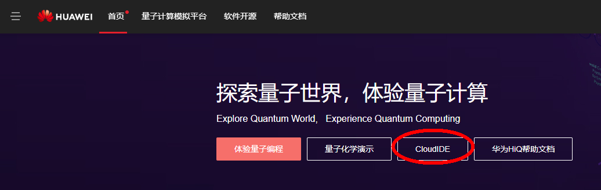

2. 登录华为云服务平台，若没有华为云账号，请先注册华为云账号，并完成个人实名认证）。
3. 进入CloudIDE官网后，点击【立即体验】按钮

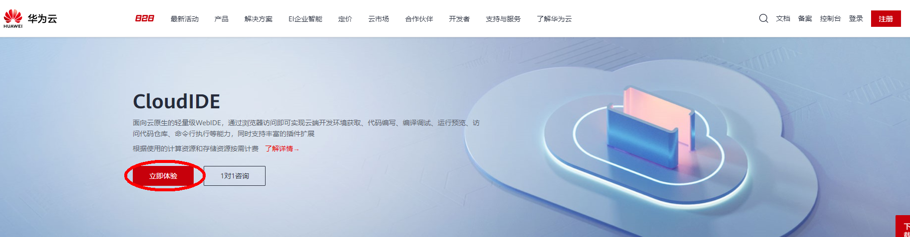

4. 新注册的华为云账号没有开通CloudIDE服务，请点击【开通服务】按钮。如已经开通CloudIDE服务可以跳转到【新建HiQ Quantum Computing IDE实例】

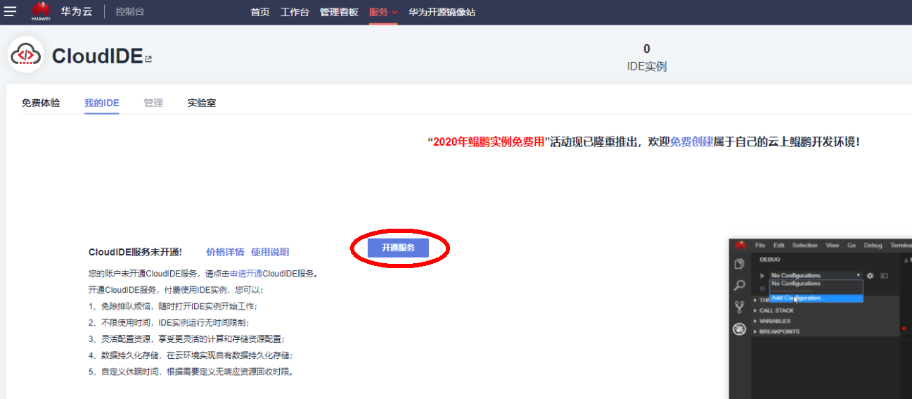

5. 勾选同意，点击【立即开通】按钮。这里只是对CloudIDE服务的收费说明，HiQ实例使用x86架构，可以免费创建使用。没有实名制的华为云账号会开通失败，请根据指引进行账号实名制操作，实名制完成以后退出账号重新登录，然后重新开通CloudIDE服务。

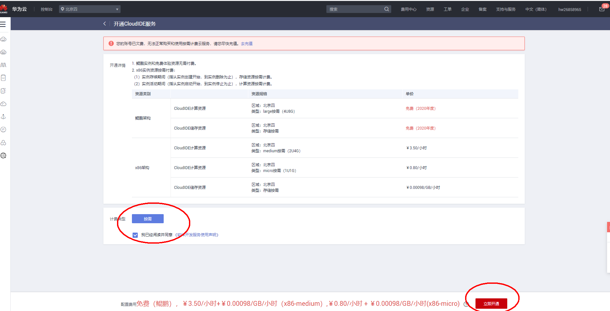

6. 点击右上角【立即使用】按钮。

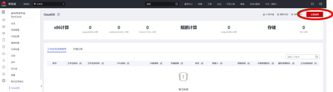

7. 选择“我的IDE”，点击【新建实例】按钮。

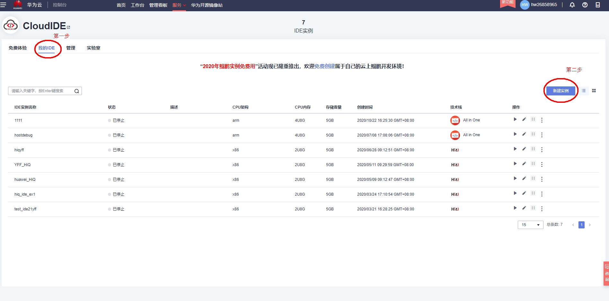

8. 请输入实例名称，选择HiQ Quantum Computing技术栈，点击下一步。HiQ实例使用x86架构，您可以根据需求，选择创建不同存储容量(5GB、10GB、20GB)的实例，并且设置实例自动休眠时长，实例无操作一段时间后，将会自动休眠。


9. 请输入工程名，点击确定。这里默认选择HiQ的样例工程，实例将内置MindQuantum的样例代码供您学习使用。

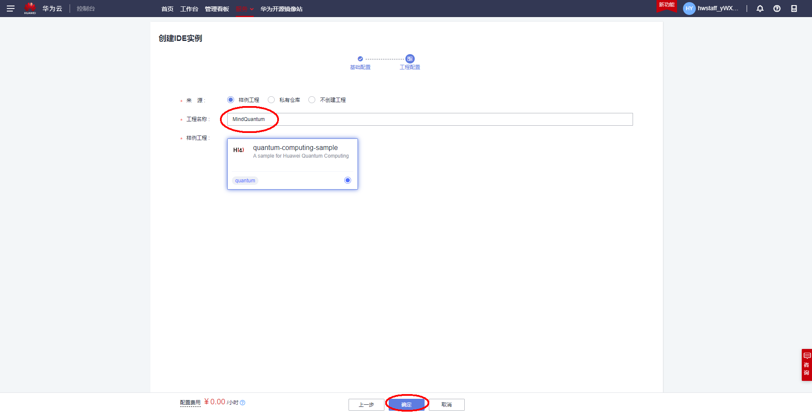

10. 进入HiQ实例，开始体验量子计算编程。


如果提前已经建好实例，再次打开页面直接点击运行按钮如下图。


### Watch & Star & Fork代码仓

1. 注册并登录Gitee，访问MindQuantum主仓库[https://gitee.com/mindspore/mindquantum](https://gitee.com/mindspore/mindquantum)
2. Watch并Star和Fork MindQuantum的主仓到个人空间。（已Forked可忽略）


3. Watch并Star和Fork MindSpore的主仓到个人空间。（已Forked可忽略）[https://gitee.com/mindspore/mindspore](https://gitee.com/mindspore/mindspore)

### 导入MindQuantum的代码仓

1. 获取个人空间Forked的代码仓链接地址：

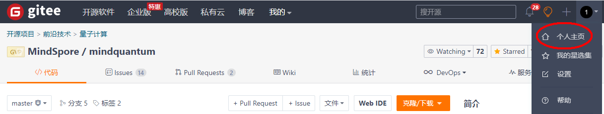
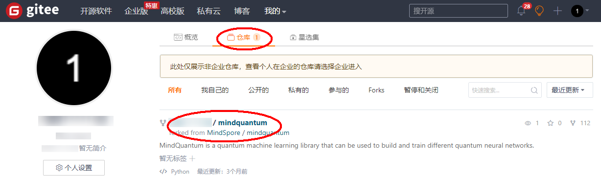


2. 进入创建的CloudIDE实例，在菜单中选择“文件/导入项目”


3. 弹出“导入项目”的窗口。填写已Forked的MindQuantum的 URl、Gitee的账号和密码。


4. 导入成功后，选择“打开项目”


5. 在CloudIDE左下角 点击master，切换到research分支。


6. 将如下命令 复制粘贴到CloudIDE的Terminal终端里面，安装最新版本mindquantum。

```bash
pip install https://hiq.huaweicloud.com/download/mindquantum/newest/linux/mindquantum-master-cp37-cp37m-linux_x86_64.whl -i https://pypi.tuna.tsinghua.edu.cn/simple
```

7. 接下来在终端设置提交代码时附带的提交信息，包括用户名和邮箱，注意需要跟gitee个人信息页面上的一致。


### 开发示例

1. 新建一个用于测试的Jupyter Notebook文件，并在Notebook中尝试调用MindQuantum。为了显示效果，可通过Ctrl+Shift+P调出CloudIDE的控制面板，并在其中输入color theme，选择一个亮色调的主题。后面可以尝试使用MindQuantum的量子线路测量模块。


2. 完成开发后，请点击保存按钮来保存Notebook的修改，并通过CloudIDE提交修改到远程分支。

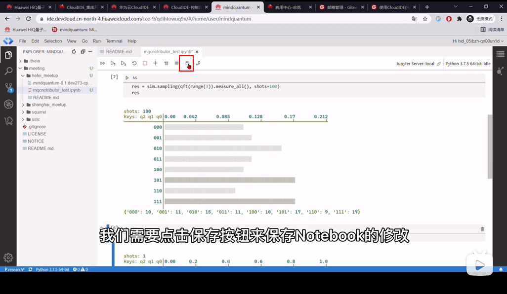

3. 点击面板左边的源代码控制标签页，在点击加号，将需要修改的文件暂存起来，在上方输入框内填写提交信息。

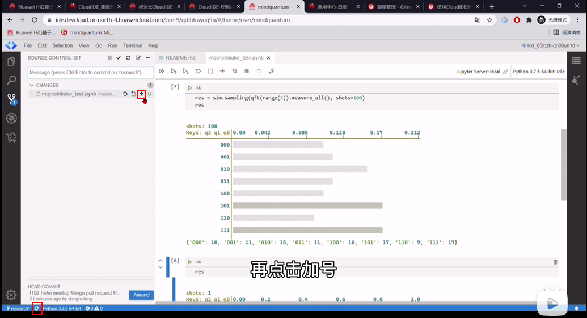

4. 点击左下角的同步按钮，将CloudIDE中的更改提交到自己的远程仓库中。远程仓库也能看到相应的更新。
5. 将自己仓库的更新通过pull request的方式提交到mindquantum的主仓库，完成最终的代码提交。


6. 这里将源分支和目标分支选为mindspore/mindquantum的research分支。填写PR标题, 取消勾选【合并后关闭提到的issue】。选择所需的审查人员后，即可创建PR。

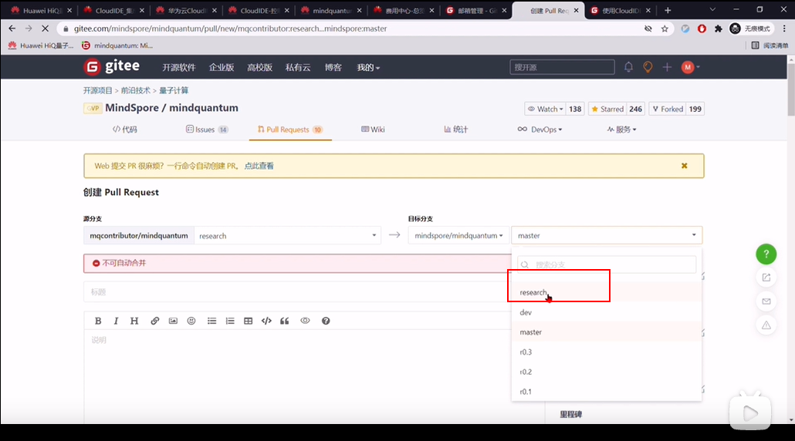

7. 签署CLA。对于第一次参与MindQuantum开源开发的同学，在评论区会发现没有签署CLA。请进入签署页面，选择sign individual cla，并根据gitee上的个人信息，填写签署信息，完成CLA的签署。回到PR页面，在评论区回复 /check-cla，检查cla是否签署完成，如果没有，则需稍等片刻。签署完后，提交PR过程结束。

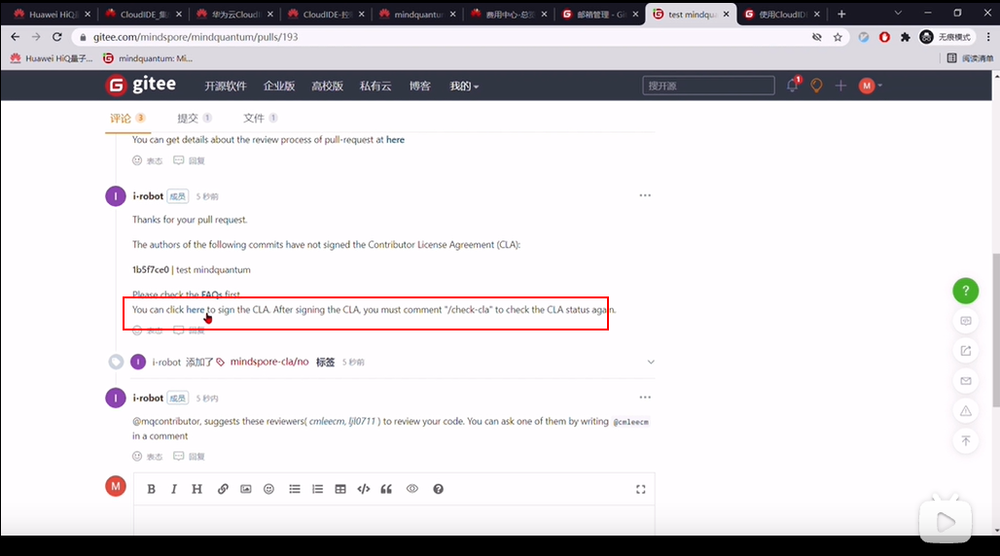

## 参与开源互动热身

### 参与开源热身（参与线上会议实操互动）

### PR贡献奖（会议中/后）

欢迎大家在会上跟专家实操互动。根据提交PR结果，前3名会奖励**高级定制背包**；4~10名会奖励**定制马克杯**; 其他同学提交PR审核通过就会奖励**布袋/书/雨伞**等奖品随机发送。（活动详情会议中会讲解，以上奖品最终以实际库存为准。）
> 注意：大家提交PR后一定要按照下面的要求发邮件反馈基本信息到公共邮箱，才能拿到奖品哦！！！

### 需要大家邮件反馈如下内容

1. 主送邮箱：hiqinfo1@huawei.com
2. 邮件反馈内容

| 主题                | \*\*月\*\*日MindQuantum开源活动体验                                  |
| ------------------- | -------------------------------------------------------------------- |
| PR地址              | https://gitee.com/mindspore/mindquantum/pulls/XXX 下面有详细路径截图 |
| 邮寄地址            |                                                                      |
| 收货人姓名+手机号码 |                                                                      |

上述信息仅用于邮寄奖品，不做其他用途。
PR地址：
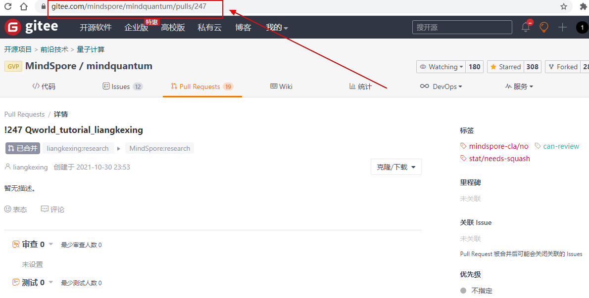

## 部分奖品展示

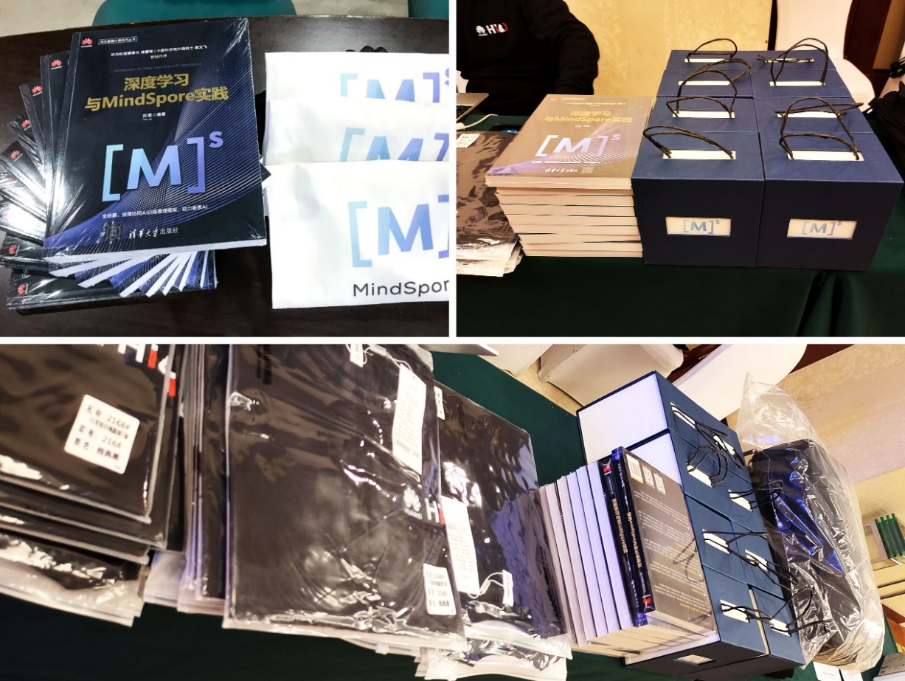

欢迎点击了解更多MindQuantum知识！

MindQuantum官网：[https://www.mindspore.cn/mindquantum](https://www.mindspore.cn/mindquantum)

Gitee代码仓：[https://gitee.com/mindspore/mindquantum](https://gitee.com/mindspore/mindquantum)

**期待您成为新时代的开源社区贡献者，加入MindQuantum的开发者行列，共同携手推进量子计算的发展！**


量子计算小助手微信