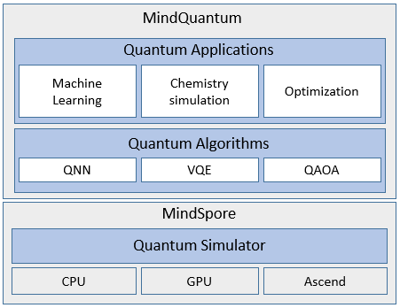

# MindQuantum

[](https://pypi.org/project/mindquantum/)
[](https://gitee.com/mindspore/mindquantum/tree/r0.9/)
[](https://pepy.tech/project/mindquantum)
[](https://mindspore.cn/mindquantum/docs/zh-CN/master/overview.html)
[](https://mindspore.cn/mindquantum/docs/zh-CN/master/beginner/parameterized_quantum_circuit.html)
[](https://gitee.com/mindspore/mindquantum/issues)
[](https://gitee.com/mindspore/mindquantum/releases)
[](https://gitee.com/mindspore/mindquantum/blob/master/LICENSE)
[](https://gitee.com/mindspore/mindquantum/pulls)

[查看中文](./README_CN.md)

<!-- TOC --->

- [MindQuantum](#mindquantum)
    - [What is MindQuantum](#what-is-mindquantum)
    - [First experience](#first-experience)
        - [Build parameterized quantum circuit](#build-parameterized-quantum-circuit)
        - [Train quantum neural network](#train-quantum-neural-network)
    - [Tutorials](#tutorials)
    - [API](#api)
    - [Installation](#installation)
        - [Confirming System Environment Information](#confirming-system-environment-information)
        - [Install by Source Code](#install-by-source-code)
        - [Install by pip](#install-by-pip)
            - [Install MindSpore](#install-mindspore)
            - [Install MindQuantum](#install-mindquantum)
    - [Verifying Successful Installation](#verifying-successful-installation)
    - [Install with Docker](#install-with-docker)
    - [Note](#note)
    - [Quick Start](#quick-start)
    - [Docs](#docs)
    - [Community](#community)
        - [Governance](#governance)
    - [Contributing](#contributing)
    - [How to cite](#how-to-cite)
    - [License](#license)

<!-- /TOC -->

## What is MindQuantum

MindQuantum is a new-generation quantum computing framework based on MindSpore, focusing on the implementation of NISQ algorithms. It combines the HiQ high-performance quantum computing simulator with the parallel automatic differentiation capability of MindSpore. MindQuantum is easy-to-use with ultra-high performance. It can efficiently handle problems like quantum machine learning, quantum chemistry simulation, and quantum optimization. MindQuantum provides an efficient platform for researchers, teachers and students to quickly design and verify quantum algorithms, making quantum computing at your fingertips.



## First experience

### Build parameterized quantum circuit

The below example shows how to build a parameterized quantum circuit.

```python
from mindquantum import *
import numpy as np

encoder = Circuit().h(0).rx({'a0': 2}, 0).ry('a1', 1)
print(encoder)
print(encoder.get_qs(pr={'a0': np.pi / 2, 'a1': np.pi / 2}, ket=True))
```

Then you will get,

```bash
      ┏━━━┓ ┏━━━━━━━━━━┓
q0: ──┨ H ┠─┨ RX(2*a0) ┠───
      ┗━━━┛ ┗━━━━━━━━━━┛
      ┏━━━━━━━━┓
q1: ──┨ RY(a1) ┠───────────
      ┗━━━━━━━━┛

-1/2j¦00⟩
-1/2j¦01⟩
-1/2j¦10⟩
-1/2j¦11⟩
```

In jupyter notebook, we can just call `svg()` of any circuit to display the circuit in svg picture (`dark` and `light` mode are also supported).

```python
circuit = (qft(range(3)) + BarrierGate(True)).measure_all()
circuit.svg()  # circuit.svg('light')
```


### Train quantum neural network

```python
ansatz = CPN(encoder.hermitian(), {'a0': 'b0', 'a1': 'b1'})
sim = Simulator('mqvector', 2)
ham = Hamiltonian(-QubitOperator('Z0 Z1'))
grad_ops = sim.get_expectation_with_grad(
    ham,
    encoder.as_encoder() + ansatz.as_ansatz(),
)

import mindspore as ms

ms.set_context(mode=ms.PYNATIVE_MODE, device_target='CPU')
net = MQLayer(grad_ops)
encoder_data = ms.Tensor(np.array([[np.pi / 2, np.pi / 2]]))
opti = ms.nn.Adam(net.trainable_params(), learning_rate=0.1)
train_net = ms.nn.TrainOneStepCell(net, opti)
for i in range(100):
    train_net(encoder_data)
print(dict(zip(ansatz.params_name, net.trainable_params()[0].asnumpy())))
```

The trained parameters are,

```bash
{'b1': 1.5720831, 'b0': 0.006396801}
```

## Tutorials

1. Basic usage

    - [Variational Quantum Circuit](https://mindspore.cn/mindquantum/docs/en/master/beginner/parameterized_quantum_circuit.html)
    - [Quantum simulator](https://www.mindspore.cn/mindquantum/docs/en/master/beginner/quantum_simulator.html)
    - [Initial experience of quantum neural network](https://www.mindspore.cn/mindquantum/docs/en/master/advanced/initial_experience_of_quantum_neural_network.html)
    - [Advanced gradient calculation of variational quantum circuits](https://www.mindspore.cn/mindquantum/docs/en/master/advanced/get_gradient_of_PQC_with_mindquantum.html)
    - [Advanced operations of quantum circuit](https://www.mindspore.cn/mindquantum/docs/en/master/beginner/advanced_operations_of_quantum_circuit.html)
    - [Quantum Measurement](https://www.mindspore.cn/mindquantum/docs/en/master/beginner/quantum_measurement.html)
    - [Noisy Quantum Circuit](https://www.mindspore.cn/mindquantum/docs/en/master/middle_level/noise.html)
    - [Noise simulator](https://www.mindspore.cn/mindquantum/docs/en/master/middle_level/noise_simulator.html)
    - [Qubit Mapping](https://www.mindspore.cn/mindquantum/docs/en/master/middle_level/qubit_mapping.html)
    - [Bloch Sphere](https://www.mindspore.cn/mindquantum/docs/en/master/beginner/bloch_sphere.html)
2. Variational quantum algorithm
    - [Classification of iris by quantum neural network](https://www.mindspore.cn/mindquantum/docs/en/master/case_library/classification_of_iris_by_qnn.html)
    - [Quantum Approximate Optimization Algorithm](https://mindspore.cn/mindquantum/docs/en/master/case_library/quantum_approximate_optimization_algorithm.html)
    - [The Application of Quantum Neural Network in NLP](https://mindspore.cn/mindquantum/docs/en/master/case_library/qnn_for_nlp.html)
    - [VQE Application in Quantum Chemistry Computing](https://mindspore.cn/mindquantum/docs/en/master/case_library/vqe_for_quantum_chemistry.html)
    - [Equivalence Checking of Parameterized Quantum Circuits](https://www.mindspore.cn/mindquantum/docs/en/master/advanced/equivalence_checking_of_PQC.html)
3. GENERAL QUANTUM ALGORITHM
    - [Quantum Phase Estimation algorithm](https://www.mindspore.cn/mindquantum/docs/en/master/case_library/quantum_phase_estimation.html)
    - [Grover search and long algorithms based on MindQuantum](https://www.mindspore.cn/mindquantum/docs/en/master/case_library/grover_search_algorithm.html)
    - [Shor’s algorithm based on MindQuantum](https://www.mindspore.cn/mindquantum/docs/en/master/case_library/shor_algorithm.html)

## API

For more API, please refer to [MindQuantum API](https://www.mindspore.cn/mindquantum/docs/en/master/overview.html).

## Installation

### Confirming System Environment Information

- The hardware platform should be CPU with avx2 supported.
- Refer to [MindQuantum Installation Guide](https://www.mindspore.cn/install/en), install MindSpore, version 1.4.0 or later is required.
- See [setup.py](https://gitee.com/mindspore/mindquantum/blob/master/setup.py) for the remaining dependencies.

### Install by Source Code

1.Download Source Code from Gitee

```bash
cd ~
git clone https://gitee.com/mindspore/mindquantum.git
```

2.Compiling MindQuantum

```bash
cd ~/mindquantum
bash build.sh
cd output
pip install mindquantum-*.whl
```

### Install by pip

#### Install MindSpore

Please refer to [MindSpore installation guide](https://www.mindspore.cn/install) to install MindSpore that at least 1.4.0 version.

#### Install MindQuantum

```bash
pip install mindquantum
```

### Build from source

1. Clone source.

    ```bash
    cd ~
    git clone https://gitee.com/mindspore/mindquantum.git
    ```

2. Build MindQuantum

    For **linux system**, please make sure your cmake version >= 3.18.3, and then run code:

    ```bash
    cd ~/mindquantum
    bash build.sh --gitee
    ```

    Here `--gitee` is telling the script to download third party from gitee. If you want to download from github, you can ignore this flag. If you want to build under GPU, please make sure you have install CUDA 11.x and the GPU driver, and then run code:

    ```bash
    cd ~/mindquantum
    bash build.sh --gitee --gpu
    ```

    For **windows system**, please make sure you have install MinGW-W64 and CMake >= 3.18.3, and then run:

    ```bash
    cd ~/mindquantum
    ./build.bat /Gitee
    ```

    For **Mac system**, please make sure you have install openmp and CMake >= 3.18.3, and then run:

    ```bash
    cd ~/mindquantum
    bash build.sh --gitee
    ```

3. Install whl

    Please go to output, and install mindquantum wheel package by `pip`.

## Verifying Successful Installation

Successfully installed, if there is no error message such as No module named 'mindquantum' when execute the following command:

```bash
python -c 'import mindquantum'
```

## Install with Docker

Mac or Windows users can install MindQuantum through Docker. Please refer to [Docker installation guide](./install_with_docker_en.md)

## Note

Please set the parallel core number before running MindQuantum scripts. For example, if you want to set the parallel core number to 4, please run the command below:

```bash
export OMP_NUM_THREADS=4
```

For large servers, please set the number of parallel kernels appropriately according to the size of the model to achieve optimal results.

## Building binary wheels

If you would like to build some binary wheels for redistribution, please have a look to our [binary wheel building guide](./INSTALL.md)

## Quick Start

For more details about how to build a parameterized quantum circuit and a quantum neural network and how to train these models, see the [MindQuantum Tutorial](https://www.mindspore.cn/mindquantum/docs/en/master/index.html).

## Docs

More details about installation guide, tutorials and APIs, please see the [User Documentation](https://gitee.com/mindspore/docs/blob/master/README.md).

## Community

### Governance

Check out how MindSpore Open Governance [works](<https://gitee.com/mindspore/community/blob/master/governance.md>).

## Contributing

Welcome contributions. See our [Contributor Wiki](https://gitee.com/mindspore/mindspore/blob/master/CONTRIBUTING.md) for more details.

## How to cite

When using MindQuantum for research, please cite:

```bash
@misc{mq_2021,
    author      = {MindQuantum Developer},
    title       = {MindQuantum, version 0.6.0},
    month       = {March},
    year        = {2021},
    url         = {https://gitee.com/mindspore/mindquantum}
}
```

## License

[Apache License 2.0](LICENSE)
