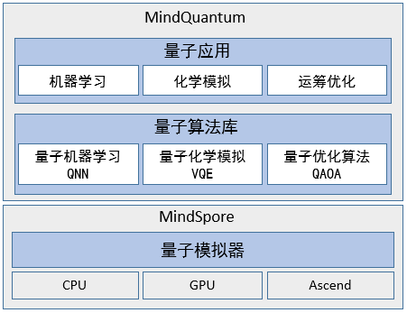

# MindQuantum

[](https://pypi.org/project/mindquantum/)
[](https://gitee.com/mindspore/mindquantum/tree/r0.9/)
[](https://pepy.tech/project/mindquantum)
[](https://mindspore.cn/mindquantum/docs/zh-CN/master/overview.html)
[](https://mindspore.cn/mindquantum/docs/zh-CN/master/beginner/parameterized_quantum_circuit.html)
[](https://gitee.com/mindspore/mindquantum/issues)
[](https://gitee.com/mindspore/mindquantum/releases)
[](https://gitee.com/mindspore/mindquantum/blob/master/LICENSE)
[](https://gitee.com/mindspore/mindquantum/pulls)

[View English](./README.md)

<!-- TOC --->

- [MindQuantum](#mindquantum)
    - [MindQuantum介绍](#mindquantum介绍)
    - [初体验](#初体验)
        - [搭建参数化量子线路](#搭建参数化量子线路)
        - [训练量子神经网络](#训练量子神经网络)
    - [案例教程](#案例教程)
    - [API](#api)
    - [安装教程](#安装教程)
        - [确认系统环境信息](#确认系统环境信息)
        - [pip安装](#pip安装)
            - [安装MindSpore](#安装mindspore)
            - [安装MindQuantum](#安装mindquantum)
        - [源码安装](#源码安装)
    - [验证是否成功安装](#验证是否成功安装)
    - [Docker安装](#docker安装)
    - [注意事项FAQ](#注意事项faq)
    - [构建二进制whl包](#构建二进制whl包)
    - [快速入门](#快速入门)
    - [文档](#文档)
    - [社区](#社区)
        - [治理](#治理)
    - [贡献](#贡献)
    - [引用MindQuantum](#引用mindquantum)
    - [许可证](#许可证)

<!-- /TOC -->

## MindQuantum介绍

MindQuantum是基于昇思MindSpore开源深度学习平台开发的新一代通用量子计算框架，聚焦于NISQ阶段的算法实现与落地。结合HiQ高性能量子计算模拟器和昇思MindSpore并行自动微分能力，MindQuantum有着极简的开发模式和极致的性能体验，能够高效处理量子机器学习、量子化学模拟和量子组合优化等问题，为广大科研人员、老师和学生提供快速设计和验证量子算法的高效平台，让量子计算触手可及。



## 初体验

### 搭建参数化量子线路

通过如下示例可便捷搭建参数化量子线路

```python
from mindquantum import *
import numpy as np

encoder = Circuit().h(0).rx({'a0': 2}, 0).ry('a1', 1)
print(encoder)
print(encoder.get_qs(pr={'a0': np.pi / 2, 'a1': np.pi / 2}, ket=True))
```

你将得到

```bash
      ┏━━━┓ ┏━━━━━━━━━━┓
q0: ──┨ H ┠─┨ RX(2*a0) ┠───
      ┗━━━┛ ┗━━━━━━━━━━┛
      ┏━━━━━━━━┓
q1: ──┨ RY(a1) ┠───────────
      ┗━━━━━━━━┛

-1/2j¦00⟩
-1/2j¦01⟩
-1/2j¦10⟩
-1/2j¦11⟩
```

在jupyter notebook中，也可通过线路的`svg()`接口来以svg格式绘制量子线路图（更有`dark`和`light`模式可选）

```python
circuit = (qft(range(3)) + BarrierGate(True)).measure_all()
circuit.svg()  # circuit.svg('light')
```


### 训练量子神经网络

```python
ansatz = CPN(encoder.hermitian(), {'a0': 'b0', 'a1': 'b1'})
sim = Simulator('mqvector', 2)
ham = Hamiltonian(-QubitOperator('Z0 Z1'))
grad_ops = sim.get_expectation_with_grad(
    ham,
    encoder.as_encoder() + ansatz.as_ansatz(),
)

import mindspore as ms

ms.set_context(mode=ms.PYNATIVE_MODE, device_target='CPU')
net = MQLayer(grad_ops)
encoder_data = ms.Tensor(np.array([[np.pi / 2, np.pi / 2]]))
opti = ms.nn.Adam(net.trainable_params(), learning_rate=0.1)
train_net = ms.nn.TrainOneStepCell(net, opti)
for i in range(100):
    train_net(encoder_data)
print(dict(zip(ansatz.params_name, net.trainable_params()[0].asnumpy())))
```

训练得到参数为

```bash
{'b1': 1.5720831, 'b0': 0.006396801}
```

## 案例教程

1. 基础使用指南

    - [变分量子线路](https://www.mindspore.cn/mindquantum/docs/zh-CN/master/beginner/parameterized_quantum_circuit.html)
    - [量子模拟器](https://www.mindspore.cn/mindquantum/docs/zh-CN/master/beginner/quantum_simulator.html)
    - [量子神经网络初体验](https://www.mindspore.cn/mindquantum/docs/zh-CN/master/advanced/initial_experience_of_quantum_neural_network.html)
    - [变分量子线路梯度计算进阶](https://www.mindspore.cn/mindquantum/docs/zh-CN/master/advanced/get_gradient_of_PQC_with_mindquantum.html)
    - [量子线路高阶操作](https://www.mindspore.cn/mindquantum/docs/zh-CN/master/beginner/advanced_operations_of_quantum_circuit.html)
    - [量子测量](https://www.mindspore.cn/mindquantum/docs/zh-CN/master/beginner/quantum_measurement.html)
    - [含噪声量子线路](https://www.mindspore.cn/mindquantum/docs/zh-CN/master/middle_level/noise.html)
    - [噪声模拟器](https://www.mindspore.cn/mindquantum/docs/zh-CN/master/middle_level/noise_simulator.html)
    - [比特映射](https://www.mindspore.cn/mindquantum/docs/zh-CN/master/middle_level/qubit_mapping.html)
    - [布洛赫球](https://www.mindspore.cn/mindquantum/docs/zh-CN/master/beginner/bloch_sphere.html)

2. 变分量子算法

    - [通过量子神经网络对鸢尾花进行分类](https://www.mindspore.cn/mindquantum/docs/zh-CN/master/case_library/classification_of_iris_by_qnn.html)
    - [量子近似优化算法](https://www.mindspore.cn/mindquantum/docs/zh-CN/master/case_library/quantum_approximate_optimization_algorithm.html)
    - [量子神经网络在自然语言处理中的应用](https://www.mindspore.cn/mindquantum/docs/zh-CN/master/case_library/qnn_for_nlp.html)
    - [在量子化学计算中应用量子变分求解器](https://www.mindspore.cn/mindquantum/docs/zh-CN/master/case_library/vqe_for_quantum_chemistry.html)
    - [含参量子线路的等价性检查](https://www.mindspore.cn/mindquantum/docs/zh-CN/master/advanced/equivalence_checking_of_PQC.html)

3. 通用量子算法

    - [量子相位估计算法](https://www.mindspore.cn/mindquantum/docs/zh-CN/master/case_library/quantum_phase_estimation.html)
    - [基于MindQuantum的Grover搜索算法和龙算法](https://www.mindspore.cn/mindquantum/docs/zh-CN/master/case_library/grover_search_algorithm.html)
    - [基于MindQuantum的Shor算法](https://www.mindspore.cn/mindquantum/docs/zh-CN/master/case_library/shor_algorithm.html)
    - [HHL算法](https://www.mindspore.cn/mindquantum/docs/zh-CN/master/case_library/hhl_algorithm.html)

## API

对于上述示例所涉及API和其他更多用法，请查看MindQuantum API文档[文档链接](https://www.mindspore.cn/mindquantum/docs/zh-CN/master/overview.html)

## 安装教程

### 确认系统环境信息

- 硬件平台支持avx2指令集。
- 参考[MindSpore安装指南](https://www.mindspore.cn/install)，完成MindSpore的安装，要求至少1.4.0版本。
- 其余依赖请参见[setup.py](https://gitee.com/mindspore/mindquantum/blob/master/setup.py)

### pip安装

#### 安装MindSpore

请根据MindSpore官网[安装指南](https://www.mindspore.cn/install)，安装1.4.0及以上版本的MindSpore。

#### 安装MindQuantum

```bash
pip install mindquantum
```

### 源码安装

1. 从代码仓下载源码

    ```bash
    cd ~
    git clone https://gitee.com/mindspore/mindquantum.git
    ```

2. 编译MindQuantum

    **Linux系统**下请确保安装好CMake >= 3.18.3，然后运行如下命令：

    ```bash
    cd ~/mindquantum
    bash build.sh --gitee
    ```

    这里 `--gitee` 让脚本从gitee代码托管平台下载第三方依赖。如果需要编译GPU版本，请先安装好 CUDA 11.x，和对应的显卡驱动，然后执行如下编译指令：

    ```bash
    cd ~/mindquantum
    bash build.sh --gitee --gpu
    ```

    **Windows系统**下请确保安装好MinGW-W64和CMake >= 3.18.3，然后运行如下命令：

    ```bash
    cd ~/mindquantum
    ./build.bat /Gitee
    ```

    **Mac系统**下请确保安装好openmp和CMake >= 3.18.3，然后运行如下命令：

    ```bash
    cd ~/mindquantum
    bash build.sh --gitee
    ```

3. 安装编译好的whl包

    进入output目录，通过`pip`命令安装编译好的mindquantum的whl包。

## 验证是否成功安装

执行如下命令，如果没有报错`No module named 'mindquantum'`，则说明安装成功。

```bash
python -c 'import mindquantum'
```

## Docker安装

通过Docker也可以在Mac系统或者Windows系统中使用Mindquantum。具体参考[Docker安装指南](./install_with_docker.md).

## 注意事项FAQ

运行代码前请设置量子模拟器运行时并行内核数，例如设置并行内核数为4，可运行如下代码：

```bash
export OMP_NUM_THREADS=4
```

对于大型服务器，请根据模型规模合理设置并行内核数以达到最优效果。

更多注意事项请查看[FAQ页面](https://gitee.com/mindspore/mindquantum/blob/r0.8/tutorials/0.frequently_asked_questions.ipynb)。

## 构建二进制whl包

如果你想构建用于分发的二进制whl包，请参考[二进制whl包构建指南](./INSTALL_cn.md)

## 快速入门

关于如何快速搭建参数化量子线路和量子神经网络，并进行训练，请点击查看[MindQuantum使用教程](https://www.mindspore.cn/mindquantum/docs/zh-CN/master/index.html)

## 文档

有关安装指南、教程和API的更多详细信息，请参阅[用户文档](https://gitee.com/mindspore/docs)。

## 社区

### 治理

查看MindSpore如何进行[开放治理](https://gitee.com/mindspore/community/blob/master/governance.md)。

## 贡献

欢迎参与贡献。更多详情，请参阅我们的[贡献者Wiki](https://gitee.com/mindspore/mindspore/blob/master/CONTRIBUTING.md)。

## 引用MindQuantum

当您用MindQuantum进行科学研究时，请引用：

```bash
@misc{mq_2021,
    author      = {MindQuantum Developer},
    title       = {MindQuantum, version 0.6.0},
    month       = {March},
    year        = {2021},
    url         = {https://gitee.com/mindspore/mindquantum}
}
```

## 许可证

[Apache License 2.0](LICENSE)
