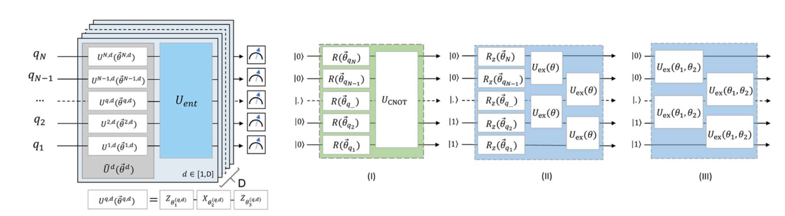

# 
Hardware-efficient ansatz

## 1. Introduction

Hardware-efficient ansatz is designed for recent quantum devices. It is constructed by preparing with D layers of circuits. Each layer has entangling gates and single qubit rotations with parameters. This can be written as
$$
|\Psi(\mathbf{\theta})\rangle=U^{D}\left(\mathbf{\theta}_{D}\right) U_{e n t} \cdots U^{1}\left(\mathbf{\theta}_{1}\right) U_{e n t} U^{0}\left(\mathbf{\theta}_{0}\right)|\Psi_0\rangle
$$
where $U^{i}\left(\mathbf{\theta}_{i}\right)$ denote to the i-th layer of single-qubit rotations implemented for each qubit, $U_{ent}$ denote to a layer of entangler gates. The total circuit contains D layers, where each layer contains these two parts. The scheme can be represented by the figure below

To make the result of Hardware-efficient ansatz more accurate, some processes should be done during algorithm. For example

## 2. Settings

In this project, we use the circuit construction (1) shown in the above figure, where each single rotation is represented by Ry and Rz rotation(two parameters). The $U_{ent}$ is constructed by a linear combination of CNOT gates to entangle neareat neighboring qubits.

Similar to the original article, we grow the circuit from one layer to more layers at each bond length, until chemical accuracy or a maximum number of energy evaluations N reached. For circuit with different number of layers, we test S times with different initial variational parameters, and choose the best result. In practice, we set N = 5e4, S = 10.

## 3. Reference
Kandala, A., Mezzacapo, A., Temme, K., Takita, M., Brink, M., Chow, J. M., & Gambetta, J. M. (2017). Hardware-efficient variational quantum eigensolver for small molecules and quantum magnets. Nature, 549(7671), 242–246. https://doi.org/10.1038/nature23879