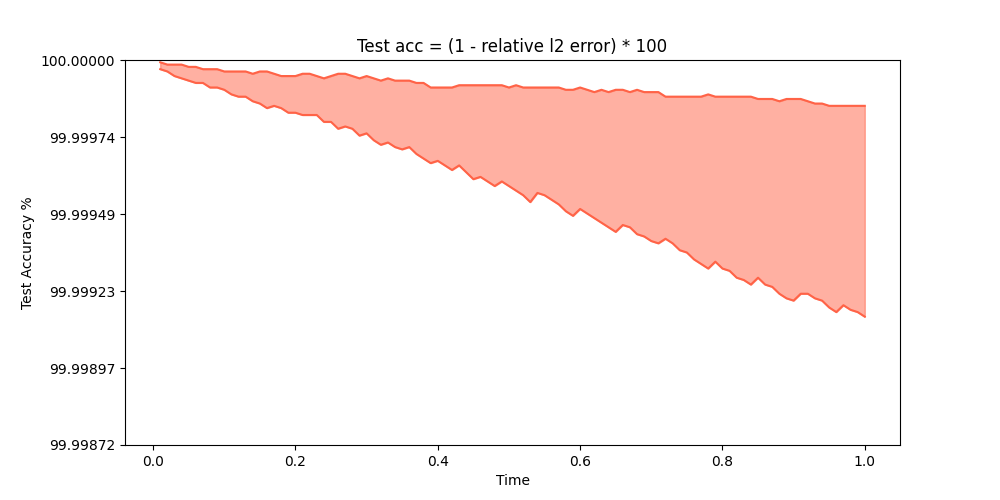

[简体中文](README_CN.md)|English

# Dense ODE-Net for solving Schrödinger's Equation

## Overview
Schrödinger's equation describes the evolution of closed quantum system. 
Recent researches reveal the linkage between modern neural network structure such as residual connection and differential equations: 
[Bridging Deep Architectures and Numerical Differential Equations](https://arxiv.org/pdf/1710.10121.pdf); 
[Neural Ordinary Differential Equations](https://arxiv.org/pdf/1806.07366.pdf). 
The key idea is that connections between layers of neural network are related to the discrete structure of a differential equation. 
E.g. the residual connection is equal to the identity mapping. 
As a further work of ResNet, DenseNet introduces dense connection enabling more complex topological structure. 
Inspired by these researches, We Introduce Dense Connections to learn the discrete structure of a differential equation such as Schrödinger's Equation in this demo.
For more details, see [train_English](train.ipynb).
Note that every random Hamiltonian in this demo is hermitian, further non-hermitian Hamiltonian such as PT-Symmetric Hamiltonian is not taken into consideration yet.

* ### Trained dense weights:
    >```
    > -- Current Dense Weight
    > [[0.         0.38127717 0.525522   0.546216   1.        ]
    > [0.         0.7565703  0.77493346 0.8735501  0.768293  ]
    > [0.         0.         0.8958091  0.85228485 0.25397432]
    > [0.         0.         0.         0.90918434 0.21371573]
    > [0.         0.         0.         0.         0.0413048 ]]
    >```

* ### Predict accuracies of random hamiltonians:
    * 

## Quick Start
* ### Training Method 1: Call the `train.py` scripts on the command line
    >```
    > python train.py --config_file_path ./config.yaml --device_target CPU --device_id 0 --mode PYNATIVE --save_graphs False --save_graphs_path ./graphs
    >```

* ### Training Method 1.1: Change directory to `./scripts` and call the `train.sh` on the command line
    >```
    > cd {PATH}/PDENet/scripts
    > bash train.sh
    >```

* ### Training Method 2: Running Jupyter Notebook
    You can run train code line by line using the [train_Chinese_version](train_CN.ipynb) or the [train_English_version](train.ipynb)

* ### Requirements
    Refers to [requirements](requirements.txt)

## Contributor
* ## zhi-san
* ## e-mail: 762598802@qq.com
