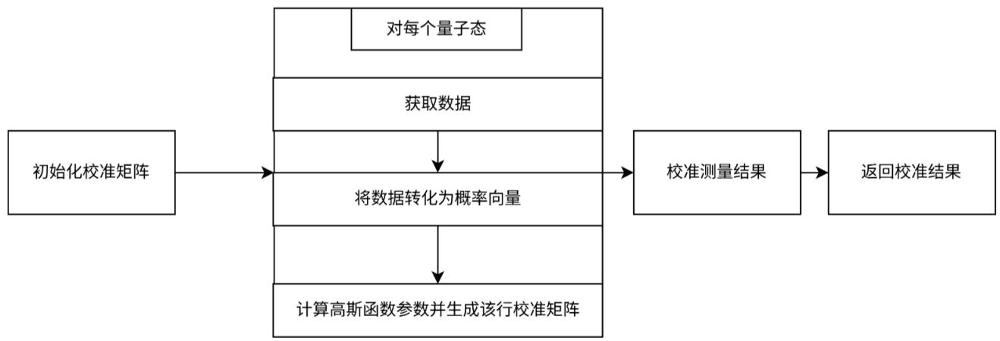
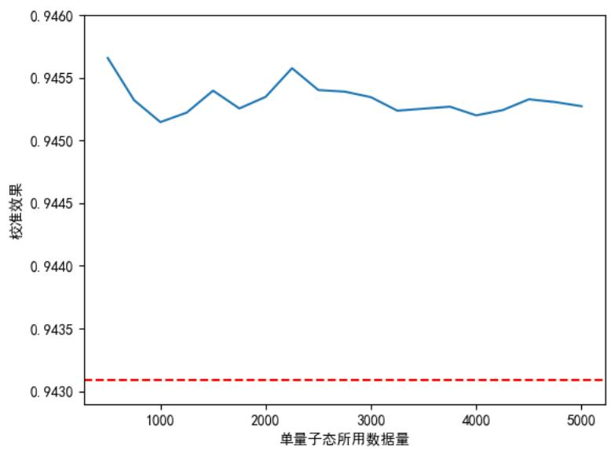
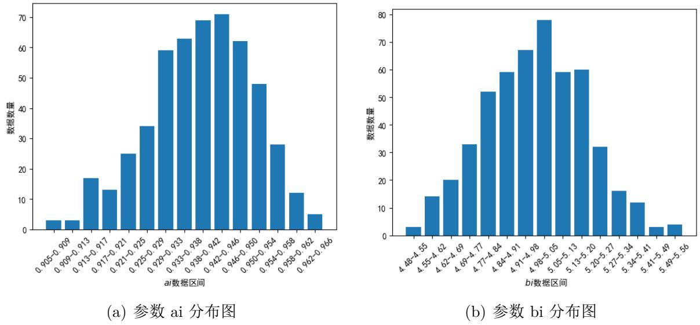

# 基于高斯函数预设的量子测量误差缓解

# 周泓宇 中国科学技术大学

# 摘要

本文通过改进基于矩阵的测量误差模型,来对量子计算的测量误差进行误差缓解。根据量子比特态发生翻转的概率较小这一事实,预设两个量子态之间发生转移的概率与这两个态之间汉明距离之间的函数关系满足高斯函数的形式,并基于此建立校准矩阵。通过这一预设,可减少构建校准矩阵的所需的参数数量和数据量,同时具有较好的泛化性能。此外,我们还能看到不同基态的校准线路的高斯函数的参数稳定在一定范围内,这让我们可以在构建较少的基态校准线路的情况下,预测其他校准线路的正态分布参数,从而降低构建校准矩阵所需的量子资源。

# 1 问题背景与分析

量子计算是一种利用量子力学原理进行计算的方法,可以降低一些问题的复杂度,从而求解一些在经典计算机下无法求解的问题。量子计算输出结果时需要通过测量的过程来获取量子比特的状态。而由于噪声干扰等原因,量子测量的结果可能会出现误差,导致测量得到的结果与实际的量子比特状态不匹配,从而影响计算的准确性。因此,纠正测量误差至关重要。

目前常用的量子误差缓解的方案是基于矩阵的测量误差模型,该方案认为测量的含误差的概率分布与理想概率分布之间的转移关系为线性的,因此可以用一个校准矩阵  $M$  来描述测量误差。

$$
p_{noisy} = Mp_{ideal} \tag{1}
$$

其中,  $p_{noisy}$  是测量的含误差的概率分布,  $p_{ideal}$  是理想的概率分布。

因此只要构建出校准矩阵  $M$ ,并求出其逆矩阵  $M^{- 1}$ ,就可以将测量的含误差的概率分

布转换为理想的概率分布。

$$
p_{ideal} = M^{-1}p_{noisy} \tag{2}
$$

实验上构建校准矩阵的方法是构建基本态的量子线路,并测量其输出的概率分布。例如,对于第  $i$  个基本态,对于其测量的含误差的概率分布为  $p_{noisy}$ ,认为  $p_{noisy}$  的的  $j$  个分量为基态  $i$  在噪声影响下转移为基态  $j$  的概率,从而定义  $M[i][j] = p_{noisy}[j]$ 。

上述基于矩阵的量子误差缓解方案有以下两个问题:

- 构建校准矩阵的方法需要构建大量的基本态的量子线路,对于有  $n$  个量子比特的线路,需要构建出  $2^{n}$  个基本态的量子线路,所需的量子资源随比特数的增长是指数级增长的。

- 直接将样本数据的转移频率作为校准矩阵的转移概率容易产生过拟合问题,将测得的数据中的干扰噪声当作普遍的特征,从而导致泛化性能的下降。

# 2 方案描述

# 2.1 基于高斯函数预设的矫正矩阵构建

由于量子比特态发生翻转的概率较小,所以两个量子比特态之间的相差的比特数目越多,就越不可能发生相互转移。以九比特系统为例,定义基础态  $|c_{0}c_{1}c_{2}c_{3}c_{4}c_{5}c_{6}c_{7}c_{8}>$  可用  $q_{i}$  表示,其中  $c_{k}$  表示第  $k$  个比特的量子态,取值为0或1,  $i$  是将二进制的量子态转化为十进制的结果,转换关系如下:

$$
i = \sum_{k}c_{k}2^{k} \tag{3}
$$

对于量子态  $q_{0} = |000000000 >$  ,与量子态  $q_{1} = |100000000 >$  相比,仅有一个比特不同,而量子态  $q_{3} = |110000000 >$  与  $q_{0}$  相比,有两个比特不同,则认为  $q_{0}$  转移为  $q_{1}$  的概率大于  $q_{0}$  转移为  $q_{3}$  的概率。

将量子态  $q_{i},q_{j}$  之间相差的比特的数量定义为这两个量子态之间的汉明距离  $N(q_{i},q_{j})$  并预设量子态  $q_{i}$  转移为  $q_{j}$  的概率  $M[i][j]$  与  $N(q_{i},q_{j})$  之间的函数关系满足高斯函数的形式(  $M[i][j]$  为校准矩阵的元素,表示量子态  $q_{i}$  转移为  $q_{j}$  的概率)。

$$
M[i][j] = a_{i}\exp \left(-b_{i}N(q_{i},q_{j})^{2}\right) \tag{4}
$$

其中， $a_{i}$  和  $b_{i}$  为高斯函数的参数，下标  $i$  代表是每个量子态  $q_{i}$  的高斯参数并不相同。在应用中，这些个参数可以通过实验数据来确定，进而构建出校准矩阵。

# 2.2 校准矩阵的构建

下面解释如何构建9比特系统的校准矩阵。对于每个量子态  $q_{i}$ ，程序随机采集适当数量的的测试结果，并将其转换为频率向量  $BaseProb$ ，其中  $BaseProb[j]$  表示这2000个测试结果中量子态  $q_{j}$  出现的频率。随后，根据  $BaseProb$  中  $q_{i}$  自身出现的频率确定高斯函数的参数  $a_{i}$ ：

$$
a_{i} = BaseProb[i] \tag{5}
$$

参数  $b_{i}$  的计算是根据与  $q_{i}$  汉明距离为1的量子态的频率来确定的。首先计算出与  $q_{i}$  汉明距离为1的9个量子态的频率之和，然后根据以下公式估算  $b_{i}$ ：

$$
9a_{i}\exp (-b_{i}) = \sum_{N(q_{i},q_{j}) = 1}BaseProb[j] \tag{6}
$$

解得：

$$
b_{i} = -\ln \left(\frac{\sum_{N(q_{i},q_{j}) = 1}BaseProb[j]}{9a_{i}}\right) \tag{7}
$$

估计出量子态  $q_{i}$  的高斯函数参数  $a_{i}$  和  $b_{i}$  后，即可根据公式(4)构建出校准矩阵  $M$  的第  $i$  行。求得  $M$  的每行向量后，都要对其进行归一化。对每个量子态遍历完上述操作后，即可构建出9比特系统的校准矩阵  $M$ 。对其求逆，即可根据公式(2)对量子测量的含误差的概率分布进行校正。

# 2.3 代码结构

本方案提交的代码基本结构与示例代码一致，下面介绍一些主要函数及其功能：

- get_data(state, qubits_number_list, random_seed)：用于获取实验数据。第一个输入为要获取的量子态的十进制数；第二个输入为一个列表，列表的每个元素有为一个列表，列表的第一个元素为要获取的比特组合，第二个元素为要获取的数据组数；第三个输入为随机种子；输出为比特串列表。

- num2bit_string(nqubits, number, reverse=False): 将十进制数转换为二进制字符串。第一个输入为要转换的十进制数；第二个输入为要转换的比特数；第三个输入为是否反转字符串，默认为 False。输出为二进制字符串。

- dict2vec(nqubits, res_dict, reverse=False): 将字典转换为向量。第一个输入为比特数；第二个输入为要转换的字典，字典的键为量子态的二进制字符串表示，相应值为该量子态的概率；第三个输入为是否反转字符串，默认为 False。输出为各量子态的概率向量。

- bitstring_arr2vec(bitstring_arr, q_num): 将二进制字符串数组转换为字典。第一个输入为二进制字符串数组；第二个输入为量子比特数。输出为一个字典，字典的键为量子态的二进制字符串表示，相应值为该量子态的概率。

- MatrixInversion(ymes, Rin): 用校准矩阵修正测量的含误差的概率向量。第一个输入为测量结果的概率向量；第二个输入为校准矩阵。输出为经过校准的概率向量。

- compare(n, m, q_num): 计算两个量子态之间的汉明距离。第一个输入为第一个量子态的十进制数；第二个输入为第二个量子态的十进制数；第三个输入为量子比特数。输出为两个量子态之间的汉明距离。

下图为算法的流程图：

  
图1：流程图

# 3 结果与分析

# 3.1 使用数据量与校准矩阵性能的关系

使用比赛所提供的评分程序，将评分程序中的raw score作为校准矩阵的性能指标。改变对于每个量子态所采集的测试数据的数量，校准矩阵的性能随使用数据数量改变趋势如下：

  
图2：校准矩阵性能随数据量变化图

图中蓝色折线为本文介绍方案所构建的校准矩阵的性能随每个量子态所采集的测试数据的数量变化的折线图，红色直线为直接将样本数据的转移频率作为校准矩阵的性能。从图中可以看出，本文介绍的方案的性与所使用的数据数量并无明显的关系，使用较少的数据量也可以得到同样的效果。

# 3.2 高斯函数参数分布

设定每个量子态使用2000个测试数据，512个量子基态校准线路的高斯函数参数分布如下：

  
图3：高斯参数分布图

从图中可见，高斯函数的参数分布表现出一种正态分布的形式，且参数分布较为集中。这说明对于不同的量子态，其在噪声影响下保持不变和转移到汉明距离为1的量子态的概率稳定一定范围内，这在一定程度上印证了预设转移概率与汉明距离满足高斯函数形式的合理性。

同时，根据这一性质，对于比特数量较大的系统，我们可以不必设置全部的校准线路，通过获取较少的校准线路的高斯参数，来估计其他校准线路的高斯参数，从而使用较少的量子资源构建出性能良好的校准矩阵。

# 4 总结与展望

本文对基于矩阵的测量误差模型进行了改进，通过预设两个量子态之间发生转移的概率与这两个态之间汉明距离之间的函数关系满足高斯函数的形式，构建了校准矩阵。通过这一改进，我们可以减少构建校准矩阵的所需的参数数量和数据量，同时具有较好的泛化性能。此外，我们还能看到不同基态的校准线路的高斯函数的参数稳定在一定范围内，这让我们可以在构建较少的基态校准线路的情况下，预测其他校准线路的正态分布参数，从而降低构建校准矩阵所需的量子资源。

需要指出的是，这里采用高斯函数作为预设条件仅出于一般的误差分布都会有近似于高斯函数的形式，而没有其他数学或物理上的佐证。最终选择这一形式作为预设条件的原因是，其结果在测试线路上的表现较好。不过由于比赛所提供的测试线路较少，且只有比特数为9的系统，所以本方案的合理性需要在更多的测试线路和其他数量比特的系统进行进一步验证。

# 参考文献

[1] NATION P D, KANG H, SUNDARESAN N, 等. Scalable Mitigation of Measurement Errors on Quantum Computers[J/OL]. PRX Quantum, 2021, 2(4): 040326.