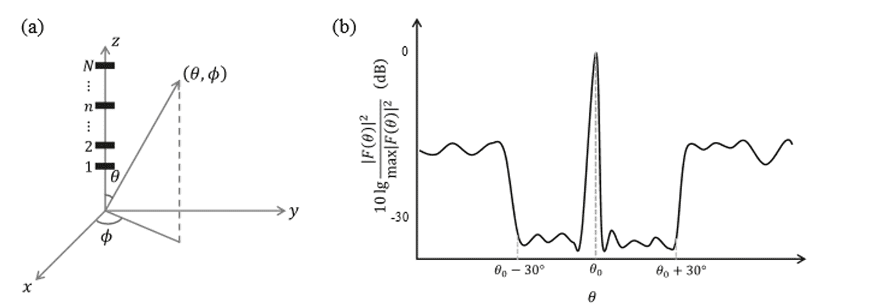
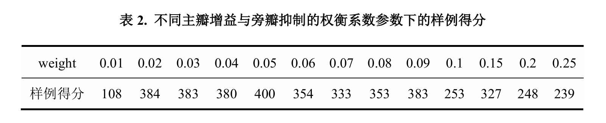

# 基于多阶段“量子启发式+机器学习”框架的波束赋形组合优化方法

作者：朱珈仪，陈述季，万广

指导老师：李蔚 研究员

上海理工大学

## 摘要

针对波束赋形优化问题，我们构建了基于量子启发式计算框架的组合优化模型，使用了集编码映射、量子退火启发搜索与梯度调节为一体的多阶段优化方法。首先，将波束主瓣增强与多区间旁瓣抑制目标统一转化为二次无约束二进制优化（QUBO）问题，构造等效哈密顿量模型，并采用自定义比特编码策略将复数相位映射至伊辛变量空间。在求解阶段，本文引入MindQuantum平台的LQA模拟退火器，对相位参数进行全局搜索，在相位优化基础上进一步引入PyTorch的Adam优化器对振幅进行连续梯度调节，实现对振幅的进一步调控。在实验部分，我们系统评估了不同编码位数、轨迹批量、压制区间设置、损失函数幂次等参数对收敛效果与波束图形的影响。结果表明，在所有测试中，当主瓣增益与旁瓣抑制的权衡系数设置为0.05、LQA迭代次数为1000、样本批数（batch size）为1、旁瓣压制区间设定为  $(0, \theta_0 - 3^\circ) \cup (\theta_0 + 3^\circ , 180)$ ，且采用损失函数形式为  $\frac{(L_{\text{sidelobe}})^3}{L_{\text{main}} + \epsilon}$  时，整体波束赋形效果最优。该方法在旁瓣压制深度、主瓣增益保持及主瓣宽度控制等多目标性能上均表现出较优解质量与稳定性，在未来大规模MIMO阵列信号处理中具有潜在应用价值。

## 1 问题背景与描述

在现代通信与雷达系统中，波束赋形是利用天线阵列的空间调控能力，在预设方向上增强信号辐射与接收能力的关键技术。它通过调整每个天线阵元的激励参数——包括相位角与振幅，实现对波束方向图的灵活塑造，从而提升系统的抗干扰能力、目标分辨率与能量利用率[1]- [2]。在众多实际应用场景中，往往不仅要求波束在目标方向上具有高增益主瓣，还要求在非目标方向实现严格抑制，尤其是抑制主瓣附近的强副瓣回波或干扰源信号。同时，收窄主瓣宽度也是提升角度分辨率与空间区分度的关键目标[3]。

**图1(a)天线阵列建模示意图。赛题中采用的是等间距半波长线性排列的天线阵子（用黑色直线表示，忽略天线阵子的具体结构）组成的天线阵列，所有的N个天线阵子都在  $\mathbf{z}$  轴上，极坐标系和直角坐标系间的转换关系也在图中绘出，其中， $\theta$  为方向向量与  $\mathbf{z}$  轴的夹角， $\phi$  为方向向量投影在  $\mathbf{xy}$  平面后与轴的夹角。 $\theta \in [0,\pi ],\phi \in [0,2\pi ]$ 。(b)波束赋形目标示意图，其中是主瓣指向。(摘自赛题文档[3])**

为此，该问题以一维线性天线阵列模型为基础进行建模。阵列由  $\mathrm{N} = 32$  个阵元组成，沿  $\mathbf{z}$  轴以半波长等间距排列。整个天线阵列通过在  $(\theta ,\phi)$  上的信号强度  $|F(\theta ,\phi)|^2$  描述（对于一维阵列，取  $\phi = 90^{\circ}$ ，之后略去  $\phi$ ，得到理想的  $|F(\theta)|^2$ ），该函数由阵因子与天线单元因子共同决定，并具有如下形式：

$$
|F(\theta)|^2 = E(\theta)\left[\sum_{n = 1}^{N}A_n(\theta)\right]\left[\sum_{n = 1}^{N}A_n^* (\theta)\right] \tag{1}
$$

阵因子：

$$
A_{n}(\theta) = I_{n}exp\{\pi incos\theta \} \tag{2}
$$

天线单元因子：

$$
E(\theta) = 10^{\frac{E_{dB}(\theta)}{10}} \tag{3}
$$

$$
E_{dB}(\theta) = -min\left\{12\left(\frac{\theta - 90^{\circ}}{90^{\circ}}\right)^{2},30\right\} \tag{4}
$$

每个阵元的激励表达为  $I_{n} = \beta_{n}exp(i\alpha_{n})$，其中  $\alpha_{n}$  是阵元的相位角，可在  $[0,2\pi)$  范围内按照  $k_{1}$  比特离散调节，即相位角可以进行  $2^{k_1}$  个离散变量的调节。 

随着阵元数目增加与相位离散度提高，整个问题呈现为高维、非凸、混合离散连续的组合优化问题，解空间维度急剧上升，使得基于穷举、贪婪或常规梯度优化的算法易陷入局部最优，求解效率低。因此，赛题鼓励使用量子启发算法（Quantum- Inspired Algorithm, QIA），如基于量子退火原理的优化策略，或结合机器学习方法（如基于反向传播的 Adam 优化器）形成混合优化框架,在合理的时间限制内搜索满足要求的最优激励序列  $\{\alpha_{n},\beta_{n}\}$ 。

为量化优化算法的性能,确保解决方案在多个性能指标上达成最优平衡,赛题设计的评分机制如下:

对每一组测试条件(包括目标方向  $\theta_{0}\in [45^{\circ},135^{\circ}]$  、相位量化比特数  $k_{1}$  、是否优化振幅)下,计算得分  $y_{i}$  的方式如下:

$$
y_{i} = 1000 - 100a - 80b - 20c \tag{5}
$$

其中各项定义如下:

**(1)远区旁瓣抑制项  $a$：**

$$
a = \max \bigg\{15 + \max \bigg(10l o g_{10}\frac{|F(\theta)|^{2}}{|F(\theta_{0})|^{2}}\bigg),0\bigg\} , \tag{6}
$$

$$
\theta \in [0,\theta_{0} - 30^{\circ})\cup (\theta_{0} + 30^{\circ},180^{\circ}]
$$

即要求远离主瓣区域的旁瓣低于  $- 30\mathrm{dB}$  ,即目标为  $\leq - 15\mathrm{dB}$  0

**(2)主瓣宽度惩罚项  $b$：**

$$
b = \max (W - 6^{\circ},0) \tag{7}
$$

即主瓣宽度  $W$  为主瓣左右两侧  $- 30\mathrm{dB}$  降幅对应的角度差,越小越优,目标最好不超过  $6^{\circ}$  。

**(3)近区旁瓣抑制项  $c$：**

$$
c = \max \left(10l o g_{10}\frac{|F(\theta)|^{2}}{|F(\theta_{0})|^{2}} +30\right),\theta \in [\theta_{0} - 30^{\circ},\theta_{1}]\cup [\theta_{2},\theta_{0} + 30^{\circ}] \tag{8}
$$

其中  $\theta_{1},\theta_{2}$  为主瓣左右两侧的第一个极小值点。

**(4)方向偏差约束：**

主瓣最大值对应方向  $\theta_{\mathrm{peak}}$  与目标方向  $\theta_{0}$  的偏差不超过  $1^{\circ}$  ,否则该项  $y_{i} = 0$  。

**(5)主瓣降幅不达标处理：**

若主瓣两侧信号未下降至  $- 30\mathrm{dB}$  ,也判为不合格,记为  $y_{i} = 0$  。

**(6)运行时间限制：**

每次优化不得超过90秒,超时将该轮得分设为  $y_{i} = 0$  。最终总得分为所有测试输入下得分  $y_{i}$  的平均值。

该问题不仅体现了波束赋形在复杂场景下的工程挑战，也为研究和验证量子启发算法在高维离散优化中的潜力提供了极具现实意义的测试平台。同时，它也鼓励优化策略的创新与多算法协同融合，对于推动量子计算与人工智能算法在天线阵列优化中的应用落地具有重要参考价值。

## 2 问题分析

### 2.1 问题建模

本文关注的波束赋形优化可转化为典型的 Quadratic Unconstrained Binary Optimization (QUBO) 问题，其核心思想是将阵列主瓣信号强度与旁瓣抑制等性能指标用二次无约束二进制变量表示，从而可等效为伊辛模型（Ising Model）形式，便于使用量子启发式算法求解。对于  $N$  个待优化变量，QUBO 问题可用如下哈密顿量表示：

$$
H = \sum_{i,j} J_{ij} x_{i} x_{j} + \sum_{i} h_{i} x_{i}, x_{i} \in \{-1, +1\} \tag{9}
$$

其中， $J_{ij}$  为耦合权重矩阵， $h_{i}$  为偏置项。优化目标是寻找使  $H$  取最小值的二进制向量  $\mathbf{x}$ 。

### 2.2 现有方法

**2.2.1 模拟分叉算法（Simulated Bifurcation, SB）**

SB 算法受 Kerr 非线性动力学启发，源自 Kerr 参数振荡器（Kerr Parametric Oscillator, KPO）自发对称破缺机制。其量子哈密顿量为：

$$
H_{q}(t) = \hbar \sum_{i = 1}^{N} \left[ \frac{K}{2} (a_{i}^{\dagger})^{2} a_{i}^{2} - \frac{p(t)}{2} (a_{i}^{\dagger 2} + a_{i}^{2}) + \Delta_{i} a_{i}^{\dagger} a_{i} \right] - \hbar \xi_{0} \sum_{i,j} J_{ij} a_{i}^{\dagger} a_{j} \tag{10}
$$

其中， $K$  为 Kerr 非线性系数， $p(t)$  为时间驱动强度， $\Delta$  为失谐参数， $\xi_{0}$  为耦合缩放系数， $J_{ij}$  为耦合矩阵[4]。

SB 发展为以下三种演化模型：

**Adiabatic SB (aSB) 绝热模拟分叉算法**

$$
H_{aSB}(x, y, t) = \sum_{i} \left[ \frac{\Delta}{2} y_{i}^{2} + \frac{K}{4} x_{i}^{4} + \frac{\Delta - p(t)}{2} x_{i}^{2} \right] - \xi_{0} \sum_{i,j} J_{ij} x_{i} x_{j} \tag{11}
$$

$$
\dot{x}_{i} = \Delta y_{i}, \dot{y}_{i} = -K x_{i}^{3} + p(t) x_{i} - \xi_{0} \sum_{j} J_{ij} x_{j} \tag{12}
$$

**Ballistic SB (bSB) 弹道模拟分叉算法**

$$
H_{\mathrm{bSB}}(x,y,t) = \sum_{i}\left[\frac{\Delta}{2} y_{i}^{2} + \frac{\Delta - p(t)}{2} x_{i}^{2}\right] - \xi_{0}\sum_{i,j}J_{ij}x_{ij}x_{j},\left|x_{i}\right|\leq 1 \tag{13}
$$

$$
\dot{x}_i = \Delta y_i,\dot{y}_i = (p(t) - \Delta)x_i + \xi_0\sum_j J_{ij}x_j \tag{14}
$$

**Discrete SB (dSB) 离散模拟分叉算法**

$$
H_{dSB}(x,y,t) = \sum_{i}\left[\frac{\Delta}{2} y_i^2 +\frac{\Delta - p(t)}{2} x_i^2\right] - \xi_0\sum_{ij}J_{ij}x_i\mathrm{sign}(x_j),\left|x_i\right|\leq 1, \tag{15}
$$

$$
\dot{x}_i = \Delta y_i,\dot{y}_i = (p(t) - \Delta)x_i + \xi_0\sum_j J_{ij}\mathrm{sign}(x_j) \tag{16}
$$

**2.2.2 模拟相干伊辛机算法（Simulated Coherent Ising Machine, SimCIM）**

CIM 是基于光学参量振荡器（Optical Parametric Oscillator, OPO）网络实现的物理伊辛机，能够通过光学场的相干叠加自动搜索 Ising 能量最低态。SimCIM 则在经典计算机上用随机微分方程来数值近似 OPO 模式演化：

$$
\frac{d}{dt} x_{ij} = wx_{i} - \gamma x_{i} - s(x_{i}^{2} + p_{i}^{2})x_{i} + \sum_{j}J_{ij}x_{j} + \mathrm{Ref}_{i} \tag{17}
$$

$$
\frac{d}{dt} p_{i} = -wp_{i} - \gamma p_{i} - s(x_{i}^{2} + p_{i}^{2})p_{i} + \mathrm{Im}f_{i} \tag{18}
$$

其中，  $w$  为参数增益，  $\gamma$  为线性损耗，  $s$  为非线性饱和系数，  $J_{ij}$  是耦合矩阵，  $f_{i}$  是外部注入扰动[5]。

为修正 CIM 在振幅演化中易出现的非均匀性，提出了以下常用反馈控制策略：

**CIM Chaotic Amplitude Control (CAC) 混沌振幅控制算法**

引入误差变量  $e_i$

$$
\frac{d}{dt} x_{i} = -x_{i}^{3} + (p - 1)x_{i} - e_{i} + \sum_{j}J_{ij}x_{j},\frac{d}{dt} e_{i} = -\beta e_{i}(x_{i}^{2} - \alpha) \tag{19}
$$

**CIM Chaotic Feedback Control (CFC) 混沌振幅反馈算法**

引入混沌变量  $z_{i}$  替代直接误差：

$$
z_{i} = e_{i}\sum_{j}J_{ij}x_{j},\frac{d}{dt} x_{i} = -x_{i}^{3} + (p - 1)x_{i} - z_{i},\frac{d}{dt} e_{i} = -\beta e_{i}(x_{i}^{2} - \alpha) \tag{20}
$$

**CIM Separated Feedback Control (SFC) 模拟相干伊辛机算法**

将反馈项独立分离：

$$
\begin{array}{c}{z_i = \sum_j\zeta J_{ij}x_j,\frac{d}{dt} x_i = -x_i^3 +(p - 1)x_i - \tanh (cz_i) - k(z_i - e_i)}\\ {\frac{d}{dt} e_i = -\beta (e_i - z_i)} \end{array} \tag{21}
$$

这些反馈机制增强了解空间搜索的收敛性和稳定性，降低了振幅失配带来的能量反映误差。

**2.2.3 局域量子退火启发算法（Local Quantum Annealing-Inspired Algorithm, LQA）**

LQA 源于量子退火思想，在经典计算框架下构造含时哈密顿量来引导参数演化：

$$
H(t) = tH_{z} + \gamma (1 - t)H_{x}, H_{z} = \sum_{i,j} J_{ij} \sigma_{z}^{(i)} \sigma_{z}^{(j)}, H_{x} = \sum_{i} \sigma_{x}^{(i)} \tag{22}
$$

其中，  $t$  为演化时间参数，  $\gamma$  为横场强度系数，  $H_{z}$  为问题哈密顿量，  $H_{x}$  为横场项，  $\theta_{i}$  为单量子比特旋转角度。

损失函数为哈密顿量在参数化张量积量子态下的期望值：

$$
C(t, \theta) = t \gamma \sum_{i,j} J_{ij} \sin \theta_{i} \sin \theta_{j} = (1 - t) \sum_{i} \cos \theta_{i} \tag{23}
$$

LQA 通过含时演化有效平滑搜索空间，兼顾全局探索与局部收敛，相比 SimCIM 与 SB 在求解大规模 QUBO 时表现出更快收敛性与优良的能量稳定性[6]。

**2.2.4 相关工作**

针对 MIMO 阵列中相位量化带来的组合优化难题，Yutong Jiang 等人提出了基于 SB 的量子启发式波束赋形优化方法 [7]。该工作通过将高比特相位量化映射为 Ising 自旋变量，构建可求解的哈密顿量模型，并利用 SB 演化过程在经典计算框架中高效逼近最优解。实验结果表明，该方法在收敛速度与解的全局性方面显著优于传统的数字波束形成、全局搜索及遗传算法，验证了量子启发式算法在复杂波束形状设计中的潜力。

与之相比，本文工作在承接该思路的基础上改进了算法流程。一方面，本文同样将主瓣增强与多区间旁瓣抑制统一建模为 QUBO 形式，并引入可扩展的比特编码策略以适配不同分辨率的相位表达；另一方面，我们利用了 LQA 算法进行了相位优化，在相位优化的基础上引入振幅梯度调节以联合提升波束图形的方向性和能量利用效率。相比单纯使用 SB 优化相位，本文提出的多阶段量子启发式框架在复杂旁瓣抑制、主瓣宽度调控及多目标性能平衡等方面展现了更高的灵活性和适应性。

## 3 方案描述

### 3.1研究方法选择

3.1 研究方法选择在本研究中，我们提出了一种结合量子启发算法与机器学习方法的联合优化框架，用于天线阵列波束赋形参数的高效搜索。具体而言，在相位优化过程中，引入了基于量子局域退火的启发式算法，以应对相位离散变量所构成的高维组合优化问题；随后，在振幅优化阶段，利用PyTorch框架下的Adam（Adaptive Moment Estimation）优化器对振幅参数进行连续空间中的梯度下降优化，从而进一步提升波束图性能。

### 3.2理论推导

**3.2.1量子局域退火算法**

为提升局部搜索阶段的效率与解质量，本研究采用了量子局域退火算法。为在经典计算框架中高效模拟量子退火行为，该方法在不依赖真实量子设备的前提下，构建出一个可微、可优化的类量子哈密顿量形式，从而实现对QUBO或Ising问题的高效求解[6]。

该算法的基本思想是将组合优化问题映射为量子哈密顿量的基态搜索，整个优化过程的核心是围绕构造的时间演化损失函数  $Ct,\mathbf{w}$  进行参数更新。该损失函数是哈密顿量在参数化张量积量子态下的期望值，其演化路径由退火时间参数  $\mathfrak{t}\in [0,1]$  控制。系统的能量期望表示为可微损失函数（2.2.3节中式(23)）：

$$
C(t,\theta) = t\gamma \sum_{ij}J_{ij}\sin \theta_i\sin \theta_j - (1 - t)\sum_i\cos \theta_i \tag{23}
$$

进一步地，将参数  $\theta_{i}$  替换为：

$$
\theta_{i} = \frac{\pi}{2}\tanh (w_{i}) \tag{24}
$$

使得

$$
z_{i} = \sin \left(\frac{\pi}{2}\tanh (w_{i})\right) \tag{25}
$$

$$
x_{i} = \cos \left(\frac{\pi}{2}\tanh (w_{i})\right) \tag{26}
$$

$$
\alpha (w_{i}) = 1 - \tanh^{2}(w_{i}) \tag{27}
$$

优化目标函数进一步变为：

$$
C^i,\mathbf{w} = t\mathbf{z}^T J\mathbf{z} - 1 - t\mathbf{x}^T\cdot \mathbf{1} \tag{28}
$$

其梯度表示为：

$$
\nabla_{\mathbf{w}}C(t,\mathbf{w}) = \frac{\pi}{2} [t(J\mathbf{z})\circ \mathbf{x} + (1 - t) \mathbf{z}] \circ \alpha (\mathbf{w}) \tag{29}
$$

其中。表示逐元素乘法。

在每一次迭代中，算法根据当前时间步  $\mathbf{t} = i / N$  （其中N为总步数），计算损失函数的梯度，并对参数向量  $\mathbf{w}$  进行更新。

为验证所提出LQA算法的优化能力，我们参考了Bowles等人对Max- Cut问题的基准测试。实验采用一个规模为2000自旋的fully connected Ising Max- Cut问题（即 $J_{ij} = \pm 1$ ，服从均匀分布），比较了LQA与三种模拟退火类算法（SB、ballistic SB、discrete SB）以及相干伊辛机（SIM）在5000次优化步长下的表现。

**图2.针对文献[5]中定义的  $K_{2000}$  Max一Cut问题的基准测试结果。该问题等价于求解一个具有2000个自旋、耦合系数  $J_{ij} = \pm 1$  随机分配的全连接Ising模型。图(a)、(b)对比了LQA、原始模拟分叉算法[4]和模拟相干伊辛机[5]的表现；图(c)、(d)进一步比较了LQA与模拟分叉算法的两种改进版本：ballistic SB和discrete SB[8]。对于每种算法，均执行了100次独立实验，每次实验包含5000个优化步骤。图(a)和(c)中的粗实线表示100次实验在每一步的平均cut值，阴影区域表示所有实验中最大值与最小值的范围。红色水平线表示目前已知的最佳cut值33，337[8]。图(b)和(d)显示了100次实验在优化结束时得到的最终cut值的直方分布。参数设置如下：LQA的初始步长为  $1,\gamma = 0.1$  ；SB、SBB和SBD的步长分别设为0.5、1.25和1.25，其他参数参照文献[8]；SIMCIM的步长为1，噪声幅值  $A_{n}$  设为0.25。所有算法的初始值均在区间[- 1,1]内均匀随机生成。（摘自文献[6]）**

如图2(a)(c)所示，LQA在迭代初期即能快速上升并接近最优cut值（33,337），整体收敛速度显著快于其他算法。平均性能曲线显示，在相同步数条件下，LQA达到更高的目标值，并且波动范围更小。进一步从图2(b)(d)的直方图可以看出，在100次独立试验中，LQA的最终cut值分布最为集中，几乎所有实验都逼近最优值，表现出良好的稳定性与鲁棒性。

此外，与原始SB和CIM等方法相比，LQA具有更小的方差和更高的"成功率”，在统计意义上能够更稳定地逼近最优解。尤其是在discreteSB或noisyCIM等方法存在精度损失和收敛波动时，LQA仍能保持平滑而稳定的优化路径。

**3.2.3Adam优化器**

在振幅优化阶段，我们采用了Adam优化算法。作为一种一阶自适应学习率方法，Adam结合了动量机制与梯度平方加权机制，能在非凸连续优化问题中实现高效、稳定的收敛表现。其核心思想是对每一步的梯度信息  $g_{t} = V_{\theta}L(\theta_{t})$  构造一阶与二阶矩的指数加权平均，分别表示为：

$$
m_{t} = \beta_{1}m_{t - 1} + 1 - \beta_{1}g_{t} \tag{30}
$$

$$
v_{t} = \beta_{2}v_{t - 1} + 1 - \beta_{2}g_{t}^{2} \tag{31}
$$

其中  $m_{t}$  是梯度的一阶动量估计，  $v_{t}$  是二阶（均方）梯度估计，  $\beta_{1},\beta_{2}$  是衰减因子。为抵消初始时刻估计偏差，引入偏差修正项：

$$
\widehat{m}_{t} = \frac{m_{t}}{1 - \beta_{1}^{t}} \tag{32}
$$

$$
\widehat{\nu}_{t} = \frac{\nu_{t}}{1 - \beta_{2}^{t}} \tag{33}
$$

最终，参数更新按照如下规则进行：

$$
\theta_{t + 1} = \theta_{t} - \eta \cdot \frac{\widehat{m}_{t}}{\sqrt{\widehat{\nu}_{t}} + \epsilon} \tag{34}
$$

其中  $\eta$  为学习率， $\epsilon$  是为防止分母为零而设置的常数。相比传统的随机梯度下降方法，Adam 能够在梯度稀疏或梯度尺度变化较大的情况下实现更鲁棒的步长控制，并能自适应不同维度的学习速度[9]。在本研究中，Adam 被用于优化天线阵列的振幅系数  $\{\beta_{n}\}$ ，在固定相位序列基础上进一步增强主瓣增益并抑制旁瓣，提高波束赋形性能。

### 3.3 算法流程

首先，我们将波束主瓣增强与旁瓣抑制目标统一转化为 QUBO 形式，从而构造哈密顿量矩阵作为优化目标函数。具体而言，算法以主瓣方向电场因子的复权叠加构建增强项，结合多个旁瓣区段的平均能量抑制项，并通过权重因子加权组合，形成总的哈密顿矩阵 J。

为将波束赋形问题表述为 QUBO 问题，我们将目标函数转化为标准二次型形式，即：

$$
\min_{\mathbf{x}\in \{-1, + 1\} ^n}\mathbf{x}^\top J\mathbf{x} \tag{35}
$$

其中变量  $\mathbf{x}$  表示编码后的相位比特串，哈密顿量矩阵  $J\in \mathbb{R}^{n\times n}$  则对应于损失函数关于比特变量的二次展开。在本研究中，设阵元数量为  $N = 32$ ，我们采用 2 比特对每个相位进行编码，总变量维数为  $n = 2N = 64$ 。针对主瓣方向  $\theta_0$ ，构造增强项电场向量  $\mathbf{f}_{\theta_0}$ ，其形式为：

$$
\mathbf{f}_{\theta_0} = \left[ \begin{array}{l}c_1\cdot \mathbf{E}_{\theta_0}\\ c_2\cdot \mathbf{E}_{\theta_0} \end{array} \right],c_1 = 0.5 + 0.5i,c_2 = 0.5 - 0.5i \tag{36}
$$

对应代码如下：

主瓣增强项可表示为：

$$
J_{\mathrm{enhance}} = \mathrm{Re}\Big(\mathbf{f}_{\theta_0}\cdot \mathbf{f}_{\theta_0}^{\dagger}\Big) \tag{37}
$$

对应代码如下：

为了抑制旁瓣功率，我们选取多个旁瓣角度区间  $\left[\theta_i^{\min}, \theta_i^{\max}\right]$ ，对每个区间内多个角度位置构造类似的平均抑制矩阵：

$$
J_{\mathrm{suppess}} = \sum_{i}w_{i}\cdot \frac{1}{M_{i}}\sum_{j = 1}^{M_{i}}\mathrm{Re}\Big(\mathbf{f}_{\theta_{ij}}\mathbf{f}_{\theta_{ij}}^{\dagger}\Big) \tag{38}
$$

在代码中对应如下：

最终，主旁瓣的加权组合构成完整的哈密顿量：

$$
J = \omega \cdot J_{\mathrm{enhance}} - (1 - \omega) \cdot J_{\mathrm{suppess}} \tag{39}
$$

该矩阵具有实对称结构，便于匹配量子模拟退火等优化算法的输入格式。

为实现对 QUBO 问题的高效求解，本文引入 MindQuantum 平台中的 QAIA 模块，并选用其中的 LQA 优化器对相位参数进行全局优化。在编码策略上，采用二进制比特串对阵元相位进行复数映射，该映射机制具有可扩展性，能够适配任意比特数的相位表达。LQA 算法通过模拟动力学演化，并使用带有动量和二阶方差估计的 Adam 更新规则，逐步逼近最优解，最终达到能量最低的情况作为最优相位配置。整个 LQA 的优化过程可由下列伪代码描述：

整个LQA的优化过程可由下列伪代码描述：

对应接口源代码构造如下：

优化过程代码构造如下：

在迭代结束后，选取最低能量对应的比特解：

$$
x_{\mathrm{best}} = \arg \min_k\left[\mathbf{x}^{(k)\top}J\mathbf{x}^{(k)}\right] \tag{40}
$$

并将最终输出的比特向量重塑为每个阵元对应的编码结构，用于后续的相位映射与波束权重构造。

代码实现为：

若需要进一步优化振幅，我们采用了PyTorch提供的Adam优化器对振幅参数进行梯度下降。在这里，我们设计的是基于主瓣能量与旁瓣加权平均能量比值倒数的损失函数，并在每轮迭代中，保持相位不变，以振幅为自变量执行反向传播，逐步逼近最优解。最终输出的振幅向量进行归一化处理，若存在负值则通过对其对应相位加  $\pi$  的方式转化为等效正值，从而满足物理可实现性。

具体来说，损失函数的形式如下：

$$
\mathcal{L}_{\mathrm{amp}}(\mathbf{a}) = \frac{(L_{\mathrm{sidelobe}})^3}{L_{\mathrm{main}} + \epsilon} \tag{41}
$$

其中，主瓣项定义为：

$$
L_{\mathrm{main}} = \omega \cdot \left|\mathrm{F}_{\mathrm{main}}\right|^2 = \omega \cdot \left|\sum_n a_n e^{i\phi_n}E_n(\theta_0)\right|^2 \tag{42}
$$

即主瓣方向能量， $\epsilon$  为小量，避免分母为 0。代码实现如下：

旁瓣项则取主瓣两侧角度区间能量的加权平均：

$$
L_{\mathrm{side}} = 1 + \sum_{i}(1 - \omega)\cdot \alpha_{i}\cdot \frac{1}{|\mathcal{R}_{i}|}\sum_{\theta \in \mathcal{R}_{i}}\left|\sum_{n = 1}^{N}a_{n}e^{i\phi_{n}}E_{n}(\theta)\right|^{2} \tag{43}
$$

即旁瓣整体抑制目标。代码实现如下：

上述目标函数实现为一个可导表达式：

并使用PyTorch构建张量。优化过程如下：

综上，本优化策略在保证主瓣方向增益的基础上，有效抑制非目标方向上的旁瓣平均功率。通过构造联合优化目标函数，在强化主瓣信号强度的同时引入对双侧旁瓣区间的加权抑制项，实现对能量分布的准确调控。该方法不仅提高了波束指向性的精度，还增强了系统的抗干扰能力和能量利用效率，体现了目标增强与干扰抑制的综合平衡优化思想。

### 3.4 数据采集

为进一步验证算法的优化性能与参数灵敏性，本文设计了典型的数值样例，并在相位优化、振幅优化以及全局优化三个阶段开展了数据采集与参数调节实验，具体如下：在相位优化部分，重点考察了以下因素对最终波束性能的影响：

(1) 调整主瓣增益与旁瓣抑制的权衡系数  $\omega$ ；(2) 修改LQA优化器的迭代次数n_iter，以探索收敛速度与解质量的平衡；(3) 调整LQA的并行轨迹数量（batch size），分析多轨迹采样对结果的稳定性与全局搜索能力的提升效果。在振幅优化部分，主要进行了以下实验：

针对振幅优化的损失函数中的旁瓣项的指数幂进行了测试，包括：

$$
\frac{(L_{\mathrm{sidebce}})^n}{L_{\mathrm{main}} + \epsilon} n = 1,2,3,4 \tag{44}
$$

以验证旁瓣项的非线性放大对优化约束强度的影响。

在全局优化部分，我们进一步调节优化时所使用的旁瓣抑制区间范围，分析其对波束指向性与旁瓣水平的调控能力。

通过上述参数敏感性与多轮实验采样，以下全面评估了算法在不同配置下的鲁棒性、收敛行为及波束赋形效果。

## 4 结果与分析

### 4.1 相位优化

我们首先对相位的相关参数进行了优化，使用的测试样例如下：

其中，theta_0 为主瓣目标方向，encode_qubit 为编码比特数，opt_amp_or_not 为是否优化振幅。在这里，我们首先对相位进行优化，所以取 opt_amp_or_not 为 False，即不优化振幅。

**(1)Weight参数调优**

在相位优化阶段，为平衡主瓣信号增强与旁瓣抑制的相对重要性，实验首先对目标函数中的weight参数  $\omega$  进行了系统性扫描测试。

从表格结果可见，当weight从0.01增加至0.05时，样例得分整体上呈现明显提升趋势，得分由108上升至400，表明主瓣项权重的增大有助于提升波束指向性。然而，当weight超过0.05后，样例得分出现波动并逐步下降，尤其在weight大于0.1时，得分显著下滑。这说明过高的主瓣权重会削弱对旁瓣抑制的约束，导致优化器倾向于最大化主瓣而忽略对旁瓣的约束，从而影响整体波束赋形性能。综合考虑不同weight下的得分表现与稳定性，最终确定相位优化的主瓣增益与旁瓣抑制的权衡系数参数取值为  $\omega = 0.05$  ，在此条件下，平台测得平均得分为374，性能表现优良且稳定。

**(2)LQA迭代次数调优**

为进一步提升相位优化的收敛精度，实验针对LQA优化器的迭代步数n_iter进行了调节分析。从实验结果可见，当迭代次数从500增加到1000时，样例得分从378提升至400，收敛性能显著改善。然而继续增大迭代次数至1500及以上时，样例得分

未出现明显提升，反而在 4000 次时得分下降至 254，表明过长的迭代可能引入过拟合或数值震荡，降低了优化的有效性与稳定性。

因此，综合优化精度与计算成本，确定 LQA 的迭代次数选用 n_iter = 1000，即可获得较优的收敛效果。

**(3)样本个数（batch size）调优**

为了探究 LQA 优化器中每次训练的样本个数对相位优化效果的影响，我们对样本个数的取值从 1 到 32 进行了实验。

实验结果表明，当 batch_size = 1 时，平台得分最高（413），说明在当前 QUBO 能量矩阵下，单轨迹即可较充分地探索到较优解。随着 batch_size 增大至 2、4 时，得分有所波动（分别为 385 和 399），表明少量轨迹并行能在一定程度上增加搜索多样性，对避免局部最优有所帮助，但提升幅度有限。当 batch_size 增至 8 时，得分再次接近最优（410），说明中等规模的轨迹并行对稳定收敛与全局搜索的补充作用仍然明显。然而，当 batch_size 进一步增大到 16 和 32 时，得分并未继续提升，甚至出现轻微下降（385 和 395），这表明在给定哈密顿矩阵规模和相位比特数下，过多轨迹可能并未带来额外有效信息，反而增加了数值冗余与计算负担，且可能引入轨迹之间的非独立干扰，影响收敛稳定性。

### 4.2 振幅优化

在振幅优化阶段，我们将测试样例的opt_amp_or_not取为True，即优化振幅。为进一步探究旁瓣抑制项的非线性放大对波束赋形效果的影响，我们对损失函数中旁瓣项的指数幂进行了测试。具体形式为：

$$
\frac{(L_{\mathrm{side}})}{L_{\mathrm{main}} + \epsilon} n = 1,2,3,4 \tag{44}
$$

其中，幂次  $n$  控制了旁瓣能量在目标函数中的相对重要性，幂次越高，意味着旁瓣泄漏对总损失的放大效应越强，优化器在梯度更新时对旁瓣的约束更严格。

从表格结果可见，  $\mathrm{n} = 1$  时，旁瓣与主瓣的约束关系较弱，样例得分为374，表现相对一般。随着幂次增加到  $\mathrm{n} = 2$  ，得分上升至380，说明适度放大旁瓣抑制有助于平衡主瓣增强与旁瓣压制的矛盾。当幂次进一步增至  $\mathrm{n} = 3$  时，得分达到413，取得最优结果，

表明此时旁瓣项的非线性放大正好匹配了近旁瓣和远旁瓣双重抑制的需求，同时对主瓣宽度约束影响最小，优化表现最佳。然而，若幂次继续提高到  $\mathrm{n = 4}$ ，得分反而下降至394，说明过强的旁瓣放大效应导致梯度更新过于偏向抑制副瓣，可能限制了主瓣形状的自适应调整空间，影响主瓣能量聚焦，最终降低了整体得分。

综上，实验验证表明：适度的旁瓣项非线性放大能够有效提高优化器对副瓣的约束能力，但过高幂次会破坏主瓣形状的灵活调节，产生负面影响。本实验中，幂次  $\mathrm{n = 3}$  时的损失函数形式在平衡主瓣与旁瓣约束方面表现最优，因此我们确定了损失函数为三次形式。

### 4.3 旁瓣压制范围调整

为了分析不同旁瓣压制区间对方向图质量的影响，本文设计了三组典型的压制范围组合进行对比实验。实验结果显示，当压制范围设置为主瓣左右两侧  $3^{\circ}$  以外时，样例得分最高，表明该区间在兼顾主瓣增益与旁瓣约束方面取得了较好的平衡。

若将压制区间设置为主瓣左右两侧  $2^{\circ}$  以外时，虽然放宽了对主瓣附近方向的限制，理论上有利于提升主瓣峰值增益，但也可能导致主瓣扩展过宽，难以精准收束到  $6^{\circ}$ ，从而在主瓣宽度评分项中扣分增加。实验中此设定的样例得分下降至322，验证了该问题。

而当压制范围改为仅覆盖近区旁瓣，即主瓣左右  $3^{\circ}$  到  $30^{\circ}$  的范围内，这意味着对近区旁瓣实施了精确抑制，但对  $\pm 30^{\circ}$  以外的远区旁瓣未设约束，导致对远区旁瓣的压制效果较差，最终样例得分仅326。此外，过度约束近区旁瓣区域也可能对主瓣两侧的形状调节产生影响，使主瓣不能很好的成形。

综合比较后，我们选用了  $(0, \theta_{0} - 3^{\circ}) \cup (\theta_{0} + 3^{\circ}, 180)$  作为最优压制区间，保证了良好的旁瓣抑制与主瓣聚焦效果的平衡。

我们围绕基于量子启发式算法的波束赋形优化问题，设计并实现了相位与振幅联合调节的多阶段优化框架，并通过系统的参数敏感性实验，深入分析了关键超参数对波束指向性、旁瓣水平及主瓣宽度的影响规律。实验结果表明，合理选择旁瓣抑制范围、适度放大旁瓣损失项、以及配置恰当的轨迹并行度，均有助于在满足评分约束的同时，兼顾主瓣增益和副瓣抑制效果，显著提升波束赋形性能与优化鲁棒性。

尽管本研究在小规模阵列与固定目标方向下验证了所提出方法的有效性，未来仍可从以下方面进一步完善：一是结合自适应权重调节策略，使主瓣增益与旁瓣抑制的权衡系数可根据迭代阶段动态调整，提升对复杂场景的适应性；二是探索更高效的量子态初始化与多轨迹协同演化机制，进一步增强求解器的全局搜索能力；三是在理论层面深入分析量子比特编码与传统连续相位表达在目标函数中的映射一致性，为量子启发算法求解波束赋形问题提供更坚实的理论基础。

## 5 参考文献

[1] Van Veen B D, Buckley K M. Beamforming: a versatile approach to spatial filtering[J]. IEEE ASSP Magazine, 1988, 5(2): 4 - 24. DOI: 10.1109/53.665.

[2] Godara L C. Application of antenna arrays to mobile communications. II. Beam- forming and direction- of- arrival considerations[J]. Proceedings of the IEEE, 1997, 85(8): 1195 - 1245. DOI: 10.1109/5.622504.

[3] 昇思MindSpore社区. 基于量子启发算法的波束赋形问题[R/OL]. 2025[2025- 06- 13]. https://developer.huaweicloud.com/competition/information/1300000041/html9

[4] Goto H, Tatsumura K, Dixon A R. Combinatorial optimization by simulating adiabatic bifurcations in nonlinear Hamiltonian systems[J]. Science Advances, 2019, 5(4): eaav2372. DOI: 10.1126/sciadv.aav2372.

[5] Tiunov E S, Ulanov A E, Lvovsky A I. Annealing by simulating the coherent Ising machine[J]. Optics Express, 2019, 27(7): 10288 - 10295. DOI: 10.1364/OE.27.010288.

[6] Bowles J, Dauphin A, Huenbeli P, Martinez J, Acin A. Quadratic Unconstrained Binary Optimization via Quantum- Inspired Annealing[J]. Physical Review Applied, 2022, 18(3): 034016. DOI: 10.1103/PhysRevApplied.18.034016.

[7] Jiang Y T, Ge H Y, Wang B Y, et al. Quantum- inspired beamforming optimization for quantized phase- only massive MIMO arrays[EB/OL]. arXiv:2409.19938 [physics.app- ph], 2024- 09- 30 [2025- 05- 28]. DOI: 10.48550/arXiv.2409.19938.

[8] Goto H, Endo K, Suzuki M, Sakai Y, Kanao T, Hamakawa Y, Hidaka R, Yamasaki M, Tatsumura K. High- performance combinatorial optimization based on classical mechanics[J]. Science Advances,

2021, 7(21): eabe7953. DOI: 10.1126/sciadv.abe7953.

[9] Kingma D P, Ba J. Adam: A Method for Stochastic Optimization[C]. Proceedings of the 3rd International Conference on Learning Representations (ICLR). 2015.