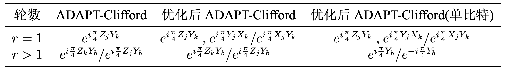

# 2025量子计算黑客松决赛论文

 胡书鸣 

## 摘要

量子变分算法作为含噪声量子设备上最重要的算法之一，自提出以来一直备受关注。其主要的应用包括变分量子本征求解器以及量子近似优化算法。量子近似优化算法常用于求解组合优化问题，然而由于其线路复杂，容易在实验中受到噪声的影响，导致算法性能受限。因此，Muñoz-Arias等人提出了一种浅层的Clifford线路来尝试对最大割问题求解，该算法线路简单，可以进行高效经典模拟。本次赛题要求设计基于Clifford门的量子组合优化算法，来解决一般的Ising问题。针对该问题，我通过对ADAPT-Clifford 算法进行分析，分别从操作池优化，时间复杂度优化，比特翻转优化，与线路深度优化这四个方向进行了优化。

## 1 问题背景与描述

自上世纪80年代量子计算的概念被提出以来，最近几十年量子计算得到了迅速的发展。量子计算面临的一个最重要的挑战来自计算过程中的噪声，不同于经典噪声，由于量子态不可克隆、量子错误具有连续性以及不可测量性，使得量子纠错充满困难。通常我们可以通过量子纠错码（Quantum Error Correction Code,QECC）来实现量子纠错，例如，CSS code、surface code、color code等。但是由于编码过程需要消耗大量资源，以及纠错码对噪声的阈值很小，在实际实验中很难满足要求，导致纠错码不能有效的工作。目前量子计算通常具有几十到数百个量子比特，属于中等尺度噪声（Noisy Intermediate-Scale Quantum,NISQ）设备，这一规模使得它们有潜力超越经典计算机在某些特定任务上的能力，但还不足以进行全面的量子纠错。

变分量子算法（Variational Quantum Algorithms, VQA）[1］作为NISQ设备上最重要的算法之一，自提出以来得到了广泛的关注。VQA是一种经典-量子混合算法，其基本思想是利用量子计算机来执行某些难以在经典计算机上完成的任务（如状态制备和量子态演化），然后使用经典计算机对量子电路的参数进行优化，具有很大的潜力。VQA的典型应用包括变分量子本征求解器（Variational Quantum Eigensolver,VQE）和量子近似优化算法（QAOA）。VQE算法［2-4］常用于在量子化学问题中求解分子基态以及激发态能量［5]，QAOA算法［6-7］常用于求解组合优化问题。

在这里我们主要讨论的是QAOA算法，由于现有硬件系统的规模和错误率限制，QAOA的应用仍局限于较浅的电路结构和较小规模的问题。此外，QAOA在实验中受到噪声的影响，导致算法性能受限，而大规模量子线路的复杂性也使得它们难以用经典计算机进行有效模拟，这些因素共同构成了量子算法设计与实现的重大挑战。因此，Muñoz-Arias等人提出了一种浅层的Clifford线路来尝试对最大割问题求解［8］，并且取得了不错的效果。这表明Clifford线路在求解组合优化问题方面存在一定的潜力。本次赛题就是要求设计基于Clifford门的量子组合优化算法，来解决一般的Ising问题。

## 2 问题分析

本章节为介绍对问题的理解以及现有方法，主要分为三个部分，分别为QAOA算法介绍，ADAPT-Clifford算法分析以及赛题分析。

### 2.1 QAOA算法介绍

QAOA 全称为 quantum approximation optimization algorithm，意为量子近似优化算法，是一种量子-经典混合算法。该算法旨在在近似多项式时间内求解组合优化问题，最早由Farhi等人于2014年提出［6]，特别适用于在Noisy Intermediate-Scale Quantum(NISQ）设备上运行。QAOA的核心思想是将优化问题转化为求解一个哈密顿量的基态（最低能量状态）。具体地，它利用问题哈密顿量（通常由优化目标函数构造）和混合哈密顿量交替演化，通过参数化的量子线路构造一个变分量子态。通过经典优化器调整这些参数，逐步逼近最优解。QAOA的优点在于其结构简单、可扩展性强，并能在现有NISQ硬件上实现。它已被用于解决如Max-Cut、独立集、着色问题等经典NP难题，具有广泛的研究与应用前景。下面我们以Max-Cut（最大割问题）为例，具体地介绍QAOA算法以及它的变种ADAPT-QAOA算法。

#### 2.1.1 Max-Cut问题

Max-Cut（最大割）问题是图论中的一个经典组合优化问题，目标是将一个无向图的节点集合分成两个子集，使得跨越这两个子集的边的数量（或权重总和）最大。给定一个无向图 $G=(V,E)$ ，其中V是节点集合，E是边集合，每条边 $(i,j)\in $ 权重为 $w_{ij}$ 。目标是将节点集合V划分为两个互补的不相交子集A和 $\bar {A}$ ，使得A与 $\bar {A}$ 之间边的权重和最大。我们用二值变量 $z_{i}\in \{0,1\},i\in V$ 来为节点赋值，如果节点 $i\in A$ ，则 $z_{i}=1$ ，如果节点 $i\in \bar {A},$ ，则 $z_{i}=0$  由此最大割问题目标为合理地分配 $z_{i}$ ,，来最大化目标函数：

$$C(\boldsymbol {z})=\sum _{(i,j)\in E}w_{ij}z_{i}\left(1-z_{j}\right)\tag{1}$$

对于一般的图，最大割问题是一个NP-hard问题，但尽管精确解不容易得到，我们却可以想办法在多项式时间内找到问题的一个近似解，这就是近似优化算法。下面我将介绍如何把最大割问题量子化。

首先，我们可以通过映射： $s_{i}=2z_{i}-1$ ，将变量 $z_{i}\in \{0,1\}$ 映射成 $s_{i}\in \{-1,1\}$ 。变量 $s_{i}$ 只能在 $\pm 1$ 之间取值，可以视为Pauli算符 $Z_{i}$ 的测量值，因此为节点 $i\in V$ 赋值 $z_{i}\in \{0,1\}$ 的过程可以等价为将图中的每个顶点赋予一个量子比特 $\vert 0\rangle ,\vert 1\rangle$ 。原问题的目标函数 $C(\boldsymbol {z})$ 也可以改写为对应的哈密顿量 $H_{C}:$ 

$$H_{C}=\frac {1}{2}\sum _{i<j}w_{i,j}Z_{i}Z_{j},\tag{2}$$

在这里我们忽略了常数项，并且添加了一个负号来把最大化问题转变为最小化问题。该哈密顿量的基态能量对应着最大割问题的答案，基态对应着具体的集合划分方案。因此QAOA算法的目的就是通过变分线路制备试探波函数，通过优化参数来让哈密顿量 $H_{C}$ 的期望值最小。下面我来具体介绍QAOA算法的相关流程。

#### 2.1.2 QAOA算法

我们首先来看一下QAOA的流程，QAOA的一般步骤如下：

1．定义问题哈密顿量：将目标优化问题编码为一个可对角化的哈密顿量 $H_{C},$ ，其基态对应于最优解。

2．制备初始状态：通常选择 $\vert +\rangle ^{\otimes N}$ ，可以通过对 $\vert 0\rangle$ 作用 Hadamard门来实现

3．搭建变分量子线路：交替作用问题哈密顿量 $H_{C}$ 和混合哈密顿量 $H_{M}$ 的时间演化算符，每层由一对参数 $\left(γ_{i},\beta _{i}\right)$ 控制。

4．测量与优化：对量子态进行多次测量，计算哈密顿量 $H_{C}$ 的期望值并通过经典优化器迭代调整参数，直到收敛。

接下来我将对流程中的一些细节进行解释。定义问题哈密顿量的过程可以参考上一章节Max-Cut部分，最终得到问题哈密顿量为 $H_{C}=\frac {1}{2}\sum _{i<j}w_{i,j}Z_{i}Z_{j}$ 。线路的初始态通常采用混合哈密顿量 $H_{M}=\sum _{j=1}^{N}X_{j}$ 的本征态 $\vert +\rangle ^{\otimes N}$ ，该量子态可以通过对 $\vert 0\rangle$ 作用Hadamard门来实现，即 $\vert +\rangle ^{\otimes N}=H^{\otimes N}\vert 0\rangle ^{\otimes N}$ 。QAOA中的变分线路为固定结构，可以分为p层，每层在哈密顿量 $H_{C}$ 和 $H_{M}$ 作用下含时演化，如图1所示。因此通过变分线路

图1 QAOA算法流程示意图［9］

得到的试探波函数可以表示为：

$$\vert \psi (\boldsymbol {\gamma },\boldsymbol {\beta })\rangle _{p}=\left[\prod _{l=1}^{p}e^{-i\beta _{l}H_{M}}e^{-i\gamma _{l}H_{C}}\right]H^{\otimes N}\vert 0\rangle ^{\otimes N},\tag{3}$$

其中 $γ=γ_{1},\cdots ,γ_{p}$ $\boldsymbol {\beta }=\beta _{1},\cdots ,\beta _{p}$ 。测量与优化指的是根据演化后的末态 $\vert \psi (\boldsymbol {\gamma },\boldsymbol {\beta })\rangle _{p},$ 计算哈密顿量 $H_{C}$ 的期望值，并在经典计算机上对参数进行优化。对于一个层数为 $p$ 的QAOA线路，共有 $2p$ 个参数，通常 $p$ 越大，线路的表达能力越强，但过大的 $p$ 可能难以在NISQ设备上实现。

#### 2.1.3 ADAPT-QAOA算法

QAOA算法的线路采用固定结构，易于扩展，但是固定的结构会重复作用很多对结果影响很小的量子门。由此人们也提出了许多优化的QAOA算法，接下来我们将具体地介绍其中的ADAPT-QAOA算法［10］。ADAPT-QAOA不同于QAOA的固定结构，它采用了自适应结构来逐层搭建变分线路，直到收敛。

ADAPT-QAOA与QAOA的区别主要在于搭建变分量子线路这一步，QAOA是交替在目标哈密顿量 $H_{C}$ 和混合哈密顿量 $H_{M}$ 作用下含时演化，而ADAPT-QAOA则是预先构造一个操作算符池（operator pool)，用操作池中的算符来替换掉混合哈密顿量 $H_{M}$ ，因此得到的试探波函数为：

$$\vert \psi (\boldsymbol {\gamma },\boldsymbol {\beta })\rangle _{p}^{ADAPT}=\left[\prod _{l=1}^{p}e^{-i\beta _{l}A_{l}}e^{-i\gamma _{l}H_{C}}\right]H^{\otimes N}\vert 0\rangle ^{\otimes N}\tag{4}$$

$A_{l}$ 的选取方式是从操作池中选取能量梯度最大的算符，即：

$$A_{l}=\max _{A_{s}\in P_{OP}}\left[-i\left\langle \psi _{l-1}\right|e^{i\gamma _{l}H_{C}}\left[H_{C},\hat {A}_{s}\right]e^{-i\gamma _{l}H_{C}}\left|\psi _{l-1}\right\rangle \right]\tag{5}$$

其中 $P_{OP}$ 是操作池， $\left|\psi _{l-1}\right\rangle$ 是 ADAPT-QAOA 方法得到的 $l-1$ 层时的量子态。

操作池的选择并不是完全固定的，可以根据具体的问题来进行选择。需要注意的是，每轮得到的最优参数 $\left(γ_{l},\beta _{l}\right)$ 会在后续轮次重新被优化，也就是说每轮添加最优的算符后，会对整体全部的参数进行优化，得到当前最优的参数。与QAOA方法固定层数 $p$ 进行优化相比，ADAPT-QAOA方法逐层搭建变分线路，直到达到理想的结果，是一种动态结构。ADAPT-QAOA方法避免了QAOA方法中许多对结果影响很小的操作，但是由于其每轮添加对当前能力梯度最大的算符，使得搜索方向容易陷入局部最优，难以找到全局最优解。

### 2.2 ADAPT-Clifford 算法

前文提到的QAOA方法和ADAPT-QAOA方法都可以很好地解决Max-Cut问题，然而，由于现有硬件系统的规模和错误率限制，QAOA的应用仍局限于较浅的电路结构和较小规模的问题。而大规模量子线路的复杂性也使得它们难以用经典计算机进行有效模拟，这些因素共同构成了量子算法设计与实现的重大挑战。因此我们需要一种可以在经典计算机上进行高效模拟的量子算法，于是Muñoz-Arias等人提出了一种浅层的Clifford线路来尝试对最大割问题求解，并且取得了不错的效果，该方法被命名为ADAPT-Clifford 算法［8］。ADAPT-Clifford算法在限制只使用Clifford门的情况下，逐步搭建量子线路，以逼近目标量子态或最小化某个代价函数。

Muñoz-Arias等人通过对ADAPT-QAOA方法的大量模拟发现，参见图2：

1．混合层的线路参数通常为 $0$ 或 $-\pi /4$ ，是Clifford线路，并且添加的算符往往是 $Y_{i}Z_{j}$ 这种形式的。

2．目标层的线路参数往往是 $0$，也就是说 $H_{C}$ 在大部分情况下都不需要作用在线路上。

3．想要找到合适的结果一般只需要 $N$ 步，也就是说线路中只需要 $N$ 层混合层即可，$N$ 为图节点数量。

图2 ADAPT-QAOA模拟时，参数的取值结果［8］

根据以上发现，作者提出了ADAPT-Clifford 算法，下面我们来详细介绍一下ADAPT-Clifford算法，以及算法中需要注意的一些细节。

#### 2.2.1 ADAPT-Clifford算法流程

首先我们来介绍下ADAPT-Clifford算法的流程。在这里我们用 $r$ 来表示步数，由于该算法共需要 $N$ 步，所以我们让 $r\in \{0,\cdots ,N-1\}$. 

1. $r=0$ 时，选择位置 $k$ ，制备初始态 $\left|\psi _{0}\right\rangle =Z_{k}H^{\otimes N}|0\rangle ^{\otimes N}$ 。由此图中的节点可以被分为两类，活跃节点 $\boldsymbol {a}^{(0)}=\{k\}$ 和不活跃节点 $\boldsymbol {b}^{(0)}=\{0,\cdots ,N-1\}\backslash \{k\}$ 。接下来的目标就是：每轮从不活跃（inactive）集合中选取一个点加入活跃（active）集合。

2. $r=1$ 时，从不活跃节点中选择算符 $Z_{j}Y_{k}$ 对能量梯度最大的节点 $j$ 加入活跃集合，并从不活跃集合中移除 $j$ ，量子态变为 $\left|\psi _{1}\right\rangle =e^{i\frac {\pi }{4}Z_{j}Y_{k}}Z_{k}H^{\otimes N}|0\rangle ^{\otimes N}$ ，活跃集合变为 $\boldsymbol {a}^{(1)}=\{k,j\}$ ，不活跃集合变为 $\boldsymbol {b}^{(1)}=\{0,\cdots ,N-1\}\backslash \{k,j\}。$ 

3. $r=2,\cdots ,N-1$ 时，分别从 $\{k,j\}$ 中选择节点 $\tilde {l}\in \{k,j\}$ ，不活跃集合 $\boldsymbol {b}^{(r-1)}$ 选择节点 $b^{(r-1)}\in \boldsymbol {b}^{(r-1)}$ ，计算算符 $Z_{\tilde {l}}Y_{b^{(r-1)}}$ 对能量的梯度，保留梯度最大的结果，将对应的不活跃节点转为活跃节点。

4．经过上述N个步骤，我们可以得到最终的量子态：

$$\vert \psi \rangle =\left[\prod _{r=2}^{N-1}e^{i\frac {\pi }{4}Z_{\bar {l}}Y_{b(r)}}\right]e^{i\frac {\pi }{4}Z_{j}Y_{k}}Z_{k}H^{\otimes N}\vert 0\rangle ^{\otimes N}\tag{6}$$

对最终量子态在 $\vert 0\rangle$ ,$\vert 1\rangle$ 基失下进行测量，得到目标哈密顿量的基态能量，对应着Max-Cut问题的解。

通过上述过程，我们可以逐层搭建量子Clifford线路来求解Max-Cut问题，由于该线路只使用了Clifford门，因此可以在经典计算机上进行高效模拟。接下来我会对该算法的一些细节进行展开分析。

#### 2.2.2 ADAPT-Clifford 算法分析

在上一小节中，我介绍了ADAPT-Clifford算法的具体流程，但是在具体实现时还有许多细节问题需要搞清楚。接下来我将就该算法中的一些值得注意的点进行分析。

首先是第一个问题，初始起始点 $k$ 是怎么选择的？该论文提出了两种可行的方案，第一种是随机选择初始点 $k$ ，第二种是对所有节点都分别让其为初始点进行尝试。对于稠密图，第一种方案的时间复杂度为 $O\left(N^{3}\right)$ ，而第二种则为 $O\left(N^{4}\right)$ 。对于节点数量比较多的图，方案二难以在有效时间内给出结果，我们往往只能采用第一种方案，由于初始节点的选取对结果影响较大，我们可以多选取几个不同的节点作为初始节点，保留最好的结果。

其次是第二个问题，为什么在 $r=2,\cdots ,N-1$ 时，计算梯度只需要从 $\{k,j\}$ 选取 $\tilde {l}\in \{k,j\}$ ，而不是从活跃集合 $\boldsymbol {a}^{(r-1)}$ 中选取？这是因为从活跃集合 $\boldsymbol {a}^{(r-1)}$ 中选取 $\tilde {l}$ 的结果是与只从 $\{k,j\}$ 选取的结果相同，在计算梯度时，梯度公式可以表示为：

$$g_{a^{(r-1)},b^{(r-1)}}^{(r)}=-i\left\langle \left[H_{C},Z_{a^{(r-1)}}Y_{b^{(r-1)}}\right]\right\rangle =-\sum _{l}w_{l,b^{(r-1)}}\left\langle Z_{l}Z_{a^{(r-1)}}\right\rangle _{r-1}\tag{7}$$

当分别从活跃集合 $\boldsymbol {a}^{(r-1)}$ 选取节点 $\tilde {a}$ ，从不活跃集合 $\boldsymbol {b}^{(r-1)}$ 中选取节点 $\tilde {b}$ 时，有

$$g_{\tilde {a},\tilde {b}}^{(r)}=\sum _{l}w_{l,\tilde {b}}\left\langle -Z_{l}Z_{\tilde {a}}\right\rangle _{r-1}$$

$$=\sum _{l}w_{l,\tilde {b}}\langle -Z_{l}Z_{\tilde {l}}Z_{\tilde {l}}Z_{\tilde {a}}\rangle _{r-1}$$

$$=\sum _{l}w_{l,\tilde {b}}\left\langle -Z_{l}Z_{\tilde {l}}\right\rangle _{r-1}=g_{\tilde {l},\tilde {b}}^{(r)}\tag{8}$$

其中用到了总能找到 $\tilde {l}\in \{k,j\}$ 满足 $Z_{\tilde {l}}Z_{\tilde {a}}\left|\psi _{r-1}\right\rangle =\left|\psi _{r-1}\right\rangle$ 这个关系。更进一步可以得到

$g_{k,\tilde {b}}^{(r)}=-g_{j,\tilde {b}}^{(r)}$ ，因此我们在计算梯度时无需遍历所有的活跃节点，只需计算节点 $k$ 与不活跃节点组成算符相对于能量的梯度，将潜在的 $O\left(N^{2}\right)$ 复杂度将为了 $O(N)$ ，有效地降低了计算所需时间。

然后是第三个问题，在算符 $Z_{m}Y_{l}$ 下的含时演化 $e^{i\frac {\pi }{4}Z_{m}Y_{l}}$ 应该如何进行？该问题可以通过对 $e^{i\frac {\pi }{4}Z_{m}Y_{l}}$ 进行变换后分解成若干个Clifford门来实现。具体来说，我们可以根据变换关系 $Y=S·H·Z·H·S^{\dagger }$ ，得到

$$e^{i\frac {\pi }{4}Z_{m}Y_{l}}=S_{l}H_{l}e^{i\frac {\pi }{4}Z_{m}Z_{l}}H_{l}S_{l}^{\dagger }\tag{9}$$

又因为 $e^{i\frac {\pi }{4}Z_{m}Z_{l}}=CNOT_{m,l}S_{l}^{\dagger }CNOT_{m,l}$ 进而得到

$$e^{i\frac {\pi }{4}Z_{m}Y_{l}}=S_{l}H_{l}CNOT_{m,l}S_{l}^{\dagger }CNOT_{m,l}H_{l}S_{l}^{\dagger }\tag{10}$$

最后便是梯度应该如何计算，需要在当前的线路中计算期望值吗？答案是并不需要真的在当前的线路中计算期望值，梯度计算公式还可以继续化简。当 $r=1$ 时，梯度 $g_{k,b^{(0)}}^{(1)}=w_{k,b^{(0)}}$ ，而 $r>1$ 时，梯度可化简为：

$$g_{k,b^{(r-1)}}^{(r)}=-\sum _{l\in V_{k}^{(r-1)}}w_{l,b^{(r-1)}}+\sum _{l\in V_{j}^{(r-1)}}w_{l,b^{(r-1)}}\tag{11}$$

其中 $V_{k}^{(r-1)}$ 和 $V_{j}^{(r-1)}$ 分别代表活跃节点是通过 $k$ 还是 $j$ 加入活跃集合的。因此在具体实现该算法时，我们并不需要在当前量子线路中计算梯度值，而是只需要通过权重矩阵W来计算梯度，这将极大地节省时间。因此该算法更像是一个由量子启发得到的经典算法。

#### 2.2.3 stabilizer 分析

为了更好地理解该算法的原理，我们可以从稳定子stabilizer的角度出发，对问题进行分析。对于初始态 $\left|\psi _{0}\right\rangle =Z_{k}H^{\otimes N}|0\rangle ^{\otimes N}$ ，其stabilizer 可以表示为 $\left\{X_{b^{(0)}},-X_{k}\right\}$ 。在经历了 $r=1$ 的操作后，对于量子态 $\left|\psi _{1}\right\rangle =e^{i\frac {\pi }{4}Z_{j}Y_{k}}Z_{k}H^{\otimes N}|0\rangle ^{\otimes N}$ ，其stabilizer变为 $\left\{X_{b^{(1)}},-X_{k}X_{j},-Z_{k}Z_{j}\right\}$ 。当进行了r步后，其stabilizer变为

$$\left\{X_{b^{(r)}},-\prod _{l\in a^{(r)}}X_{l},-Z_{k}Z_{j},Z_{k}Z_{l}/Z_{j}Z_{l}\left(l\in a^{(r)}\backslash \{k,j\}\right)\right\},\tag{12}$$

由此我们可以发现，当 $r>1$ 后，每次操作实际上是将stabilizer中的 $X_{b^{(r)}}$ 变为 $Z_{k}Z_{b^{(r)}}$ 或者 $Z_{j}Z_{b^{(r)}}$ ，取决于不活跃节点 $b^{(r)}$  是通过节点k还是节点 $j$ 加入的活跃集合。在进行N步后，最终得到的量子态的stabilizer可表示为 $\left\{-\prod _{l\in V}X_{l},-Z_{k}Z_{j},Z_{k}Z_{l}/Z_{j}Z_{l}(l\in \right.$ $V\backslash \{k,j\})\}$ ，其中形如 $Z_{l}Z_{m}$ 的项正对应着目标哈密顿量中的 $ZZ$ 项。对于哈密顿量中的 $Z_{i}Z_{j}$ 项，如果其在末态的stabilizer集合中，那么它对结果有贡献，否则的话就没贡献。该算法的本质实际上是选择一个节点 $k$ 加入集合A，在根据梯度选择节点 $j$ 加入A，随后根据梯度信息分别把剩余节点加入集合 $A$ 或者 $\bar {A}。$  如果 $g_{l,k}>g_{l,j}$ ，那么节点 $l$ 就加入 $k$ 所在的集合 $A$，反之则加入集合 $\bar {A}$ 。

### 2.3 赛题分析

在搞清楚ADAPT-Clifford算法后，我们来对本次赛题进行具体分析。

#### 2.3.1 赛题说明

首先来看下本次赛题。一个包含N个自旋变量的Ising模型可以表示为

$$H_{c}=\sum _{i}h_{i}σ_{z}^{i}+\sum _{i<j\in E}J_{ij}σ_{z}^{i}σ_{z}^{j}\tag{13}$$

最大割问题是特殊的Ising问题，Muñoz-Arias等人提出的随机ADAPT-Clifford算法可以很好的求解最大割问题，实际上在上述框架下，我们可以通过对算符库，梯度更新，接收判据，并行性等多个方面进行优化，从而实现针对任意ising问题的算法，并且提升求解质量，优化求解速度。

赛题要求在给定的时间20min内（超出时间计为0分），对于隐藏测试集案例D，求解每个案例d的能量期望值，并对所有案例求和取负号后作为总分数。并且要求一律禁止直接使用经典算法求解得到问题最优解后用于辅助设计算法，并且每一次经典优化器作用后必须在线路中添加相应的算符更新线路，算法返回Clifford线路。下面我将对本次赛题的优化方向进行分析。

#### 2.3.2 优化方向

首先，本次赛题要求对一般地Ising问题进行求解，而不再是前文提到过的Max-Cut 问题，这两者之间的最大的区别在于Ising问题中既有一次项也有二次项，而Max-Cut 问题中只有二次项。因此如果还是采用ADAPT-Clifford算法中的操作池 $Z_{l}Y_{m}$ 的话，最终得到的末态也只有目标哈密顿量中的二阶项对结果有贡献，一阶项没有任何贡献，当一阶项系数难以忽略时，得到的结果会很差。因此我们需要对操作池中的算符进行改变，增加一些可能会用到的算符。

其次，通过ADAPT-Clifford算法得到的结果仍存在一定的可优化空间，因为该方法对节点所属的集合的划分是相对粗糙的。在 $r=1$ 时建立以 $k,j$ 为首的两个集合A,A 后，后续操作都是根据梯度，从不活跃集合中选择一个节点加入两者中的一个。对于节点较多的问题，该方法往往无法达到局部最优，还有很多可以后续调整的空间。

最后，由于遍历所有节点的方案时间复杂度为 $O\left(N^{4}\right)$ ，难以在规定时间内给出答案，因此我们只能选择随机起点的方案。但是为了获得更好的结果，我们需要多次随机选取不同的起点，保留最好的作为最终的结果，随机起点方案 $O\left(N^{3}\right)$ 的时间复杂度还是有些高，需要尝试能否继续优化。

## 3 方案描述

在这部分，我将详细的介绍我对本次赛题的解决方案。我的解决方案主要分为四部分，分别为操作池优化，时间复杂度优化，比特翻转优化，与线路深度优化。

### 3.1 操作池优化

首先是操作池的优化，ADAPT-Clifford算法中的操作池不再满足需要，我们需要增加可选择的算符，但是如果操作池中的算符数量过多的话，每次计算梯度时需要对每种算符进行计算，会花费太多时间。通过计算我发现，实际上并不需要为操作池中增加很多可行的算符，只需要在原有的ADAPT-Clifford算法的 $r=1$ 这步做一些改变即可。原有的ADAPT-Clifford算法在 $r=1$ 时，会选择梯度最大的节点 $j$ 对线路做 $e^{i\frac {\pi }{4}Z_{j}Y_{k}}$ 操作，而我的方法为在其后再添加一个 $e^{i\frac {\pi }{4}X_{j}Y_{k}}$ 或者 $e^{i\frac {\pi }{4}Y_{j}X_{k}}$ 操作，在 $r=0$ 以及 $r>1$ 时，可以继续沿用ADAPT-Clifford算法。

我们可以通过对量子态的stabilizer分析，来比较我的方法与原有方法之间的差异。在ADAPT-Clifford算法中，最终量子态的stabilizer只包含ZZ这种二阶项，并不包含一阶项，这将导致目标哈密顿量中的一阶项对结果没有贡献。因此我们需要改变一些操作，使得最终的末态不仅含有二阶项，也含有一阶项。在我的方法中， $r=0$ 时，量子态的stabilizer为 $\left\{X_{b^{(0)}},-X_{k}\right\}$ ，与ADAPT-Clifford算法相同。变化发生在 $r=1$ 时，在进行 $e^{i\frac {\pi }{4}Z_{j}Y_{k}}$ 操作后，量子态的stabilizer为 $\left\{X_{b^{(1)}},-X_{k}X_{j},-Z_{k}Z_{j}\right\}$ ，而在进行 $e^{i\frac {\pi }{4}X_{j}Y_{k}}/e^{i\frac {\pi }{4}Y_{j}X_{k}}$ 后，则变为 $\{X_{b^{(1)}},Z_{j},-Z_{k}\}/\{X_{b^{(1)}},-Z_{j},Z_{k}\}$ 。这将导致后续量子态的的stabilizer不再与ADAPT-Clifford算法相同，中间过程量子态的stabilizer中的二阶项ZZ形式，变为了一阶项Z的形式，根据其是由节点k还是 $j$ 加入活跃集合，以及做的是 $e^{i\frac {\pi }{4}X_{j}Y_{k}}$ 还是 $e^{i\frac {\pi }{4}Y_{j}X_{k}}$ 操作，来决定是 $Z$ 还是 $-Z$。

在经历N步后，末态的stabilizer为 $\left\{Z_{j},-Z_{k},Z_{l}\left(l\in V_{j}\right),-Z_{m}\left(m\in V_{k}\right)\right\}$ 或者 $\left\{-Z_{j},Z_{k},-Z_{l}\left(l\in V_{j}\right),Z_{m}\left(m\in V_{k}\right)\right\}$ 。由于一阶项可以相乘组合成二阶项，因此对于我的方法得到的量子态，目标哈密顿量中的二阶项和一阶项均对其有着贡献。更具体的来看，我们是应该做 $e^{i\frac {\pi }{4}X_{j}Y_{k}}$ 还是 $e^{i\frac {\pi }{4}Y_{j}X_{k}}$ 操作呢？这两种操作本质上是将节点 $k,j$ 的值分别分配为 $\{-1,1\}$ 或者 $\{1,-1\}$ ，如果根据当前梯度选择的话，作用当前梯度大的操作，最终结果可能不如当前梯度小的操作。因此我们可以分别作用两种操作，保留结果更好的那个再继续优化。

### 3.2 时间复杂度优化

其次，我们还要对算法的时间复杂度进行优化，原有的随机起点ADAPT-Clifford算法的时间复杂度为 $O\left(N^{3}\right)$ ，对于本次赛题给出的1000节点的图来说，所需的时间还是太长了。该算法 $O\left(N^{3}\right)$ 的时间复杂度主要来源于三个方面，一是该算法要进行N步才能为所有节点赋值，二是来自于添加算符时要遍历不活跃集合中的所有节点来找出最大梯度的算符，三是来自于计算算符梯度时的求和运算，在求和时需要遍历活跃集合。也就是说 $O\left(N^{3}\right)$ 的时间复杂度实际上来源于运行了 $N$ 步计算梯度的算法，而该算法的时间复杂度为 $O\left(N^{2}\right)$ 。

我对算法流程进行分析后发现，计算算符梯度的方法可以进行优化，通过预处理的方式，我们可以将该过程的时间复杂度降为 $O(N)$ 。因此整个随机起点ADAPT-Clifford 算法的时间复杂度降为 $O\left(N^{2}\right)$ ，这样的话我们就可以尝试多个起点进行求解，保留最好的结果。下面我将具体展示预处理的过程。

由于我的方法在 $r=1$ 时，添加了 $e^{i\frac {\pi }{4}X_{j}Y_{k}}$ 或者 $e^{i\frac {\pi }{4}Y_{j}X_{k}}$ 操作，梯度计算的公式会跟原有的计算公式11略有不同。接下来我将以选择 $e^{i\frac {\pi }{4}Y_{j}X_{k}}$ 操作为例，推导梯度计算公式及其简化过程， $e^{i\frac {\pi }{4}X_{j}Y_{k}}$ 的相关内容可以参见附录。同时为了方便叙述以及与代码进行对应，我在这里约定：节点编号为 $\{0,\ldots ,N-1\}$ ，初始起点记为 $k$ ， $r=1$ 时选择的节点为 $j$。Ising问题的系数矩阵记为 $J$ 和 $h$，其中 $J$ 代表二阶项的系数，$h$ 代表一阶项的系数，这里我进行了对称化处理，因此 $J$ 是一个对称矩阵。在该约定下，目标的哈密顿量可以写作：

$$H_{C}=\sum _{i}h_{i}Z_{i}+\sum _{i,j}J_{ij}Z_{i}Z_{j}.\tag{14}$$

梯度的计算可以分为两部分，分别为 $r=1$ 以及 $r>1$ 时的梯度计算。 $r=1$ 时，根据初始起点 $k$ ，我们需要计算其与其他节点之间的梯度。根据梯度计算公式，可以得到

$$g_{k,b}=-i\left\langle \left[H_{C},Z_{k}Y_{b}\right]\right\rangle =4J_{k,b},\tag{15}$$

因此我们只需遍历J矩阵的第k行即可找到最大梯度所对应的节点 $j$ ，由此得到两个集合记为 $active_{k}, active_{j}$，其中 $active_{k}$ 用来存储与节点 $k$ 取值相同的活跃节点，$active_{j}$ 用来存储与节点 $j$ 取值相同的活跃节点。随后我们将作用 $e^{i\frac {\pi }{4}Y_{j}X_{k}}$ 操作，在此情况下，$active_{k}$  实际上就存储了值为 $1$ 的节点， $ active_{j}$ 则存储了值为 $-1$ 的节点，如果这一步作用的是 $e^{i\frac {\pi }{4}X_{j}Y_{k}}$  操作的话，则反过来， $active_{k}$  中节点值为 $-1$, $active_{j}$ 中节点值为 $1$。 $r>1$ 时，对不活跃集合中的节点 $b$，其梯度为：

$$g_{k,b}=-2h_{b}-4\sum _{i\in active_{k}}J_{ib}+4\sum _{i\in active_{j}}J_{ib}\tag{16}$$

若按照原论文的方法直接计算求和，需要遍历活跃集合，为 $O(N)$ 的时间复杂度，因为需要对所有不活跃节点计算梯度，因此整个过程时间复杂度为 $O\left(N^{2}\right)$.

在这里我通过预处理的方式，来降低计算求和时的复杂度。通过观察梯度计算公式，我发现计算求和时，只需要遍历活跃集合，而每一步只会使活跃集合中增加一个节点，也就是说相邻的两步，在计算同一个不活跃节点的梯度时，只会相差上一次新加入活跃集合中的点对应的那一项。因此，在 $r=1$ 时，我们可以先对所有不活跃节点计算其梯度 $g_{k,b}=-2h_{b}-4J_{kb}+4J_{jb}$ ,并存储起来， $r=2$ 时，可以直接对刚才计算得到的结果查询其最大值。在 $r>2$ 时，在遍历不活跃集合时，对其更新由于上一步添加的活跃节点带来的影响，即可得到对应的梯度值。具体来说，如果上一步的活跃节点 $pre$ 添加到 $active_{k}$ 中，则将 $g_{k,b}$ 更新为 $g_{k,b}=g_{k,b}-4J_{pre,b}$ ，若上一步的活跃节点 $pre$ 添加到 $active_{j}$ 中，则将 $g_{k,b}$ 更新为 $g_{k,b}=g_{k,b}+4J_{pre,b}$ 即可。也就是说我们通过预处理的方式，可以讲

计算求和的时间复杂度从 $O(N)$  降为 $O(1)$ ，进而将单步的时间复杂度降为 $O(N)$ 。由于整个算法要进行 $N$ 步，因此总的时间复杂度为 $O\left(N^{2}\right)$.

### 3.3 比特翻转优化

最后是对结果的进一步优化，该方案得到的结果往往不是局部最优，仍存在一定的优化空间。这里我们首先采用比特翻转操作，来尝试继续使能量下降。由于时间限制，在这里我们只尝试了单比特翻转和双比特翻转。单比特翻转指的是，对ADAPT-Clifford 线路得到的结果，对每个比特尝试翻转（one-flip)，即改变其节点对应的值，看能量能否继续下降，取使能量下降最大的比特进行翻转，重复该过程，直至能量不能继续下降。双比特翻转指的是，对ADAPT-Clifford线路得到的结果，任取两个不同比特尝试翻转，看能量是否下降，同样保留下降最大的比特进行翻转，多次尝试直至能量不再下降。在这里为了节省时间，我们进一步地将双比特翻转分为了两种类型，一种是取两个来自不同集合的点，交换其所在集合（swap-flip)，另一种是取两个来自同一集合的点，去往另一集合（two-flip）。分开处理的主要目的是节省时间，将其看成两种方法，不再是每次都遍历所有可能的两比特取法，而是可以先进行swap-flip，再进行two-flip。比特翻转优化时，我们先采用swap-flip，然后是two-flip，最后在one-flip微调。

单比特翻转与双比特翻转时的梯度变化同样可以通过预处理来降低其时间复杂度。预处理指的是，单比特翻转时，由于只有一个比特的值发生变化，因此我们无需重新计算当前能量值，而是只需计算改变量即可，双比特翻转亦然。在这里，我们将值为 $1$ 的集合记为 $a_{p}$ ，值为 $-1$ 的集合记为 $a_{m}$ 预处理时，对于节点 $i$ 计算 $4\sum _{k\in a_{p}}J_{ik}-4\sum _{j\in a_{m}}J_{ij}$ 并存储起来。计算由于比特翻转导致的能量变化时，只需进行访问，并加上或减去对应的一阶项系数（二阶项系数）即可。在找到最优的翻转比特后，还需要对每个节点保存的值进行一次更新。因此预处理的单比特翻转时间复杂度为 $O\left(N^{2}\right)$ ，双比特翻转时间复杂度为 $O\left(N^{2}\right)$ 。具体的计算方式相对简单，可以直接参见附录中的代码即可。

除了上述提到的单比特翻转和双比特翻转之外，我们还进行了随机比特翻转，尝试能否跳出局部最优，进而继续优化。随机比特翻转指的是，选取一定比例的比特，例如选取 $4％$ 的节点，进行翻转，然后再进行上述的单、双比特翻转优化，如果最终结果比之前的好则保留。随机比特翻转的目的是为了尝试跳出局部最优结构，通过随机翻转一定数量的比特，给系统一个大一点的扰动。因为ADAPT-Clifford方法每次选取当前梯度最大的做法，搜索方向相对固定，容易陷入局部最优陷阱。随机翻转比特可以使其跳出局部最优结构，进而得到更好的结果。随机比特翻转后的能量计算，同样可以采用前文提到的预处理方法，在此不再赘述。

### 3.4 进一步优化方案-线路深度优化

在前三个小节，我分别从操作池优化，时间复杂度优化，以及比特翻转优化这三个方面，介绍了我的解决方案。然而在计算时，我发现还可以就电路门数量进行进一步优化，因为该优化方案只是降低了量子门数量与线路深度，并不会优化能量结果，因此我将这一部分内容放在本小节进行介绍。

正如我在章节ADAPT-Clifford算法分析中分析的那样，由于该算法的梯度计算并不需要真的在量子线路中通过测量来实现，而是只需要遍历系数矩阵进行计算即可，因此该算法更像是一个由量子启发得到的经典算法。我的优化方法又在一开始就划分出了 $1$ 和 $-1$ 的集合，后续的节点都是选其一加入，因此 $r>1$ 时，并不一定再需要作用两比特算符，而是可以用单比特算符替代。

接下来还是以 $r=1$ 时，作用了 $e^{i\frac {\pi }{4}Y_{j}X_{k}}$ 操作为例。在 $r>1$  时，对于不活跃节点 $b$ ，原版的优化算法是通过作用 $e^{i\frac {\pi }{4}Z_{k}Y_{b}}$ 把stabilizer中的 $X_{b}$ 变为了 $Z_{b}$ ，或者是作用 $e^{i\frac {\pi }{4}Z_{j}Y_{b}}$ 把 stabilizer中的 $X_{b}$ 变为了 $-Z_{b}$。然而通过计算，我发现对于不活跃节点 $b$ ，只需作用 $e^{i\frac {\pi }{4}Y_{b}}$ 即可把stabilizer中的 $X_{b}$ 变为了 $Z_{b}$ ，作用 $e^{-i\frac {\pi }{4}Y_{b}}$ 即可把stabilizer中的 $X_{b}$ 变为了 $-Z_{b}$ 。与此同时， $e^{i\frac {\pi }{4}Y_{b}}$ 操作的梯度也等于 $e^{i\frac {\pi }{4}Z_{k}Y_{b}}$  $e^{-i\frac {\pi }{4}Y_{b}}$ 的梯度等于 $e^{i\frac {\pi }{4}Z_{j}Y_{b}}$ 的。

也就是说，只对单比特进行操作与之前的双比特操作是完全等价的。因此我们可以把原本的优化ADAPT-Clifford算法中的双比特操作替换成单比特操作，这将极大地简化量子线路，降低线路深度。虽然该优化并不能直接提升结果，但是其可以略微降低程序的运行时间，从而增加随机初始点的选取数目，间接的提升结果。

表1 操作对比

## 4 结果与分析

在上一章中我详细介绍了我的解决方案，在这章中我将就模拟结果进行展示、比较，以此来显示我的优化方法带来的提升。由于评分所使用的隐藏数据集并未公开，为了方便比较，以下展示结果均基于公开数据集。

并且为了方便展示结果，所有结果均在本地计算机上运行，因此运行时间会短于线上平台（线上平台运行时间大约是本地的4倍，因此选取的结果为5min内得到的），仅供参考以及比较花费时间的相对长短。为了使结果更清晰，我先展示特定图下的结果，这里选取的是第一张图，即 $(nqubit,seed)=(200,0)$ 这张图，然后展示的是全部图下的结果。

首先展示的是只随机选取一个节点，与随机选取多个节点之间的结果比较。从图3和
图4中可以看到，随机选择多个节点作为起点，会对结果进行一定程度的提升。

图3 第一张图下，单随机节点与多随机节点结果比较

图4 全部图下，单随机节点与多随机节点结果比较

接下来展示的是单比特翻转与双比特翻转对结果的影响。这里采用的是先swap-flip，再two-flip，最后one-flip的方式。为了展示方便，在第一张图下的结果为单随机起点，

全部图下结果为多随机起点。从图5和图6中可以看到，比特翻转优化后，会对结果进行一定程度的提升。

图5 第一张图下，单随机起点时，比特翻转优化前后结果对比

图6 全部图下，多随机起点时，比特翻转优化前后结果对比

接下来展示的是在前面基础上，加入随机比特翻转对结果影响。从图7和图8中可以

图7 第一张图下，单随机起点时，随机比特翻转优化前后结果对比

图8 全部图下，多随机起点时，随机比特翻转优化前后结果对比

看到，比特翻转优化后，会对结果进行一定程度的提升。需要注意的是，随机比特翻转优化并不是总能提升结果，具有很强的不确定性，这里展示的是有提升的结果。

最后展示的是时间复杂度优化相关的结果。首先是预处理优化的结果，由于原方法所需的时间过长，所以这里只以第一张图下遍历所有节点作为初始节点的结果进行展示与对比，参见图9。

图9 第一张图下，遍历所有节点作为初始节点，预处理优化前后结果对比

然后是线路深度优化的结果。这里展示的结果为两次独立的运行结果，一次是优化前得到的，一次是优化后得到的，参见图10。

图10 线路深度优化结果对比

由于随机的节点不同，会导致求得的能量结果不同，这里只是展示一下时间变化趋势，与得到的能量结果无关。

## 参考文献

[1] CEREZO M, ARRASMITH A, BABBUSH R, et al. Variational quantum algorithms[J].Nature Reviews Physics, 2021, 3(9):625-644.

[2] PERUZZO A, MCCLEAN J, SHADBOLT P, et al. A variational eigenvalue solver on a photonic quantum processor[J]. Nature communications, 2014,5(1):4213.

[3] TILLY J,CHEN H, CAO S, et al. The variational quantum eigensolver: a review of methods and best practices[J]. Physics Reports, 2022, 986:1-128.

[4] FEDOROV D A, PENG B, GOVIND N, et al. Vqe method: a short survey and recent developments[J]. Materials Theory, 2022,6(1):2.

[5] MCARDLE S, ENDO S, ASPURU-GUZIK A, et al. Quantum computational chemistry [J]. Reviews of Modern Physics, 2020,92(1):015003.

[6] FARHI E, GOLDSTONE J, GUTMANN S. A quantum approximate optimization algo-rithm[EB/OL]. 2014. https://arxiv.org/abs/1411.4028.

[7] HADFIELD S, WANG Z,O' GORMAN B, et al. From the quantum approximate opti-mization algorithm to a quantum alternating operator ansatz[J/OL]. Algorithms,2019,12(2).https://www.mdpi.com/1999-4893/12/2/34. DOI: 10.3390/a12020034.

[8] MUÑOZ ARIAS M H, KOURTIS S, BLAIS A. Low-depth clifford circuits approximately solve maxcut[J/OL]. Phys. Rev. Res., 2024, 6:023294. https://link.aps.org/doi/10.1103/P hysRevResearch.6.023294.

[9] XIAO J,SUKULTHANASORN N, NOMURA R, et al. An efficient quantum approximate optimization algorithm with fixed linear ramp schedule for truss structure optimization [EB/OL].2025.https://arxiv.org/abs/2502.16769.

[10] ZHU L, TANG H L, BARRON G S, et al. Adaptive quantum approximate optimization algorithm for solving combinatorial problems on a quantum computer[J/OL]. Phys. Rev.Res.,2022,4:033029. https://link.aps.org/doi/10.1103/PhysRevResearch.4.033029.

## 附录A $r=1$ 时优化方法补充

正文中我介绍了 $r=1$ 时，作用 $e^{i\frac {\pi }{4}Y_{j}X_{k}}$ 时，其后 $r>1$ 时的梯度计算方式。在这里补充一下作用 $e^{i\frac {\pi }{4}X_{j}Y_{k}}$ 时的结果。其结果的主要差别在于一阶项的差异，作用 $e^{i\frac {\pi }{4}Y_{j}X_{k}}$ 时，梯度计算时

$$g_{k,b}=-2h_{b}-4\sum _{i\in \text {active}_{k}}J_{ib}+4\sum _{i\in \text {active}_{j}}J_{ib},\tag{17}$$

而作用 $e^{i\frac {\pi }{4}X_{j}Y_{k}}$ 时，梯度的计算为

$$g_{k,b}=2h_{b}-4\sum _{i\in \text {active}_{k}}J_{ib}+4\sum _{i\in \text {active}_{j}}J_{ib}.\tag{18}$$

除了梯度计算略有不同外，作用 $e^{i\frac {\pi }{4}Y_{j}X_{k}}$ 或 $e^{i\frac {\pi }{4}X_{j}Y_{k}}$ 的主要区别在于分配值的不同。对于前者， $\text {active}_{k}$ 集合中的节点值为1, $active_{j}$ 集合中的节点值为-1，而后者正好相反。

## 附录B 主要功能代码

在这里我们给出部分函数的代码

### 1．用到的量子门的Clifford分解

    # 分解Rzy门 (Z作用在idx1上, Y作用在idx2上)
    def Rzy(circ, idx1, idx2):
        circ += S.hermitian().on(idx2)
        circ += H.on(idx2)
        circ += X.on(idx2, idx1)
        circ += S.hermitian().on(idx2)
        circ += X.on(idx2, idx1)
        circ += H.on(idx2)
        circ += S.on(idx2)
        return circ

    # 分解Ryx门 (Y作用在idx1上, X作用在idx2上)
    def Ryx(circ, idx1, idx2):
        circ += H.on(idx2)
        circ += S.hermitian().on(idx1)
        circ += H.on(idx1)
        circ += X.on(idx2, idx1)
        circ += S.hermitian().on(idx2)
        circ += X.on(idx2, idx1)
        circ += H.on(idx2)
        circ += H.on(idx1)
        circ += S.on(idx1)
        return circ

    # 分解Ry门 (作用在idx2上, 参数为pi/4)
    def Ry1(circ, idx2):
        circ += H.on(idx2)
        circ += Z.on(idx2)
        return circ

    # 分解Ry门 (作用在idx2上, 参数为-pi/4)
    def Ry2(circ, idx2):
        circ += Z.on(idx2)
        circ += H.on(idx2)
        return circ

## 2．优化后的ADAPT-Clifford 实现
    # 预处理的ADAPT-Clifford算法, k为起始节点, type=0作用YjXk
    # type=1作用YkXj, r > 1时作用两比特门
    def ADAPT_circ_pre(nqubit, Q_triu, k, type):
        J = np.triu(Q_triu, k=1) + np.triu(Q_triu, k=1).T
        h = np.diag(Q_triu)
        # 初始化量子态
        circ = Circuit(UN(I, nqubit))
        for i in range(nqubit):
            circ += H.on(i)
        circ += Z.on(k)
        active = [k]
        active_j = []  # active_j 用来存储与j取值相同的节点
        active_k = []  # active_k 用来存储与k取值相同的节点
        inactive = [i for i in range(nqubit)]
        inactive.remove(k)
        pre_grad_kb = [0 for i in range(nqubit)]  # 用来存储预处理梯度

        grad_jk, pre, energy = 0, -1, 0
        while len(inactive) > 0:
            if len(active) == 1:  # r = 1时的操作
                grad, idx = -100, -1
                # 选择梯度最大的节点j，做Rzy操作
                for j in inactive:
                    grad_jk = 4 * J[j, k]
                    if grad < grad_jk:
                        grad = grad_jk
                        idx = j
                active.append(idx)
                inactive.remove(idx)
                circ = Rzy(circ, idx, k)
                energy += grad
                # 对节点k和j做Ryx或者Rxy操作
                if type == 0:
                    circ = Ryx(circ, active[1], k)
                    energy += 2 * h[active[1]] - 2 * h[k]
                else:
                    circ = Ryx(circ, k, active[1])
                    energy -= 2 * h[active[1]] - 2 * h[k]
                # 预处理梯度信息
                for b in inactive:
                    if type == 0:
                        grad_kb = -2 * h[b] - 4 * J[k, b] \
                                + 4 * J[active[1], b]
                        pre_grad_kb[b] = grad_kb
                    else:
                        grad_kb = 2 * h[b] - 4 * J[k, b] \
                                + 4 * J[active[1], b]
                        pre_grad_kb[b] = grad_kb
            else:  # r > 1时的操作
                idx1, idx2 = -1, -1
                grad = -100
                # 计算所有不活跃节点梯度
                for b in inactive:
                    grad_kb = pre_grad_kb[b]
                    # 根据上次节点加入的集合，对预处理过的梯度进行修正
                    if pre in active_k:
                        grad_kb -= 4 * J[pre, b]
                    elif pre in active_j:
                        grad_kb += 4 * J[pre, b]
                    pre_grad_kb[b] = grad_kb
                    grad_jb = -grad_kb
                    if grad < grad_jb:
                        grad = grad_jb
                        idx1, idx2 = active[1], b
                    if grad < grad_kb:
                        grad = grad_kb
                        idx1, idx2 = k, b
                inactive.remove(idx2)
                pre = idx2
                energy += grad
                # 更新active_k，active_j集合与量子线路
                if idx1 == k:
                    active_k.append(idx2)
                else:
                    active_j.append(idx2)
                circ = Rzy(circ, idx1, idx2)

        active_k.append(k)
        active_j.append(active[1])
        energy = -0.5 * energy
        # 调整active_k与active_j的相对位置
        # 保证在前的是+1的集合，在后的是-1的集合
        if type == 0:
            return circ, active_k, active_j, energy
        else:
            return circ, active_j, active_k, energy

    # 预处理的ADAPT-Clifford算法, k为起始节点, type=0作用YjXk
    # type=1作用YkXj, r > 1时作用单比特门
    def ADAPT_circ_pre_single(nqubit, Q_triu, k, type):
        J = np.triu(Q_triu, k=1) + np.triu(Q_triu, k=1).T
        h = np.diag(Q_triu)
        # 初始化量子态
        circ = Circuit(UN(I, nqubit))
        for i in range(nqubit):
            circ += H.on(i)
        circ += Z.on(k)
        active = [k]
        active_j = []  # active_j 用来存储与j取值相同的节点
        active_k = []  # active_k 用来存储与k取值相同的节点
        inactive = [i for i in range(nqubit)]
        inactive.remove(k)
        pre_grad_kb = [0 for i in range(nqubit)]  # 用来存储预处理梯度

        grad_jk, pre, energy = 0, -1, 0
        while len(inactive) > 0:
            if len(active) == 1:  # r = 1时的操作
                grad, idx = -100, -1
                # 选择梯度最大的节点j，做Rzy操作
                for j in inactive:
                    grad_jk = 4 * J[j, k]
                    if grad < grad_jk:
                        grad = grad_jk
                        idx = j
                active.append(idx)
                inactive.remove(idx)
                circ = Rzy(circ, idx, k)
                energy += grad
                # 对节点k和j做Ryx或者Rxy操作
                if type == 0:
                    circ = Ryx(circ, active[1], k)
                    energy += 2 * h[active[1]] - 2 * h[k]
                else:
                    circ = Ryx(circ, k, active[1])
                    energy -= 2 * h[active[1]] - 2 * h[k]
                # 预处理梯度信息
                for b in inactive:
                    if type == 0:
                        grad_kb = -2 * h[b] - 4 * J[k, b] \
                                + 4 * J[active[1], b]
                        pre_grad_kb[b] = grad_kb
                    else:
                        grad_kb = 2 * h[b] - 4 * J[k, b] \
                                + 4 * J[active[1], b]
                        pre_grad_kb[b] = grad_kb
            else:  # r > 1时的操作
                idx1, idx2 = -1, -1
                grad = -100
                # 计算所有不活跃节点梯度
                for b in inactive:
                    grad_kb = pre_grad_kb[b]
                    # 根据上次节点加入的集合，对预处理过的梯度进行修正
                    if pre in active_k:
                        grad_kb -= 4 * J[pre, b]
                    elif pre in active_j:
                        grad_kb += 4 * J[pre, b]
                    pre_grad_kb[b] = grad_kb
                    grad_jb = -grad_kb
                    if grad < grad_jb:
                        grad = grad_jb
                        idx1, idx2 = active[1], b
                    if grad < grad_kb:
                        grad = grad_kb
                        idx1, idx2 = k, b
                inactive.remove(idx2)
                pre = idx2
                energy += grad
                # 更新active_k，active_j集合与量子线路
                if idx1 == k:
                    active_k.append(idx2)
                    if type == 0:
                        circ = Ry1(circ, idx2)
                    else:
                        circ = Ry2(circ, idx2)
                else:
                    active_j.append(idx2)
                    if type == 0:
                        circ = Ry2(circ, idx2)
                    else:
                        circ = Ry1(circ, idx2)

        active_k.append(k)
        active_j.append(active[1])
        energy = -0.5 * energy
        # 调整active_k与active_j的相对位置
        # 保证在前的是+1的集合，在后的是-1的集合
        if type == 0:
            return circ, active_k, active_j, energy
        else:
            return circ, active_j, active_k, energy

## 3．比特翻转优化实现

    # 单比特翻转优化，同样用到了预处理
    def one_flip(nqubit, Q_triu, circ, ap, am, energy):
        J = np.triu(Q_triu, k=1) + np.triu(Q_triu, k=1).T
        h = np.diag(Q_triu)

        det = 0
        dif = [0 for i in range(nqubit)]  # 预处理梯度信息
        for i in range(nqubit):
            for k in ap:
                dif[i] += 4 * J[i, k]
            for j in am:
                dif[i] -= 4 * J[i, j]

        while det >= 0:
            det, flip = 0, 0
            for i in ap:
                det_i = 2 * h[i] + dif[i]
                if det < det_i:
                    det = det_i
                    flip = i
            for i in am:
                det_i = -2 * h[i] - dif[i]
                if det < det_i:
                    det = det_i
                    flip = i
            if det == 0:
                break
            # flip为要翻转的比特
            circ += X.on(flip)
            energy -= det
            # 对预处理的梯度信息进行修正
            if flip in ap:
                am.append(flip)
                ap.remove(flip)
                for i in range(nqubit):
                    dif[i] -= 8 * J[i, flip]
            else:
                ap.append(flip)
                am.remove(flip)
                for i in range(nqubit):
                    dif[i] += 8 * J[i, flip]

        return circ, ap, am, energy

    # 双比特翻转优化，所选择的两个比特来自同一个集合
    def two_flip(nqubit, Q_triu, circ, ap, am, energy):
        J = np.triu(Q_triu, k=1) + np.triu(Q_triu, k=1).T
        h = np.diag(Q_triu)
        det = 0
        dif = [0 for i in range(nqubit)]  # 预处理梯度信息
        for i in range(nqubit):
            for k in ap:
                dif[i] += 4 * J[i, k]
            for j in am:
                dif[i] -= 4 * J[i, j]

        while det >= 0:
            det, ik, ij = 0, 0, 0
            for k in ap:
                for j in ap:
                    if j == k:
                        continue
                    det_jk = 2 * (h[k] + h[j]) - 8 * J[j, k]
                    det_jk += dif[k] + dif[j]
                    if det < det_jk:
                        det = det_jk
                        ik, ij = k, j
            for k in am:
                for j in am:
                    if j == k:
                        continue
                    det_jk = -2 * (h[k] + h[j]) - 8 * J[j, k]
                    det_jk -= (dif[k] + dif[j])
                    if det < det_jk:
                        det = det_jk
                        ik, ij = k, j
            if det == 0:
                break
            energy -= det
            # ij, ik为需要翻转的比特
            circ += X.on(ik)
            circ += X.on(ij)
            if ik in ap:
                ap.remove(ik)
                ap.remove(ij)
                am.append(ik)
                am.append(ij)
                # 对预处理的梯度信息进行修正
                for i in range(nqubit):
                    dif[i] = dif[i] - 8 * J[i, ik] - 8 * J[i, ij]
            else:
                am.remove(ik)
                am.remove(ij)
                ap.append(ik)
                ap.append(ij)
                # 对预处理的梯度信息进行修正
                for i in range(nqubit):
                    dif[i] = dif[i] + 8 * J[i, ik] + 8 * J[i, ij]
        return circ, ap, am, energy

    # 双比特翻转优化，所选择的两个比特来自不同集合
    def swap_flip(nqubit, Q_triu, circ, ap, am, energy):
        J = np.triu(Q_triu, k=1) + np.triu(Q_triu, k=1).T
        h = np.diag(Q_triu)
        det = 0
        dif = [0 for i in range(nqubit)]  # 预处理梯度信息
        for i in range(nqubit):
            for k in ap:
                dif[i] += 4 * J[i, k]
            for j in am:
                dif[i] -= 4 * J[i, j]

        while det >= 0:
            det, ik, ij = 0, 0, 0
            for k in ap:
                for j in am:
                    det_jk = 2 * (h[k] - h[j]) + 8 * J[j, k]
                    det_jk += dif[k] - dif[j]
                    if det < det_jk:
                        det = det_jk
                        ik, ij = k, j
            if det == 0:
                break
            energy -= det
            # ij, ik为需要翻转的比特
            circ += X.on(ik)
            circ += X.on(ij)
            ap.remove(ik)
            am.remove(ij)
            ap.append(ij)
            am.append(ik)
            # 对预处理的梯度信息进行修正
            for i in range(nqubit):
                dif[i] = dif[i] - 8 * J[i, ik] + 8 * J[i, ij]
        return circ, ap, am, energy

    # 随机比特翻转优化，对量子态进行扰动，尝试跳出局部最优
    def random_Xflip(nqubit, Q_triu, circ, ap, am, energy):
        J = np.triu(Q_triu, k=1) + np.triu(Q_triu, k=1).T
        h = np.diag(Q_triu)
        select_num = random.sample(range(nqubit), int(0.04 * nqubit))  # 随机选择一定比例的比特进行翻转
        circ_tmp = circ.copy()
        ap_tmp, am_tmp, energy_tmp = ap.copy(), am.copy(), energy
        for idx in select_num:
            circ_tmp += X.on(idx)
            det_i = 2 * h[idx]
            for k in ap_tmp:
                det_i += 4 * J[idx, k]
            for j in am_tmp:
                det_i -= 4 * J[idx, j]
            if idx in am_tmp:
                det_i *= -1
            energy_tmp -= det_i
            if idx in ap_tmp:
                ap_tmp.remove(idx)
                am_tmp.append(idx)
            else:
                ap_tmp.append(idx)
                am_tmp.remove(idx)

        # 随机翻转后，再进行比特翻转优化，看是否能找到更好的结果
        circ_tmp, ap_tmp, am_tmp, val_tmp = \
            swap_flip(nqubit, Q_triu, circ_tmp, ap_tmp, am_tmp, energy_tmp)
        circ_tmp, ap_tmp, am_tmp, val_tmp = \
            two_flip(nqubit, Q_triu, circ_tmp, ap_tmp, am_tmp, val_tmp)
        circ_tmp, ap_tmp, am_tmp, val_tmp = \
            one_flip(nqubit, Q_triu, circ_tmp, ap_tmp, am_tmp, val_tmp)
        
        return circ_tmp, val_tmp, ap_tmp, am_tmp

## 4. solve 函数

    def solve(nqubit, Q_triu):
        num = max(20, int(0.035 * nqubit))  # 选取的随机初始点数量
        select_k = random.sample(range(nqubit), num)  # 选取的随机初始点list
        circ_best, energy_best = None, 0
        ap, am = [], []

        # 对于每个起点，分别计算两种type下的结果，保留最好的
        for k in select_k:
            # 预处理优化的ADAPT-Clifford算法(单比特版)
            circ1, ap1, am1, val1 = \
                ADAPT_circ_pre_single(nqubit, Q_triu, k, 0)
            circ2, ap2, am2, val2 = \
                ADAPT_circ_pre_single(nqubit, Q_triu, k, 1)
            if energy_best > val1:
                energy_best = val1
                circ_best = circ1
                ap, am = ap1, am1
            if energy_best > val2:
                energy_best = val2
                circ_best = circ2
                ap, am = ap2, am2

        # 比特翻转优化
        circ_best, ap, am, energy_best = \
            swap_flip(nqubit, Q_triu, circ_best, ap, am, energy_best)
        circ_best, ap, am, energy_best = \
            two_flip(nqubit, Q_triu, circ_best, ap, am, energy_best)
        circ_best, ap, am, energy_best = \
            one_flip(nqubit, Q_triu, circ_best, ap, am, energy_best)

        # 随机比特翻转优化
        for _ in range(6):
            circ_tmp, val_tmp, ap_tmp, am_tmp = \
                random_Xflip(nqubit, Q_triu, circ_best, ap, am, energy_best)
            if val_tmp < energy_best:
                energy_best = val_tmp
                circ_best = circ_tmp
                ap, am = ap_tmp, am_tmp

        return circ_best