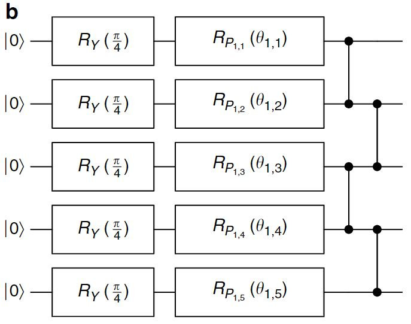
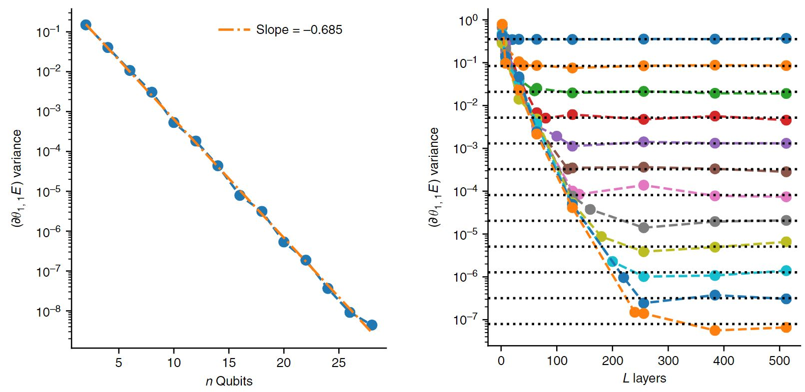

# 贫瘠高原——量子神经网络训练中的奇特图景

## Barren Plateaus in Quantum Neural Network Training Landscape

## 1. 项目介绍

### 1.1 论文介绍——Barren Plateaus简介

&emsp;&emsp;在VQA中，很多时候会采用随机初始化线路（random parameterized quantum circuits）去优化参数。而这种方式会带来一个严重的后果，就是Barren Plateaus (BP，或称贫瘠高原)。BP其实类似于深度学习中的梯度消失，具体表现为，随问题规模增长，成本函数在参数空间中表现出指数级平滑，从而导致优化算法很难进行下去，甚至根本无法计算。产生BP的原因主要有两个，一是希尔伯特空间的维数随量子比特数量指数增长，二是由于随机初始化线路的梯度估计的复杂度。

&emsp;&emsp;Andrew Arrasmith等人按如下形式严格定义了BP (arXiv:2011.12245v2)：

对于$\forall \theta_k, \exists b>1, \left\langle\partial_kC\left(\vec{\theta}\right)\right\rangle_\theta=0$，有

$$Var_\theta\left[\partial_kC\left(\vec{\theta}\right)\right]\le\mathcal{O}\left(\frac{1}{b^n}\right)\tag{1}$$

其中$n$是比特数，$C$是成本函数，$\theta_k$表示参数，角标$\theta$表示在参数空间中求期望。$\left\langle\partial_kC\left(\vec{\theta}\right)\right\rangle_\theta=0$表示成本函数的梯度在平均意义下为0。在编写代码时可以利用好这一特性计算梯度方差，因为均值为0，所以梯度的方差就是梯度的平方的期望，即

$$Var_\theta\left[\partial_kC\left(\vec{\theta}\right)\right]=\left\langle\left[\partial_kC\left(\vec{\theta}\right)-\langle\partial_kC\left(\vec{\theta}\right)\rangle\right]^2\right\rangle_\theta=\left\langle\left[\partial_kC\left(\vec{\theta}\right)\right]^2\right\rangle_\theta\tag{2}$$

&emsp;&emsp;目前，对于BP这个问题，有很多种解决策略被发现。比较杰出的工作是搭建量子卷积神经网络 (QCNN)，由Arthur Pesah等人提出 (arXiv:2011.02966v2 )，这种方法可以把BP中指数递减的梯度方差弱化成多项式递减。

### 1.2 项目简介

&emsp;&emsp;本项目的主要目标是复现这篇文章中，随机初始化线路的梯度方差随比特数与层数指数衰减的图景，源文件bp.py里定义的get_var_partial_exp写得比较完善，适用性比较强，可以计算任意含参线路第一个参数的偏导数方差，我认为bench marking有时候需要算这个梯度方差，所以应用性可以保障。

&emsp;&emsp;主要思路是按原文搭建量子神经网络（如下图，摘自原文），图中$R_Y(\pi/4)$门用于制备初态，后面的含参数$R_P$门以及控制Z门合计为一个单层，这个单层在后续计算中会重复多次施加在量子线路中。

    
     
    
图1 用于数值模拟的随机参数化量子线路（单层）

&emsp;&emsp;搭建完量子线路后，使用Mindquantum框架中get expectation with grad求解析梯度。这种方式的优势是不需要做差分，直接利用parameter shift求解析梯度，速度也比较快。求出梯度后，求其模方，然后通过多次采样取平均来使结果逼近梯度模方的期望。由2式可知，梯度模方的期望就是梯度方差，至此完成一次完整的梯度方差计算。按照原文中要求，我们只关注$\theta_{1,1}$变化的梯度，即第一层的第一个量子门上的参数的偏导数，将其作为梯度去研究。这样做的目的是简化计算，保证代码高效运行的同时较为精确地展现出BP的图像。

## 2. 主要结果

    
     
    
图2 复现结果，左图是梯度方差与比特数的关系，右图是梯度方差与层数的关系，不同颜色表示不同比特数，比特数取值为2到16的偶数

    
     
    
图3 原文结果，左图是梯度方差与比特数的关系，右图是梯度方差与层数的关系，不同颜色表示不同比特数，比特数取值为2到24的偶数

&emsp;&emsp;左图斜率的差别应该是由固定层数的选取不同导致的；右图浮现结果看起来并没有收敛完全，可以通过增加采样次数来提高精度。

&emsp;&emsp;从上面的结果可以看出，在量子神经网络中，采用随机初始化策略，会在问题规模增大时产生Barren Plateaus。这警示我们在设计算法的时候要了解问题的结构，避免采用随机的初始化策略。

## 3. 创新点

### 采样方法的改进

#### 3.1 提出问题

&emsp;&emsp;梯度方差，可以分成两个词来看，梯度，和方差。
方差相当于是样本与均值差异取平方再求均值，由于量子线路中参数空间是连续的，不可全部取一遍，那就需要采样计算。
那么问题来了，样本容量到底多少比较合适？取多了，消耗算力，不划算；取少了，数据不具有代表性，与实际期望值差别过大，也不行。
但一定存在一个合适的样本容量，这时候样本均值刚好收敛于真实均值附近的某个的误差范围内，这时候既保证了精度，也保证了效率。
于是，问题转变为找到一个适用于采样计算的审敛法。

#### 3.2 随机采样审敛法

&emsp;&emsp;比较显然的一种方法，拍拍脑袋就能想出来。比如，先采样10个，算个均值，再采10个，再算个均值，看看这两个均值差的大不大，如果差别较小，那就采样结束，如果差别很大，就继续采，再采10个……但是，这种每次迭代只增加固定的次数的采样方法，会有两个严重的问题，其一，当迭代次数增大时，下一次采样的样品数占总采样次数过小，相当于被不断地稀释，旧值的权重不断增大，这会使得审敛失准，从而增大采样误差；其次，样本数每次迭代增加固定数目，这种是一种线性增长，较为缓慢，为了满足采样需求会经过很多次迭代，影响效率。

&emsp;&emsp;经过深思熟虑，我找到了一种可靠的审敛法，也许是我首创的。现在我通过一个简单的例子介绍一下这个方法，

&emsp;&emsp;采样的本质是用样本期望去逼近真实期望。假设有一个无穷大的样本源，我们采样都是从这里边采的，当然，这个样本源还需要满足一个条件，就是整体存在一个有限大的期望，而且总是存在一个足够大的样本容量使得样本期望在某个误差范围内逼近真实期望。

设初始样本容量为$C_i$。

Step1. 我们第一轮先采样$C_i$次，这时候我们算出来一个样本期望$E_1$，但我们并不清楚这个期望对不对，有没有逼近真值;

Step2. 为了确定结果$E_1$是否收敛，我们再进行第二轮采样，次数为当前总样本数，即$C_i$次，计算出样本期望$E_2$，对前两轮采样做汇总可以得到样本容量为$2C_i$的期望值$E_{1,2}=(E_1+E_2)/2$，然后计算相对误差$(E_1-E_2)/E_{1,2}$，若其小于误差要求，比如$10%$，那就判定其收敛；若大于误差要求，则进行下一步；

Step3. 为了确定$E_{1,2}$是否收敛，我们再进行第三轮采样，次数为当前总样本数，即$2C_i$次，计算出样本期望$E_3$，对前所有采样做汇总可以得到样本容量为$4C_i$的期望值$E_{1,2,3}=(E_{1,2}+E_3)/2$，然后计算相对误差$(E_{1,2}-E_{3})/E_{1,2,3}$，若其小于误差要求，判定为收敛；若大于误差要求，则进行下一步；

Step4. 为了确定$E_{1,2,3}$是否收敛，我们再进行第四轮采样……

StepN. ……采样计算收敛完成，总样本容量为$C_i \times 2^{N-1}$。

至此，就完成了整个采样计算。这种采样方式的优点是可以快速地自适应调整样本容量的大小。相对于固定容量的随机采样，有审敛的采样在很大程度上规避了采样风险。

这个审敛法应用于源文件bp.py中函数get_var_partial_exp的编写当中。

邮箱地址：lzs03333@yeah.net