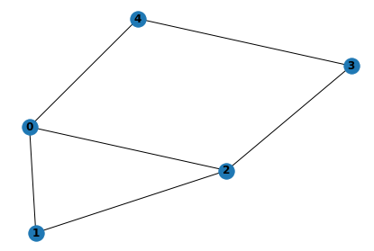
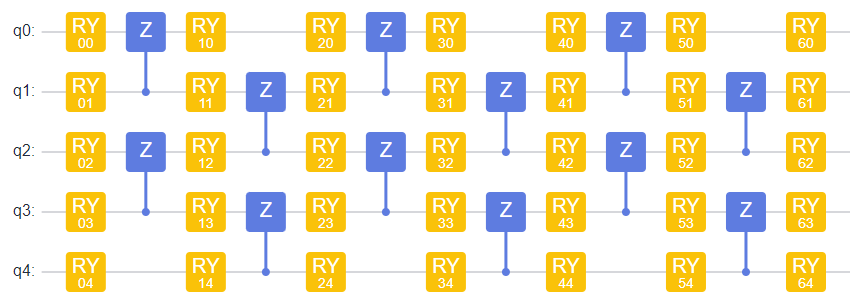
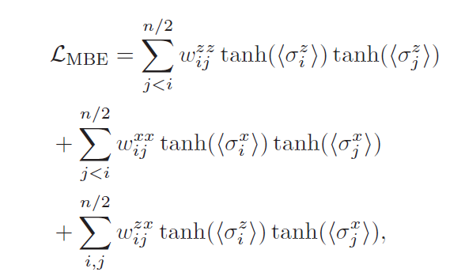
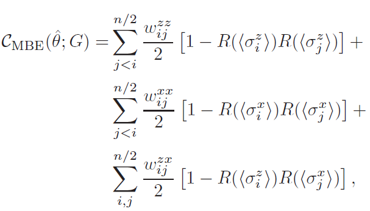
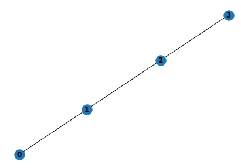
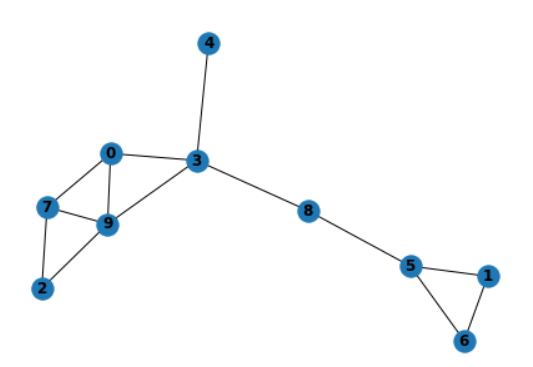

# MBE模型自验报告

## 1. 模型简介

为了减少使用QAOA解决MaxCut问题中量子比特的数量，文章提出了一种新型的编码方式。此外为了引入非线性性，还增加了非线性激活函数$\tanh$。QAOA把图$G$中每一个顶点都编码到一个量子比特中，使用Z测量得到期望的结果。Multi-Basis Encoding将图$G$的顶点平均分为两组（如果顶点是奇数，则拆分为$n$与$n-1$个顶点的两组）。之后分别将两组顶点分别编码到量子比特的Z方向和X方向，从而减少了量子比特一半的使用量。随着编码方式的改变，对应的损失函数形式也应该改变。

### 1.1 编码方式

此处我们举例解释说明编码方式。以如下的图$G$为例（来自MindQuantumQAOA教程）：



共有五个顶点：$[0, 1, 2, 3, 4]$

六条边，分别为：$[(0, 1), (0, 4), (0, 2), (1, 2), (2, 3), (3, 4)]$

将顶点分为两组，分别是：

1. $[0, 1, 2]$编码到量子比特Z方向，测量特征时分别测量$Z0, Z1, Z2$
2. $[3, 4]$编码到量子比特X方向，测量特征时分别测量$X0, X1$

### 1.2 Ansatz

使用如下HEA：



### 1.3 损失函数

使用QAOA时，损失函数直接为哈密顿量的期望$\langle H\rangle$，其中$$H=\sum_{(i,j)\in g.edges} ZiZj$$。对应到上图$G$中，$$H = Z0Z1+Z0Z4+Z0Z2+Z1Z2+Z2Z3+Z3Z4$$。

使用Multi-Basis Encoding时，信息编码到不同的轴中，因此损失函数变为了



其中还对每一个测量值作用了非线性激活函数$\tanh$。对应到上图$G$为例，我们应该测量$[Z0, Z1, Z2, X0, X1]$，作用$\tanh$后，再根据顶点的连接关系表达损失函数。图$G$的损失函数应为$$L = \tanh\langle Z0 \rangle\tanh\langle Z1 \rangle + \tanh\langle Z0 \rangle\tanh\langle X1 \rangle+\tanh\langle Z0 \rangle\tanh\langle Z2 \rangle+\tanh\langle Z1 \rangle\tanh\langle Z2 \rangle+\tanh\langle Z2 \rangle\tanh\langle X1 \rangle+\tanh\langle X1 \rangle\tanh\langle X2 \rangle$$。

### 1.4 MBEMaxCut最终结果

使用MBE编码方式，得到测量结果后，需要使用函数$R(\cdot)$二值化为1或-1后，再按照如下方式计算MaxCut最终结果。次数二值化过程以0为分界线二值化。



### 1.4 代码提交地址

https://gitee.com/richybai/multi-basis-encoding

## 2.   代码目录结构说明

```
MultiBasisEncoding
├──	main.py						# 代码文件
├── readme.md					# 说明文档
├── log.txt						# num_nodes = 2 to 10 的结果
└── requirements.txt			# 代码依赖项
```


## 3.   自验结果

### 3.1 自验环境

- 硬件环境：Ubuntu 18.04.6 LTS (GNU/Linux 4.15.0-163-generic x86_64) cpu
- 包版本：
  1. mindquantum==0.7.0
  2. mindspore==1.6.1
  3. numpy==1.21.5
  4. networkx===2.6.3

### 3.2 运行

直接运行三个模型即可，每个模型会生成对应的图以及parameter_pool。

下面给出运行`ising_hea_nt.py`的输出。

`python main.py`运行。之后会输出图的顶点，边以及MaxCut数。

``` 
base task 1 is finished True 57
base task 2 is finished True 61
...
base task 98 is finished True 70
base task 99 is finished True 85
base task 100 is finished True 75
```

开始训练时，会打印如下信息。

```
4 qubits system random sampling 500 is finished
4 qubits system network transfer sampling 500 is finished
6 qubits system random sampling 500 is finished
6 qubits system network transfer sampling 500 is finished
```

### 3.3 结果

代码中改变`num_nodes`参数，随机生成图，均可得到正确结果。结果附在`log.txt`中。

#### 3.3.1 论文中举例四顶点图



输出结果为：

```
nodes number:  4 nodes:  [0, 1, 2, 3]
edges number:  3 deges:  [(0, 1), (1, 2), (2, 3)]
MaxCut is:  3
epoch:  100 , MBE loss:  -0.26625142 , MBE MaxCut:  2.0
epoch:  200 , MBE loss:  -0.6592021 , MBE MaxCut:  2.0
epoch:  300 , MBE loss:  -1.0389342 , MBE MaxCut:  3.0
total training step: 300
```

#### 3.3.2 上面举例G


输出结果为：

```
nodes number:  5 nodes:  [0, 1, 2, 3, 4]
edges number:  6 deges:  [(0, 1), (0, 4), (0, 2), (1, 2), (2, 3), (3, 4)]
MaxCut is:  5
epoch:  100 , MBE loss:  0.85303336 , MBE MaxCut:  2.0
epoch:  200 , MBE loss:  0.10268529 , MBE MaxCut:  3.0
epoch:  300 , MBE loss:  -1.0949682 , MBE MaxCut:  5.0
total training step: 300
```

#### 3.3.3 10顶点13边



输出结果：

```
nodes number:  10 nodes:  [0, 3, 7, 9, 4, 8, 2, 1, 5, 6]
edges number:  13 deges:  [(0, 3), (0, 7), (0, 9), (3, 4), (3, 8), (3, 9), (7, 2), (7, 9), (9, 2), (8, 5), (1, 5), (1, 6), (5, 6)]
MaxCut is:  10
epoch:  100 , MBE loss:  -1.0403721 , MBE MaxCut:  8.0
epoch:  200 , MBE loss:  -1.7128493 , MBE MaxCut:  9.0
epoch:  300 , MBE loss:  -2.2399933 , MBE MaxCut:  9.0
epoch:  400 , MBE loss:  -2.5733652 , MBE MaxCut:  10.0
total training step: 400
```


## 4.   参考资料

### 4.1 参考论文

1. Patti T L, Kossaifi J, Anandkumar A, et al. Variational quantum optimization with multibasis encodings[J]. Physical Review Research, 2022, 4(3): 033142.

### 4.2 网页

1. https://www.mindspore.cn/mindquantum/docs/zh-CN/r0.7/quantum_approximate_optimization_algorithm.html