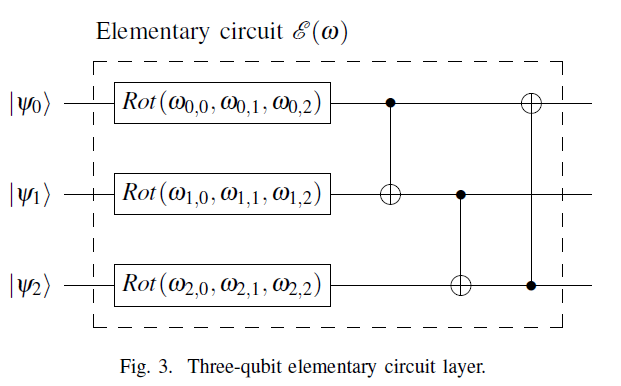
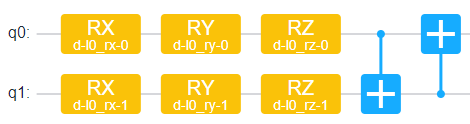
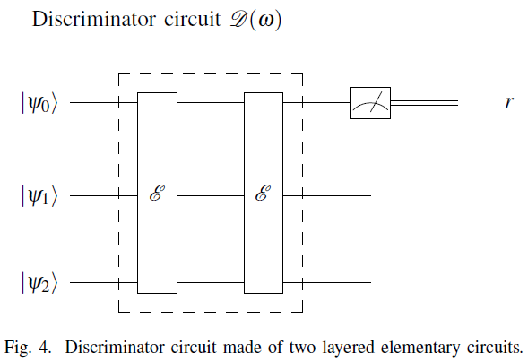
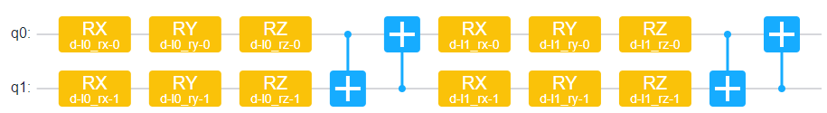
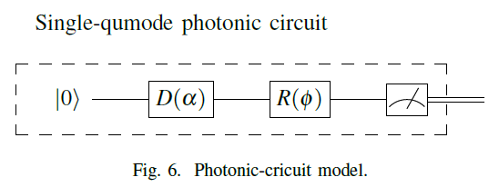
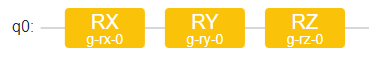
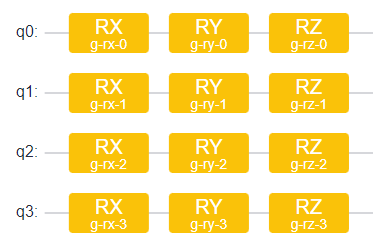
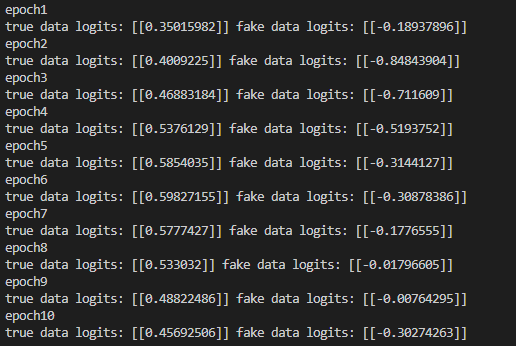

# QGAN模型自验报告


## 1. 模型简介

QGAN模型复现自赛题12的论文，模型主要分为两个部分:

- Generator:  生成假数据，目标是骗过Discriminator。
- Discriminator: 对数据进行判断，分辨数据的真假。

### 1.1. 网络模型结构简介

下面分别介绍QGAN中的Generator和Discriminator分别介绍。

#### 1.1.1 elementary circuit

结构如图：



1. 分别对qubits按顺序作用RX，RY，RZ门
2. 之后作用CX形成环

使用mind quantum 实现2-qubit线路如图：



#### 1.1.2 Discriminator

结构如图：



1. 叠加两个elementary circuit之后对第一个qubit进行测量。

使用mind quantum 实现以后线路如图（去掉测量操作）：




#### 1.1.3 photonic circuit

结构如图：



1. 第一个门是Displacement，改变的是光子位置的平均值
2. 第二个门是Rotation，改变的是光子的相位
3. 测量算子是photon counting

光量子计算使用的qumode和qubit是不一样的，qubit是二能级系统，二qumode一般不是二能级系统，因此在mind quantum中使用qubits很难实现。借鉴qumode**每一个wire生成一个qubits基态的数值**，我使用一个qubit代替一个wire，最后进行Z测量并加1，可以理解为将光子数量进行缩放，缩放到区间[0, 2]。其线路如图所示：



一个qubit上，分别作用RX，RY，RZ门实现对qumode里displacement和rotation的近似。

#### 1.1.4 Generator

后续是2-qubit的系统，因此实现Generator使用的是4个qubit，通过测量得到四个数值，当作数据。



### 1.2. 数据集

题目中给的数据集没有获取到，因此测试代码时使用的**真实数据只有一个**，[1, 1, 1, 1]，假设真实数据的标签为1。

因为Generator里面只有变分参数，所以一旦变分参数固定，生成的**虚假数据也只有一个**，假设虚假数据的标签为-1。

> 1. 可以在Generator部分加一个encoder线路，其中输入随机生成的参数，生成不同的初始态。这样不同的随机参数生成的虚假数据就时不同的，可以增加虚假数据的数量（但是在复现代码中没有实现）。
> 2. 代码中的loss选取的是MSELoss。
> 3. 本处提到的数据只是为了让代码泡通，没有实际意义。

### 1.3. 代码提交地址

https://gitee.com/richybai/qcnn


## 2.   代码目录结构说明

```
QGAN
├── readme.md			# 说明文档
├── requirements.txt	# 代码依赖项
├── src					# 模型定义源码目录
│   ├── utils.py	    # 代码中使用到的小工具代码
│   └── QGAN.py			# QGAN模型代码
└── main.py				# 训练测试代码
```

## 3.   自验结果

### 3.1. 自验环境

- 硬件环境：win10 cpu
- 包版本：
  1. mindquantum==0.6.0
  2. mindspore==1.7.0
  3. numpy==1.23.0

### 3.2. 训练超参数

1. `epochs = 10`
2. `learning_rate = 0.01`
3. `loss = MSELoss()`
4. `optimizer = Adam()`
5. 并行度未设置

### 3.3. 训练

直接运行main.py函数就可以输出结果。

在每一个epoch中，使用true和fake数据训练D五次后，更新G一百次，使G尽量生成可以骗过D的假数据。												

每个epoch后，会打印真实数据和虚假数据经过D后的预测值：

- 当logits大于0时，识别为真数据
- 当logits小于0时，识别为假数据

一下是一次运行时的输出：



可见两个数据一直可以正确识别，但是假数据logits有上升的趋势。可以预见，如果数据足够多（即在G前加encoder，生成更多的数据），应该可以骗过D。

## 4.   参考资料

### 4.1. 参考论文

Barbeau M, Garcia-Alfaro J. Faking and discriminating the navigation data of a micro aerial vehicle using quantum generative adversarial networks[C]//2019 IEEE Globecom Workshops (GC Wkshps). IEEE, 2019: 1-6.