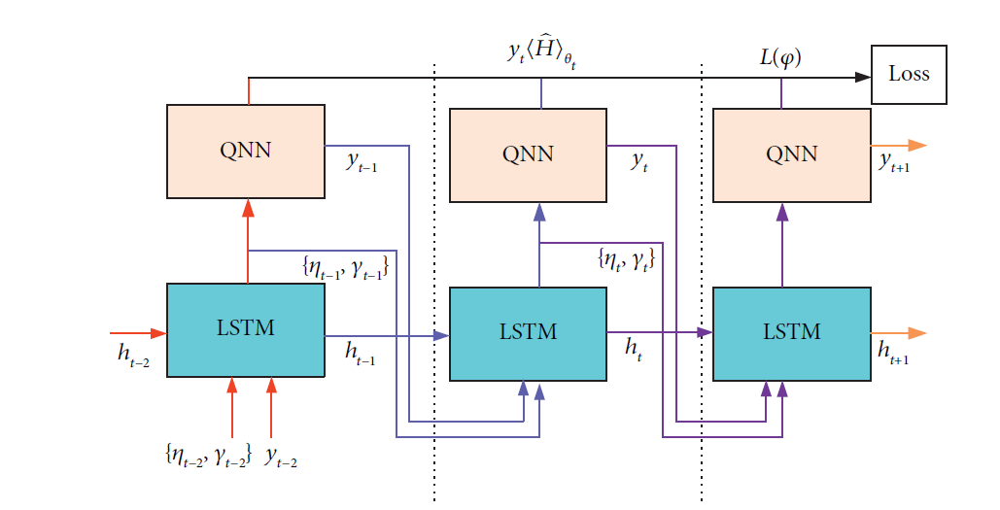
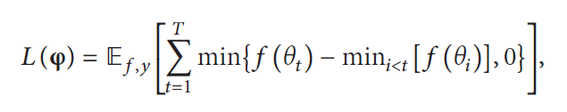
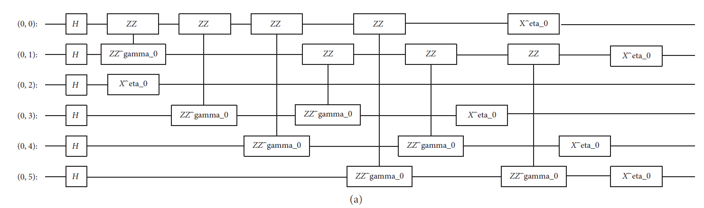
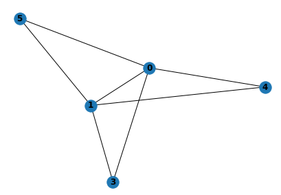
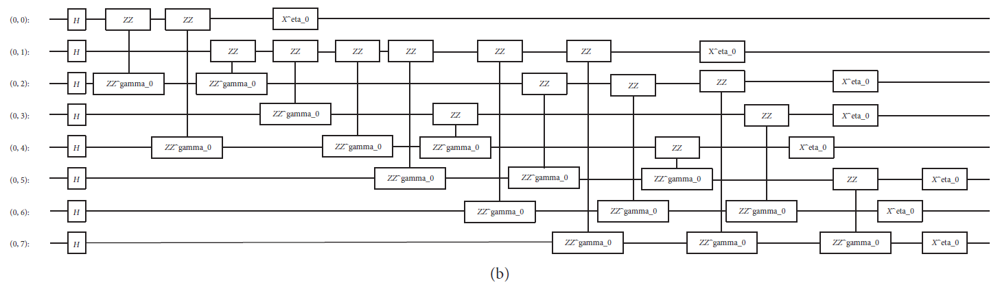
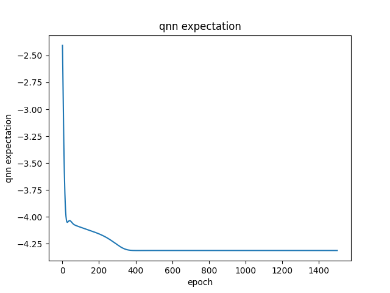
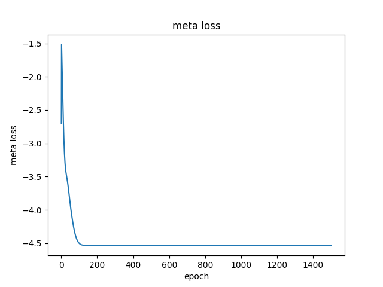
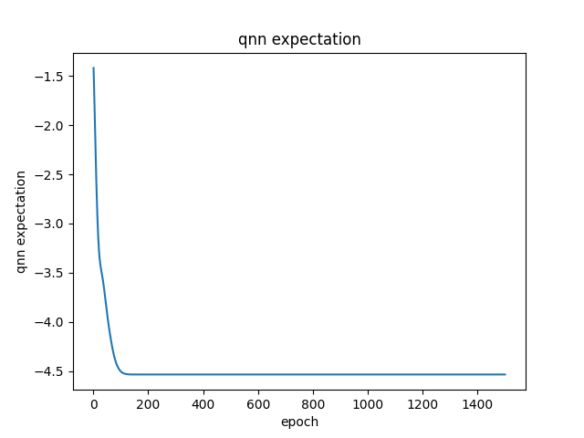
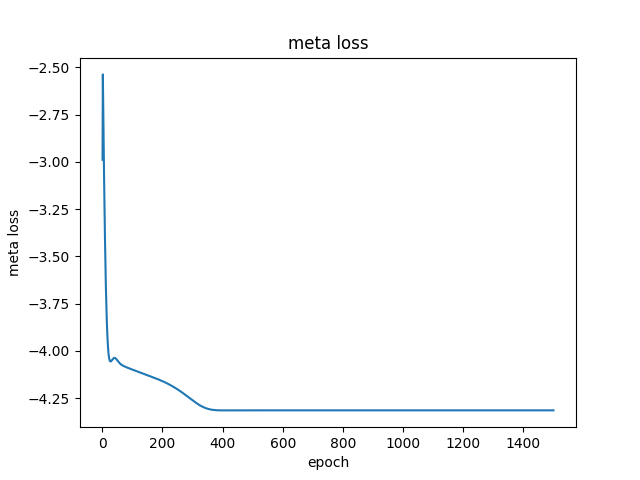

# MetaQAOA模型自验报告

## 1. 模型简介

现有的QAOA可以解决特定的组合问题，但泛化性不行，因此提出了MetaQAOA。结合Metalearning的概念，使用经典的LSTM层作为优化器，更新QAOA线路中的参数。

### 1.1. 网络模型结构简介

MetaQAOA的data flow 如下：



其中LSTM就是经典的神经网络层，QNN是经典的解决MaxCut问题的QAOA线路。在一次forward计算中，共进行了$T=5$次QNN与LSTM的交互。

#### 1.1.1 QNN结构

QNN是经典的解决MaxCut问题的QAOA线路。具体线路不再展示，其中关键的参数为线路的阶，即线路中unitary block重复的次数，也决定了参数的数量。复现时，此参数设置为$P=10$。因此需要输入的参数$\eta, \gamma$长度为20的向量。为了更好的适应LSTM的结构，我们把参数看作$[1, P, 2]$，分别对应到batch size = 1，sequence length=P，input size = 2。

#### 1.2.1 LSTM结构

为了适应输入为$[1, P, 2]$的数据，我们以如下参数初始化LSTM。

- input size = 2
- hidden size = 2
- num layers = 1

输入网络的$x, h, c$每个epoch都会迭代，$x$初始化为1，$h,c$初始化为0。

#### 1.3.1 MetaQAOA的损失函数

论文中给出的形式如下



但经过推导之后，发现应该是每一次运行QNN输出的5个期望值的最小值。分为两种情况

1. 当前期望值大于以往的最小值时，为0，无贡献
2. 当前期望值小于以往的最小值时，加上二者的差，会消掉之前的最小值，只剩当前最小值。

### 1.2. 数据集

复现论文中Fig7中的两个样例。

#### 1.2.1 样例1

对应的QAOA $ P=1$的线路如图所示：



其中第2个qubit上没有ZZ门作用，也就意味着此顶点没有边相连，简化为了五个顶点，七条边的图，MaxCut=6。如图所示：




#### 1.2.2 样例2

对应的QAOA $ P=1$的线路如图所示：



共八个顶点，十五条边的图，MaxCut=11。如图所示：


### 1.3. 代码提交地址

https://gitee.com/richybai/meta-qaoa


## 2.   代码目录结构说明

```
MetaQAOA
├── readme.md			# 说明文档
├── requirements.txt	# 代码依赖项
├── src					# 模型定义源码目录
│   ├── config.py		# 模型的配置参数
│   ├── metaqaoa.py	    # MetaQAOA的相关代码，包扩数据生成，模型结构等
│   └── utils.py		# 用到的其他代码
└── main.py				# 训练测试代码
```


## 3.   自验结果

### 3.1 自验环境

- 硬件环境：Ubuntu 18.04.6 LTS (GNU/Linux 4.15.0-163-generic x86_64) cpu
- 包版本：
  1. mindquantum==0.7.0
  2. mindspore==1.6.1
  3. numpy==1.21.5
  4. networkx==2.6.3
  5. matplotlib=3.4.3

### 3.2 训练超参数

1. `batch_size = 1`
2. `epochs = 1500`
3. `learning_rate = 0.001`
5. `optimizer = Adam()`

### 3.3 训练

在`main.py`中选择：

1. `g = fig7_instance1()`  对应fig7中样例1

2. `g = fig7_instance2()`  对应fig7中样例2
3. `g = gene_random_instance(n_train)`  随机生成`n_train`个顶点的图

然后`python main.py`运行，之后会保存`expectation.png`,`meta loss.png`,`loss.npy`三个文件

### 3.4 结果

分别给出样例1 和样例2 的结果。

#### 3.4.1 样例1

终端输出为：

```
number of nodes: 5
number of deges: 7
epoch:  100 metaqaoa loss:  -4.5007963 qnn expectation:  -4.5008035
epoch:  200 metaqaoa loss:  -4.532253 qnn expectation:  -4.532246
epoch:  300 metaqaoa loss:  -4.532238 qnn expectation:  -4.5322313
epoch:  400 metaqaoa loss:  -4.532239 qnn expectation:  -4.532231
epoch:  500 metaqaoa loss:  -4.53224 qnn expectation:  -4.532231
epoch:  600 metaqaoa loss:  -4.532241 qnn expectation:  -4.5322304
epoch:  700 metaqaoa loss:  -4.5322413 qnn expectation:  -4.53223
epoch:  800 metaqaoa loss:  -4.5322423 qnn expectation:  -4.5322294
epoch:  900 metaqaoa loss:  -4.532243 qnn expectation:  -4.532229
epoch:  1000 metaqaoa loss:  -4.5322433 qnn expectation:  -4.5322285
epoch:  1100 metaqaoa loss:  -4.532244 qnn expectation:  -4.532228
epoch:  1200 metaqaoa loss:  -4.5322447 qnn expectation:  -4.5322275
epoch:  1300 metaqaoa loss:  -4.532245 qnn expectation:  -4.532227
epoch:  1400 metaqaoa loss:  -4.5322456 qnn expectation:  -4.5322266
epoch:  1500 metaqaoa loss:  -4.532246 qnn expectation:  -4.532226
```

QNN输出的期望值变化为：



meta qaoa 的loss变化为：



#### 3.4.2 样例2

终端输出为：

```
number of nodes: 8
number of deges: 15
epoch:  100 metaqaoa loss:  -4.0983768 qnn expectation:  -4.0980406
epoch:  200 metaqaoa loss:  -4.1596565 qnn expectation:  -4.159403
epoch:  300 metaqaoa loss:  -4.2608967 qnn expectation:  -4.2606254
epoch:  400 metaqaoa loss:  -4.314428 qnn expectation:  -4.3143873
epoch:  500 metaqaoa loss:  -4.314151 qnn expectation:  -4.314146
epoch:  600 metaqaoa loss:  -4.3141522 qnn expectation:  -4.3141465
epoch:  700 metaqaoa loss:  -4.314152 qnn expectation:  -4.3141456
epoch:  800 metaqaoa loss:  -4.3141513 qnn expectation:  -4.3141446
epoch:  900 metaqaoa loss:  -4.3141503 qnn expectation:  -4.314143
epoch:  1000 metaqaoa loss:  -4.31415 qnn expectation:  -4.3141418
epoch:  1100 metaqaoa loss:  -4.314149 qnn expectation:  -4.3141403
epoch:  1200 metaqaoa loss:  -4.314148 qnn expectation:  -4.314139
epoch:  1300 metaqaoa loss:  -4.3141465 qnn expectation:  -4.314137
epoch:  1400 metaqaoa loss:  -4.3141456 qnn expectation:  -4.3141356
epoch:  1500 metaqaoa loss:  -4.314144 qnn expectation:  -4.3141336
```

QNN输出的期望值变化为：



meta qaoa 的loss变化为：



## 4.   参考资料

### 4.1. 参考论文

Wang H, Zhao J, Wang B, et al. A Quantum Approximate Optimization Algorithm with Metalearning for MaxCut Problem and Its Simulation via TensorFlow Quantum[J]. Mathematical Problems in Engineering, 2021, 2021.