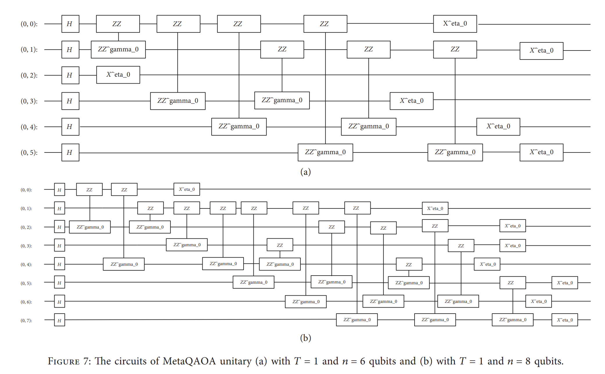
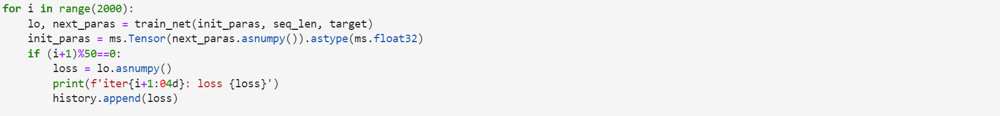
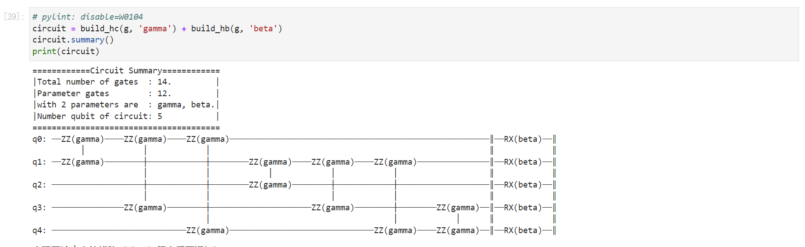
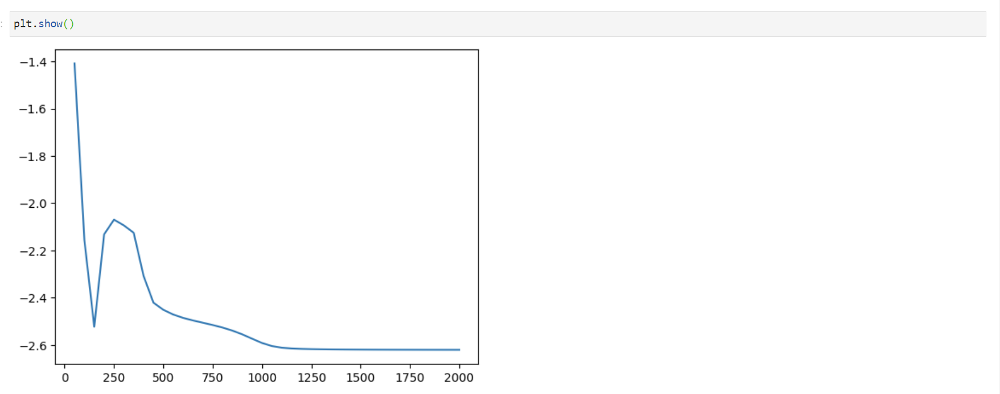

MetaQAOA-MaxCut模型自验报告

作者姓名：赵先和、邮箱：648124022@qq.com

1.      模型简介

简单介绍模型结构，所用数据集，代码仓地址等信息

1.1.  网络模型结构简介：

通过量子近似优化算法来解决最大分割问题

问题描述：在一个图𝐺𝑛,𝑚中，有n个格点，m个边，现在将这个图分为两个子集S和G-S，如何使被切割的边数量最多？

思路：用一个qubit表示一个格点，将0和1表示两个不同的子集，初始态为最大叠加态，然后逐渐将态矢转为最大分割态。

> 待实现的两个线路

1.2.  数据集：

1.3.  代码提交地址：

1.4.  其它：

无

2.      代码目录结构说明

`2.0 Quantum_approximate_optimization_algorithm_for Cut-Max.ipynb`解决Max-Cut问题

3.      自验结果

3.1.  自验环境：

所用硬件环境：HiQ量子计算云平台（[HiQ量子计算云平台 (huaweicloud.com)](https://hiq.huaweicloud.com/portal/programming/jupyterNotebook)）

MindSpore版本：1.6.0、

3.2.  训练超参数：

` optimizer = Adam(QuantumNet.trainable_params(), learning_rate=0.001)`

3.3.  训练：

3.3.1.  如何启动训练脚本：

(Notebook文件)

3.3.2.  训练精度结果：

线路与计算结果：

loss函数

4.      参考资料

4.1.  参考论文：

[1] Edward Farhi, Jeffrey Goldstone, and Sam Gutmann. [A Quantum Approximate Optimization Algorithm](https://arxiv.org/pdf/1411.4028.pdf)

[2] Haibin Wang , Jiaojiao Zhao, Bosi Wang, and Lian Tong. [A Quantum Approximate Optimization Algorithm with Metalearning for MaxCut Problem and Its Simulation via TensorFlow Quantum](https://www.hindawi.com/journals/mpe/2021/6655455/#data-availability)

4.2.  参考git项目：

量子近似优化算法[MindSpore](https://mindspore.cn/mindquantum/docs/zh-CN/master/quantum_approximate_optimization_algorithm.html#%E9%87%8F%E5%AD%90%E8%BF%91%E4%BC%BC%E4%BC%98%E5%8C%96%E7%AE%97%E6%B3%95)

[GitHub - forturnme/Replica-of-Meta-LSTM-QAOA](https://github.com/forturnme/Replica-of-Meta-LSTM-QAOA)
