# MBP模型自验报告

## 1. 模型简介

本文章提出了一种使用迁移学习减缓VQA梯度Barren Plateaus的方法。首先使用qubits数量少的模型优化参数，并将参数存储起来形成参数池。之后训练qubits数量多的模型时，采取不同策略的方式，把参数池的参数迁移到大模型中。

### 1.1. Ansatz结构简介

本文共使用了两种不同的ansatz，Hardware-efficient ansatz(**HEA**) 和 Hamiltonian variational ansatz(**HVA**)。做实验时发现改变HEA结构后结果会发生变化，一并在此介绍简化的HEA

#### 1.1.1 HEA and simplified HEA

HEA单层结构如下图，对应于论文中的表达，每一个带参数的门都有一个独立的参数，一层又12个参数

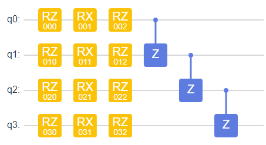

简化后的HEA结构如图，在qubits维度上使用相同的参数，一层有三个参数

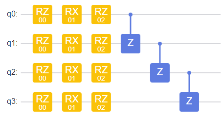


#### 1.1.2 HVA

HVA类似于QAOA，根据哈密顿量设计ansatz的结构。下面给出Heisenberg XXZ 模型一维、四个qubits所对应的单层ansatz。一层中相同的门共用相同的参数，共有三个参数。

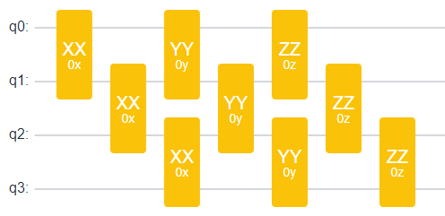


### 1.2. Transfer Method

文中提出两种参数迁移方法，分别称为**Network transfer**和**Structure transfer**。

#### 1.2.1 Network transfer

本方法从小系统变到大系统时，直接将小系统的网络复制，错位粘贴，并将参数对应迁移，如下图所示：

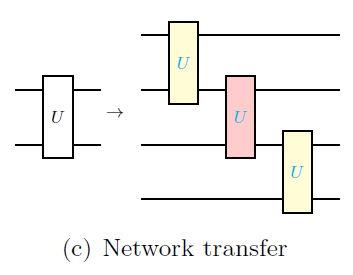

#### 1.2.2 Structure transfer

按照既定方式生成ansatz之后，本方法只根据base task的qubits数量，初始化大系统中相同数量的qubits，如下图所示：

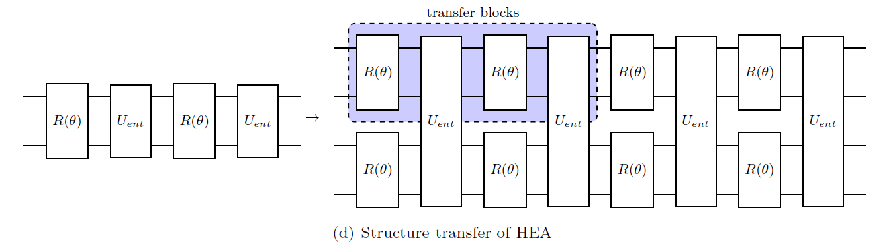

实现时，transfer block右侧的相同结构也可以被迁移初始化。

### 1.3 baseline模型

本文共用到三种模型，分别是：

1. Ising model，ansatz使用HEA，迁移方式使用network transfer
2. Hydrogen chain，ansatz使用HEA，迁移方式使用structure transfer
3. Heisenberg XXZ model，ansatz使用HVA，迁移方式使用structure transfer（仅限复现fig3的结论时）

并全部使用BFGS进行优化

#### 1.3.1 Ising model

- 哈密顿量为：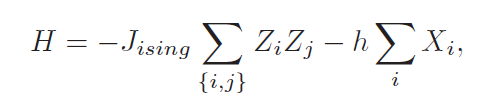，其中J=1, h=2
- ansatz: HEA
  - base，n_qubits=4, layers=4
  - target，随着qubits数量增加，base block的数量也增加

#### 1.3.2 Hydrogen chain

- 考虑氢链，氢分子之间的距离为0.74A，哈密顿量由generate_uccsd函数生成。
- ansatz: HEA
  - base: 模型考虑氢分子，n_qubits=4, layers=4
  - target: 随着氢原子个数增加，n_qubits个数也增加，为氢原子个数的两倍，但是layers=8保持不变

#### 1.3.3 Heisenberg XXZ model

- 哈密顿量为：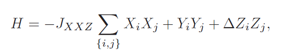这里Sum后应该有一个大括号包含所有项，J=1, Delta=2。
- ansatz: HVA
  - base: n_qubits=4, layers=4
  - target: n_qubits在变化，但是layers=8保持不变

### 1.4. 代码提交地址

https://gitee.com/richybai/mitigate-barren-plateaus

## 2.   代码目录结构说明

```
MitigateBarrenPlateaus
├── hchain_hea_st.py			# 氢链模型
├── heisenberg_xxz_hva_st.py	# 海森堡XXZ模型
├──	ising_hea_nt.py				# Ising 模型
├── readme.md					# 说明文档
└── requirements.txt			# 代码依赖项
```


## 3.   自验结果

### 3.1. 自验环境

- 硬件环境：Ubuntu 18.04.6 LTS (GNU/Linux 4.15.0-163-generic x86_64) cpu
- 包版本：
  1. mindquantum==0.7.0
  2. mindspore==1.6.1
  3. numpy==1.21.5
  4. openfermion==1.3.0
  5. openfermionpyscf==0.5
  6. scipy==1.7.3
  7. matplotlib==3.4.3

### 3.2. 运行

直接运行三个模型即可，每个模型会生成对应的图以及parameter_pool。

下面给出运行`ising_hea_nt.py`的输出。

1. 首先给出运行base task 的信息，后两项分别为是否达到精度，BFGS迭代次数。

``` 
base task 1 is finished True 57
base task 2 is finished True 61
...
base task 98 is finished True 70
base task 99 is finished True 85
base task 100 is finished True 75
```

2. 随后给出随机采样进度信息

```
4 qubits system random sampling 500 is finished
4 qubits system network transfer sampling 500 is finished
6 qubits system random sampling 500 is finished
6 qubits system network transfer sampling 500 is finished
...
```

最后会在当前目录生成`a.png`, `c.png`,`pool1.npy`分别为论文fig3中的图，与生成的参数池。

### 3.3. 结果

**随机初始化区间为[0, pi]**。下面对结果简要介绍。

#### 3.3.1 Ising model结果，分别对应a,c。

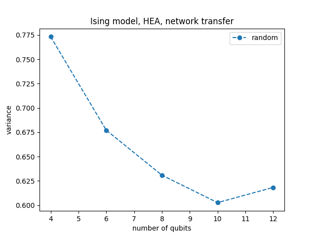 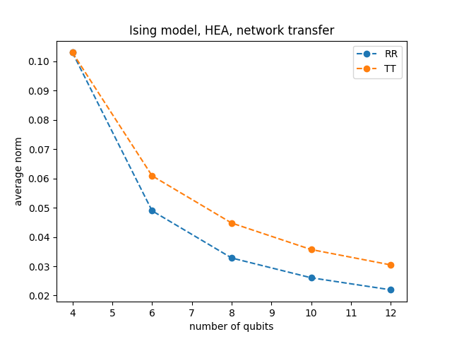

#### 3.3.2 Hydrogen chain结果，分别对应b,e。

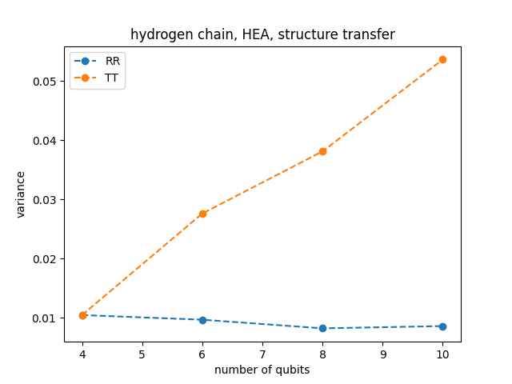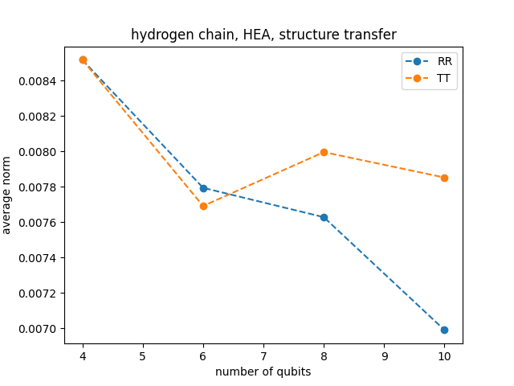

#### 3.3.3 Heisenberg XXZ结果，分别对应c,f。

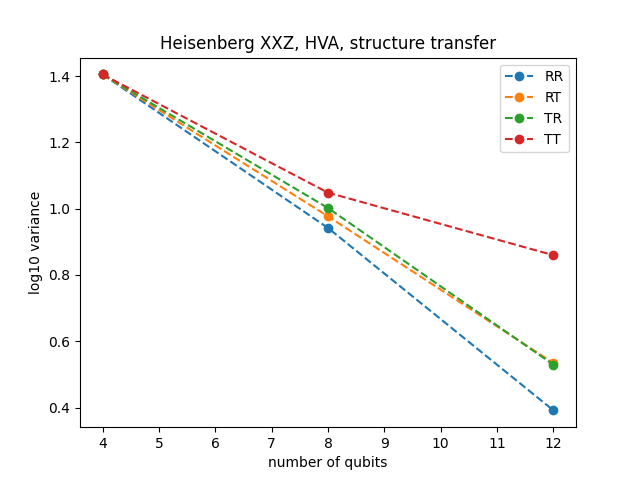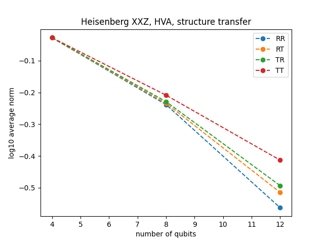


## 4.   参考资料

### 4.1. 参考论文

Liu H Y, Sun T P, Wu Y C, et al. A Parameter Initialization Method for Variational Quantum Algorithms to Mitigate Barren Plateaus Based on Transfer Learning[J]. arXiv preprint arXiv:2112.10952, 2021.