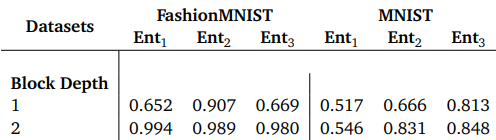

# Quantum neural network classifiers: A tutorial

## 项目介绍

该论文主要讨论了在量子神经网络的不同编码结构和编码策略在解决监督学习任务时的区别。文章对幅度编码和块编码在量子神经网络处理二分类问题时的表现进行了对比。作为测试基准，Fashion MNIST、MNIST、对称性保护拓扑态等数据集用来作为识别训练任务。本次论文复现要求：研究并理解文章内容,利用MindQuantum实现对Table 2中 对Fashion Mnist及MNIST的分类任务的结果（误差小于0.01或精度高于原文精度）。原文链接：[link](https://scipost.org/SciPostPhysLectNotes.61)

## 主要结果

原文中识别精度：

复现结果：

| Block Depth | FashionMNIST Ent1 | FashionMNIST Ent2 | FashionMNIST Ent3 | MNIST Ent1 | MNIST Ent2 | MNIST Ent3 |
| :---------: | :---------------: | :---------------: | :---------------: | :--------: | :--------: | :--------: |
|      2      |       0.996       |       0.990       |       0.982       |   0.677    |   0.844    |   0.868    |

*由于提交文件大小限制，Dataset文件夹中包只括FashionMnist数据，Mnist数据可以从原文获取，[link](https://github.com/LWKJJONAK/Quantum_Neural_Network_Classifiers/tree/main/dataset)。

## 创新点

1. 测量操作选择测量末位两量子比特计算与标签的交叉熵，避免增加对训练集与测试集额外预处理操作，减小误差引入，简化代码，增加可读性；
2. 通过继承训练网络封装类TrainOneStepCell实现模型搭建和训练，增加了代码扩展性并易于测试；
3. 对整个过程建立主类进行封装，易于移植；
3. 针对基于MNIST数据集的分类问题，对参数层和纠缠层进行改进，获得更高精度。

作者：yjshun

邮箱地址：jiashun.yan@foxmail.com