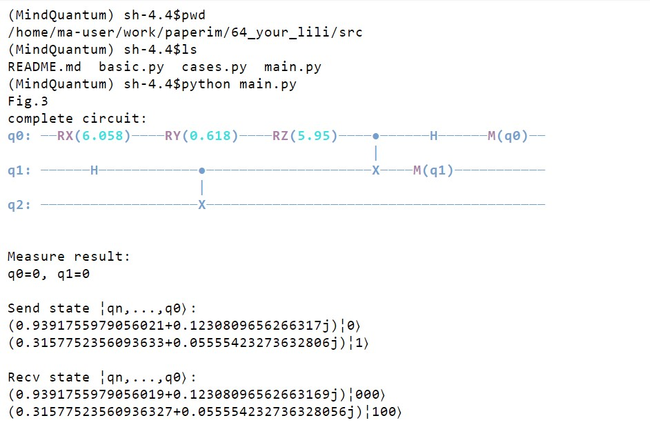

## 介绍
复现论文[Quantum communication for wireless wide-area networks](https://ieeexplore.ieee.org/document/1461505)中量子无线通信量子线路，各图对应的量子线路位于文件 `cases.py` 中，由于各个线路有很多相同模块，因此将相似部分在 `basic.py` 中实现。`main.py` 简单调用所有 `cases.py` 中的函数。

## 代码运行
进入 `src/` 目录，运行 `python main.py` 即可，效果如下：

## 其他
paper: Sheng-Tzong Cheng, Chun-Yen Wang and Ming-Hon Tao, "Quantum communication for wireless wide-area networks," in IEEE Journal on Selected Areas in Communications, vol. 23, no. 7, pp. 1424-1432, July 2005, doi: 10.1109/JSAC.2005.851157