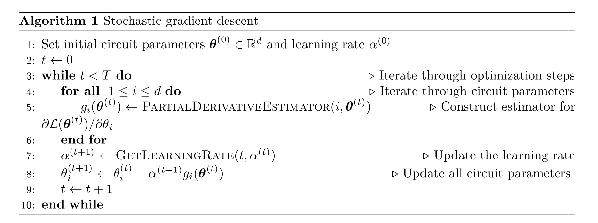
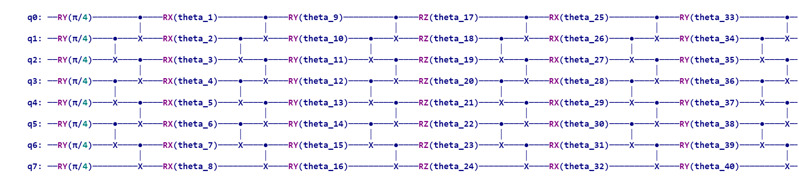

# 混合量子-经典优化的随机梯度下降算法
## Stochastic gradient descent for hybrid quantum-classical optimization

## 项目介绍

基于梯度下降的优化器通常需要估计参数化量子电路输出结果的期望值。文章中，作者表明对梯度进行近似估计会导致“随机梯度下降”。作者对于VQE、QAOA和某些量子分类器，讨论了使用 k 个测量结果估计期望值时算法的收敛特性。事实上，即使使用单一的测量结果来估计期望值也是足够的。此外，很多情况下所需的梯度可以表示为期望值的线性组合，这时期望值估计可以和线性组合项上的采样相结合，以获得“双随机”梯度下降优化器。作者在VQE、QAOA和量子增强机器学习任务上对这些方法进行了数值研究。

原文提供的代码工具包链接：https://github.com/frederikwilde/qradient
但我在复现过程中没有使用。

## 复现过程

### VQE的随机梯度下降算法复现
#### 需要复现的结果图：

实验中使用的 estimator 是 Algorithm3 中的 PartialDerivativeEstimator_1。

第一行三张图的横坐标是优化步数。第二行三张图的横坐标是测量次数。

第一列两张图：$n$-shot SGD, learning rate $\alpha=0.005$。

第二列两张图：$n$-shot SGD, initial learning rate $\alpha=0.005$ with decay。

第三列两张图：$n$-shot SGD, initial learning rate $\alpha=0.005$, Adam optimizer。

所有实验都重复了8次，每一步的最小值、最大值和均值都展示在图中。

#### 编程思路
考虑具有开边界条件的 *critical transverse field Ising model*，哈密顿量为：
$$H=\sum_{j=1}^{N-1}Z_jZ_{j+1}+\sum_{j=1}^{N}X_j$$
考虑 $N=8$ 的情形。

设参数化线路由一列 $\sigma-block$ 组成，其中$\sigma\in\{X,Y,Z\}$。一个 $\sigma-block$ 具有如下结构：

1. 一层 $R_{\sigma}(\theta)=e^{-i\theta\sigma/2}$;
2. 一层相邻 qubit 间的 CNOT 门，控制位是 j，受控位是 j+1，其中 j 是偶数；
3. 一层相邻 qubit 间的 CNOT 门，控制位是 j，受控位是 j+1，其中 j 是奇数。

线路一开始是一个所有参数固定为 $\pi/4$ 的 $Y-block$，之后是 $k$ 个 $\sigma-block$, 其中 $\sigma$ 按顺序交替取 $X,Y,Z$，$k=50$。整个线路有 $kN=400$ 个可变参数。

下面实现 Algorithm1。我们使用的 estimator 是 PartialDerivativeEstimator_1。学习率 $\alpha=0.005$。

两种变体如下：

1. *learning rate decay*：如果在过去的20步里能量没有减少，那么学习率变为原来的一半。
2. *Adam optimizer*：超参数取为 $\alpha=0.005,\beta_1=0.9,\beta_2=0.999$。

## 主要结果

完成编程后，我发现代码的运行速度很慢，因此我减小了线路深度和优化步数上限。
尽管如此，完成 9-shot 情形的400次优化也需要十个小时。必须进一步优化我的程序以及代码包的运行速度才可以完成实验。

我将线路深度减小，取 d = 10，线路拥有 80 个可变参数。搭建线路如下：

下图展示了 9-shot 情形时，能量的期望随优化步数变化的曲线图。

需要注意的是原文在画图时在 y 轴方向上做了线性变换，使得基态对应的能量为 0，
但文中没有给出该变换。我在画图时直接以能量的期望作为纵坐标。

可以看到该曲线与文中的结果图吻合。如果能提高运行速度，那么接下来改变代码中的参数并进行多次实验，就可以完全复现文中的结果了。

## 创新点

算法的线路过深，导致运行速度并不理想。可以尝试采用可变的 ansatz，在训练过程中同时搭建 ansatz，可以减小线路深度，提高运行速度。

邮箱地址：weifuchuan123@126.com