### 量子计算论文复现大赛开发指南

# Watch & Star & Fork代码仓

1.  注册并登录Gitee，访问MindQuantum主仓库。

    <https://gitee.com/mindspore/mindquantum>

2.  **Fork**
    MindQuantum的主仓到个人空间（欢迎**Watch**和**Star**）。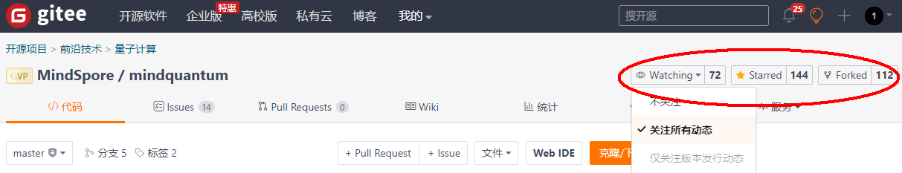

    注意：如果之前已经Fork过代码仓，先同步个人代码仓到最新版本。

    图1

    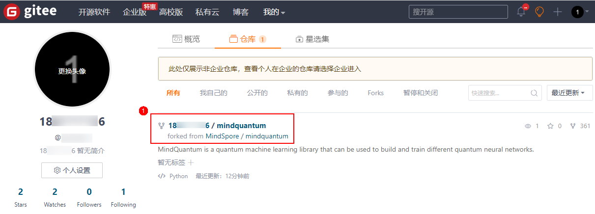

    图2

    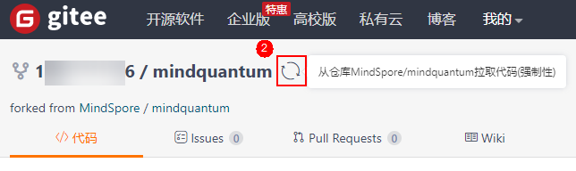
 
    图3

    

3.  **Fork** MindSpore的主仓到个人空间（欢迎**Watch**和**Star**）。

    <https://gitee.com/mindspore/mindspore>

# ModelArts Notebook环境准备

1.  登录华为云服务官网（www.huaweicloud.com），若没有华为云账号，请先注册华为云账号，并完成个人实名认证。

2.  进入ModelArts页面（官网首页–\>产品–\>人工智能–\>AI开发平台ModelArts），点击**管理控制台**。

    <https://www.huaweicloud.com/product/modelarts.html>

    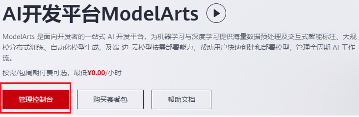

3.  进入控制台，选择 **北京四**环境。

    <https://console.huaweicloud.com/modelarts/?region=cn-north-4\#/dashboard>
    
    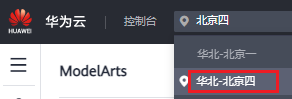

4.  配置访问授权

    

    首次使用如果没有配置访问授权，打开Notebook开发环境后会提示需要先获取依赖服务的授权。点击**此处**进行访问授权配置。

    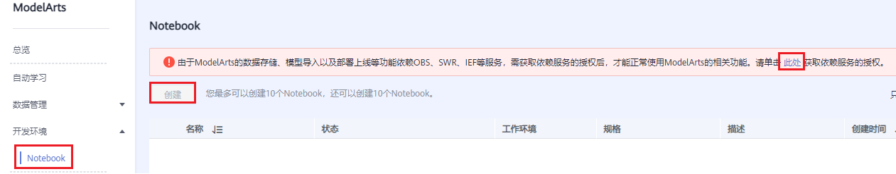

# Notebook环境准备

## 创建Notebook

1.  在进行算法开发前，需要先创建Notebook实例，在实例里进行开发。点击左侧**开发环境**–\>**Notebook**–\>**创建**进行实例创建。

    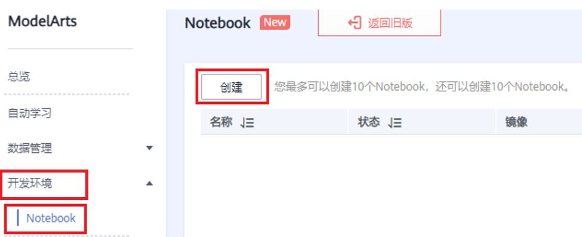

2.  创建实例时选择公共镜像**mindquantum0.3.1-mindspore1.3.0-ubuntu18.04**；资源池为**公共资源池**；类型为**CPU**，有两种规格可选，推荐使用2核8GB；存储配置为**默认存储**，参数配置完后点击底下的**立即创建**，实例就创建好了。

    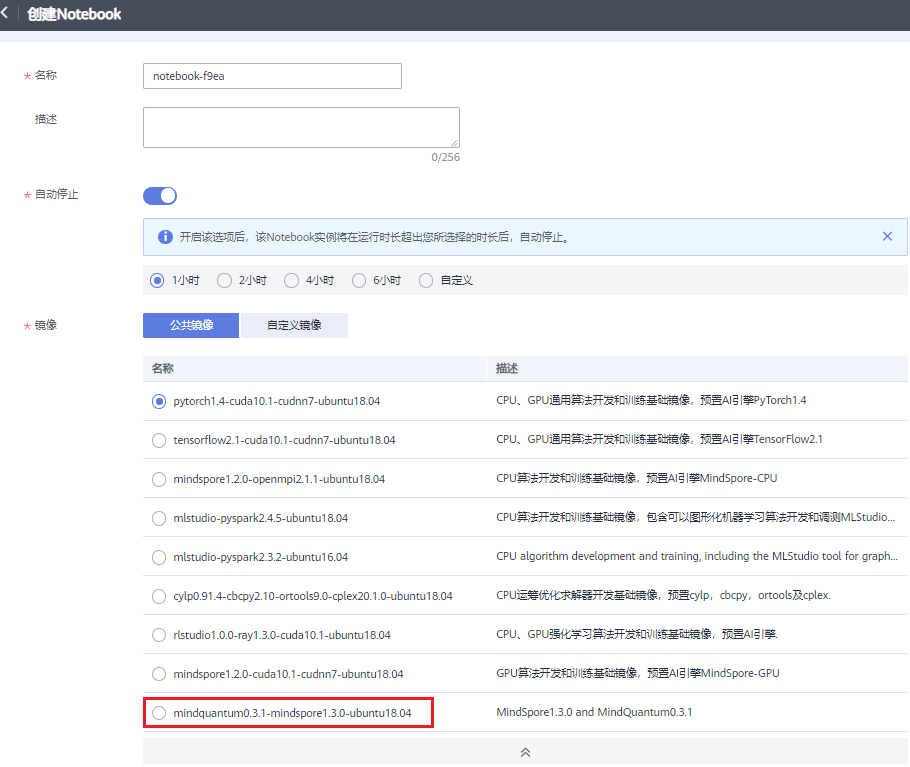

    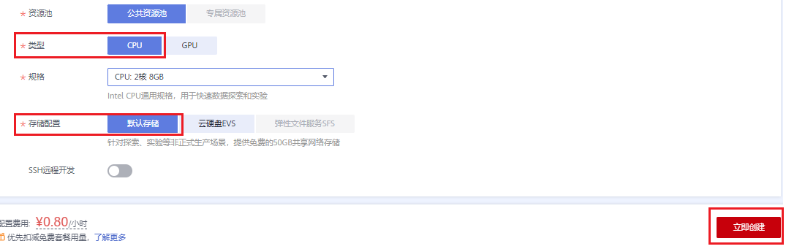

    注意：本次大赛给每位参赛者发放相同额度的云资源券，由于8U32GB费用较高，使用时间相应减少，优先使用默认配置2U8GB资源。

## 保存Notebook里的镜像
   
   可以点击操作**更多**–\>**保存镜像**，将镜像保存下来，重新启动时从镜像启动，不需要重新安装。  

   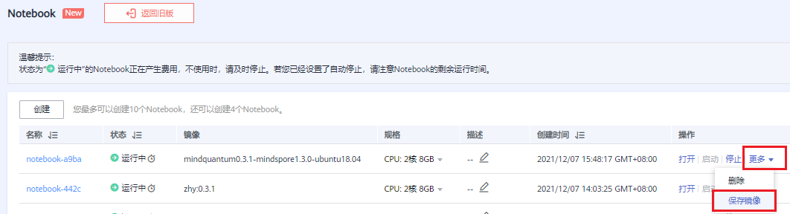

   说明：

   1.  如未保存镜像，实例重新后需要重新安装MindQuantum最新安装包（参考本文**安装mindquantum-master包**）。

   2.  如果没有看到“保存镜像”按钮，请邮件反馈（[hiqinfo1@huawei.com](mailto:hiqinfo1@huawei.com)）问题，邮件需要注明华为云账号和ID（[点击此处](https://console.huaweicloud.com/iam/?region=cn-north-1&locale=zh-cn#/mine/apiCredential)查看华为云账号信息）。

# Jupyter Notebook开发准备

## 进入Jupyter Notebook开发环境

点击Notebook实例的**打开**按钮，进入Jupyter Notebook开发环境。

## 导入MindQuantum代码仓

1.  按照下图步骤获取个人空间Forked的MindQuantum代码仓链接地址：

    图1
   
    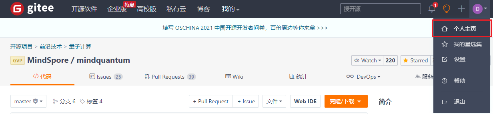

    图2

    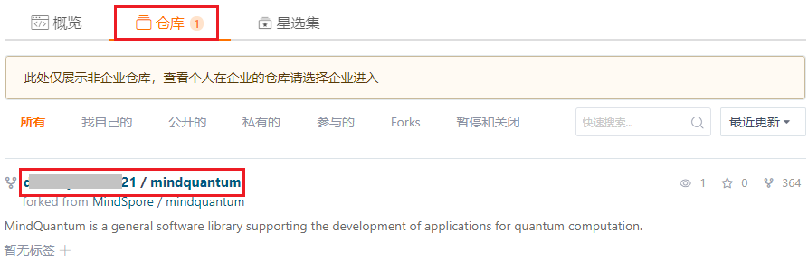

    图3

    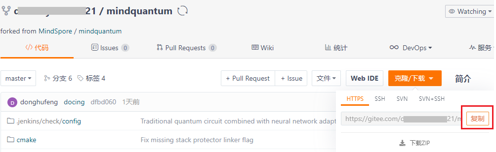

2.  在Jupyter Notebook的Launcher界面选择Other下的**Terminal**，打开命令行终端。

    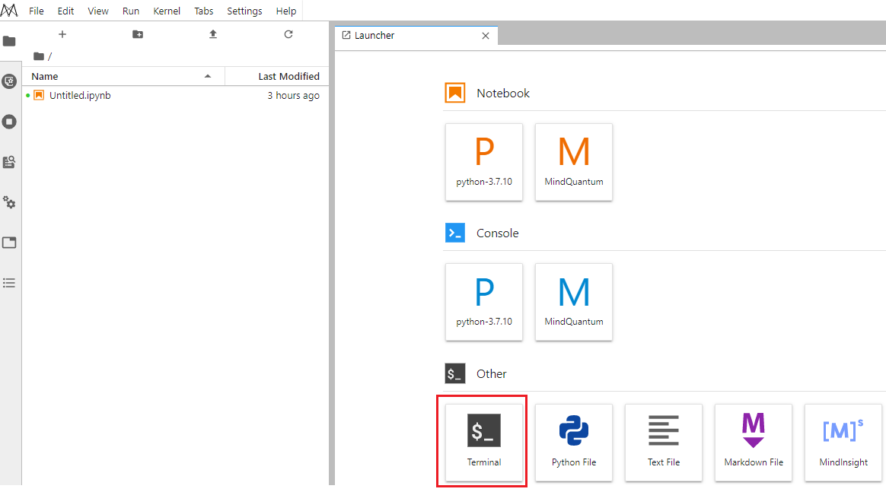

3.  ModelArts Jupyter Notebook默认工作目录是work目录，克隆代码仓前需要先切换到work目录（/home/ma-user/work），在Terminal界面输入如下命令。

    sh-4.4\$**pwd**

    /home/ma-user

    sh-4.4\$**ls**

    README anaconda3 env_script log modelarts modelarts-sdk notebook-exts notebook-samples notebook-samples-1638857122 work

    sh-4.4\$**cd work**

4.  导入MindQuantum代码仓到Notebook实例：在Terminal界面输入如下命令，导入时需要输入Gitee的账号和密码。

    sh-4.4\$**git clone 个人代码仓地址**

    **（例如：git clone**
    [**https://gitee.com/git_username/mindquantum.git**](https://gitee.com/git_username/mindquantum.git)**）**

    如果代码仓有刷新且已导入到Notebook实例，需要先运行如下命令同步代码仓再进行克隆操作：

    sh-4.4\$**git fetch --all;git pull**

## 安装mindquantum-master包

在Terminal里执行如下命令安装mindquantum-master包

sh-4.4\$**pip install https://hiq.huaweicloud.com/download/mindquantum/newest/linux/mindquantum-master-cp37-cp37m-linux_x86_64.whl -i https://pypi.tuna.tsinghua.edu.cn/simple**

## 检验环境是否安装成功

在Terminal里执行如下命令，显示“Version: 0.1.dev166”，则说明安装成功。

sh-4.4\$**pip show mindquantum**

Name: mindquantum

Version: 0.1.dev166

……

# Jupyter Notebook开发体验

首次开发可以参考“通过量子神经网络对鸢尾花进行分类”教程进行开发学习（点击菜单栏下的上传按钮导入样例进行开发/调测体验）。

<https://gitee.com/mindspore/mindquantum/blob/master/tutorials/3.classification_of_iris_by_qnn.ipynb>

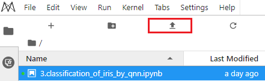

# 使用Jupyter Notebook复现论文并提交到代码仓

## 切换到research分支

在Jupyter Notebook的Terminal里执行如下命令从master分支切换到research分支。

sh-4.4\$**cd mindquantum/**

sh-4.4\$**pwd**

/home/ma-user/work/mindquantum

sh-4.4\$**git branch**

\* master

sh-4.4\$**git checkout research**

Checking out files: 100% (440/440), done.

Branch 'research' set up to track remote branch 'research' from 'origin'.

Switched to a new branch 'research'

sh-4.4\$**git branch**

\ master

\* research

## 创建个人文件夹

sh-4.4\$**ls**

LICENSE MindQuantum开源活动指导 NOTICE README.md README_copy.md benchmark meeting paper_recurrence

sh-4.4\$**cd paper_recurrence/**

sh-4.4\$**ls**

paperid_username_for_example readme.md

sh-4.4\$**cp -r paperid_username_for_example/ 1_xxx**

（举例：1为论文序号，xxx为华为云账号昵称）

点击刷新图标，就可以在左侧目录看到新建的个人文件夹。

## 开发复现代码和文档

进入个人文件夹，开发者参照文件夹目录和文件格式开发。

双机main.ipynb文件，在弹出的对话框中选择Kernel**MindQuantum**，就可以进行开发了。

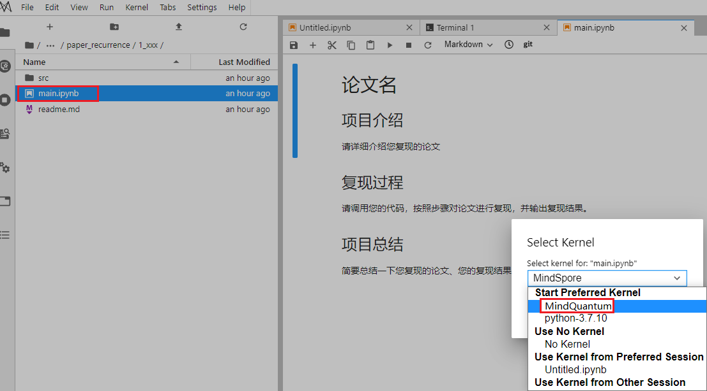

切换到红色框中的Code模式开发代码，切换到红色框中的Markdown模式开发文档，开发完的代码可以保存和调测。

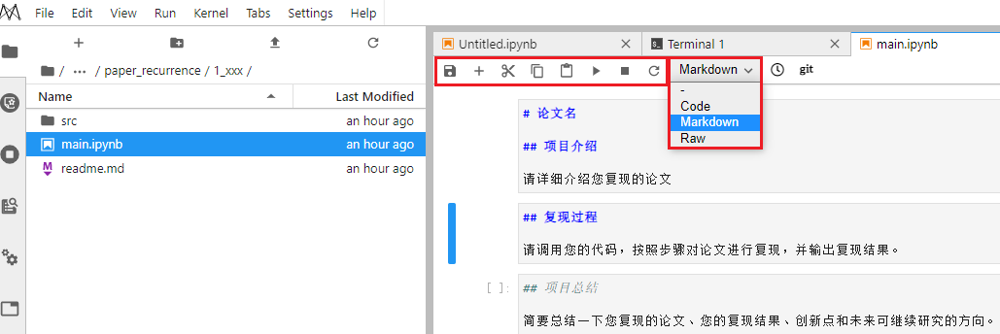

开发者可以把本地开发调试完的代码拷贝或者导入到ModelArts的Jupyter Notebook，大赛评委会对Jupyter Notebook提交的内容和运行结果进行验收。

## 提交代码仓

代码开发完了需要提交到gitee mindquantum代码仓，按如下步骤操作：

sh-4.4\$**git status**

On branch research

Your branch is up to date with 'origin/research'.

……

sh-4.4\$**git add 1_xxx/**

sh-4.4\$**git status**

Your branch is up to date with 'origin/research'.

……

sh-4.4\$**git commit -m "1_xxx"**

\*\*\* Please tell me who you are.
 
Run

git config --global user.email "you@example.com"

git config --global user.name "Your Name"

……

在commit前需要配置gitee代码仓的用户名和邮箱，然后再执行commit命令。

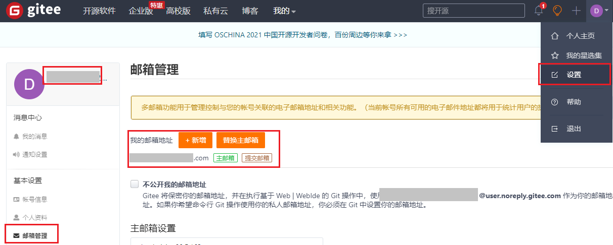

sh-4.4$**git config --global user.email "you@example.com"**

sh-4.4$**git config --global user.name "Your Name"**

sh-4.4\$**git commit -m "1_xxx"**

将本地分支修改提交到远程分支，在push过程中需要输入gitee用户名和密码。

sh-4.4\$**git push**

## 提交PR

1.  将自己仓库的更新通过pull
    request的方式提交到mindquantum的主仓库，完成最终的代码提交。

    

2.  这里将源分支和目标分支选为mindspore/mindquantum的research分支。填写PR标题,
    取消勾选【合并后关闭提到的issue】。选择所需的审查人员后，即可创建PR。

    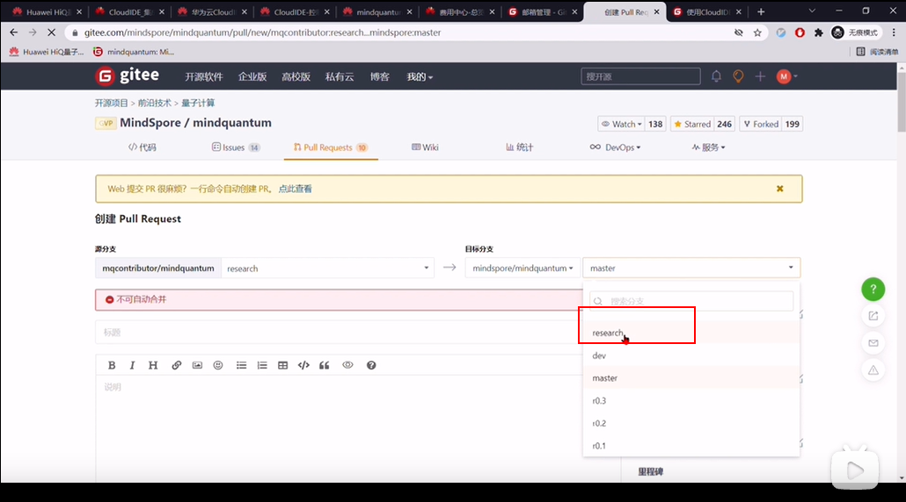

3.  签署CLA。对于第一次参与MindQuantum开源开发的同学，在评论区会发现没有签署CLA。请进入签署页面，选择**sign
    individual
    cla**，并根据gitee上的个人信息，填写签署信息，完成CLA的签署。回到PR页面，在评论区回复
    **/check-cla**，检查cla是否签署完成，如果没有，则需稍等片刻。签署完后，提交PR过程结束。

    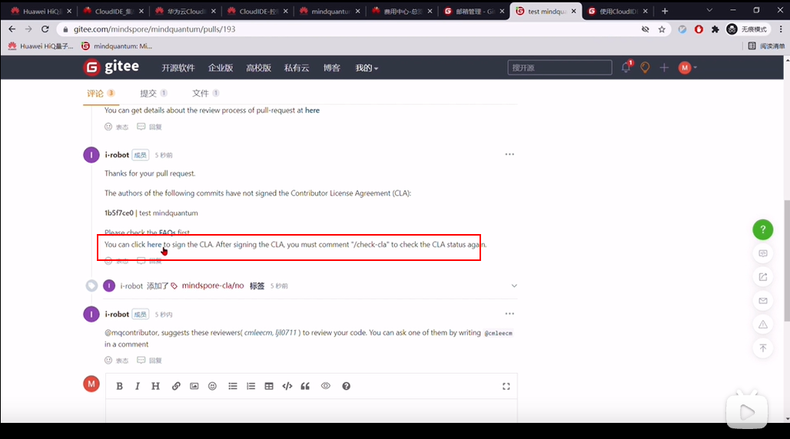

# 分享到ModelArts AI Gallery

论文复现成功后，需要把文档信息分享到AI Gallery，才能获得相应的奖品。

说明：当前版本不支持刷新分享，建议开发者收到大赛组委会的复现成功通知后，点击Notebook文件右上角的分享按钮发布分享。开发过程文档不要发布分享。

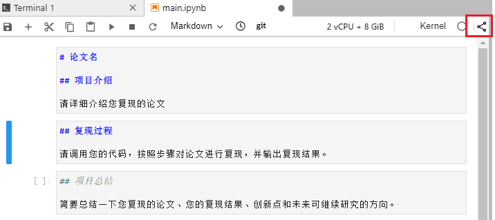

# 附录：

1.  MindQuantum代码仓地址

<https://gitee.com/mindspore/mindquantum>

2.  ModelArts Notebook操作指导

<https://support.huaweicloud.com/engineers-modelarts/modelarts_30_0004.html>

3.  ModelArts JupyterLab操作指导

<https://support.huaweicloud.com/engineers-modelarts/modelarts_30_0008.html>
