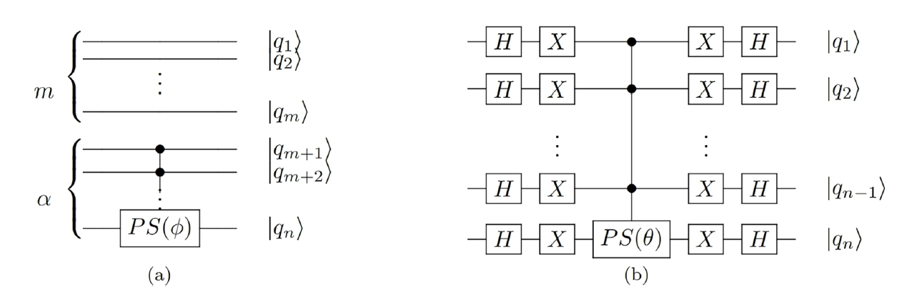

# RD of variational Grover search

#### 介绍
The code of our paper "Reachability Deficit of variational Grover search" [Physical Review A 109,012414 (2024)](https://journals.aps.org/pra/abstract/10.1103/PhysRevA.109.012414)

#### 变分Grover搜索
量子搜索算法的目标是利用一个给定的黑箱算符(Oracle)，从给定的$N=2^n$个条目中搜索$M$个目标条目 $\mathbf{w}:=\{w_1,w_2,\cdots,w_M\}$。我们将给定的条目编码到$n$个qubit的量子态上，Orcale算符$U_w$的特性是，对于目标条目对应的量子态，本征值为-1，对于非目标条目对应地量子态，本征值为1。传统的 Grover 搜索算法对均匀叠加态$|s\rangle:=|+\rangle^{\otimes n}$使用$R=O(\sqrt{N/M})$次 Grover 迭代$G:=U_sU_w$ 来执行搜索任务。这里$U_s:=2(|s\rangle\langle s|)-I$ 为Grover diffusion 算符。然而，上述算法并不能保证任意情况下都能实现精确搜索。

变分量子搜索引入两个额外的相位作为变分参数，对应的算符变成了$V_B(\theta):=(1-e^{i\theta})|s\rangle\langle s| -I$以及 $V_C(\phi):=(1-e^{i\phi})\sum_{w_k\in \mathbf{w}}|w_k\rangle\langle w_k|-I$，Grover迭代算符由$G(\theta,\phi)=V_B(\theta)V_C(\phi)$。变分量子搜索的cost哈密顿量可以设置为 
$$H_C:=I-\sum_{k=1}^M |w_k\rangle\langle w_k|,$$
变分量子搜索的目标为寻找合适的相位，使得$H_C$在迭代算符作用后的量子态上的期望值取得最小值。
借助经典优化器优化这些变分参数，可以在$R=O(\sqrt{N/M})$次作用迭代算符后实现精确搜索。

我们不妨设置目标的个数为$M=2^m$, 其中$m$为整数。引入$\alpha:=n-m$, $V_C$和$V_B$的线路构造如下图所示：

其中$PS(\phi)=\text{diag}(1,e^{i\phi})$。
#### 代码依赖
numpy, scipy, matplotlib, mindquantum
