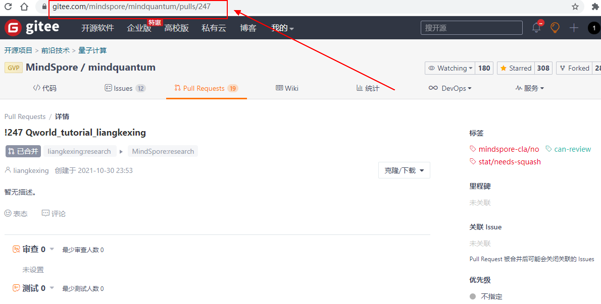
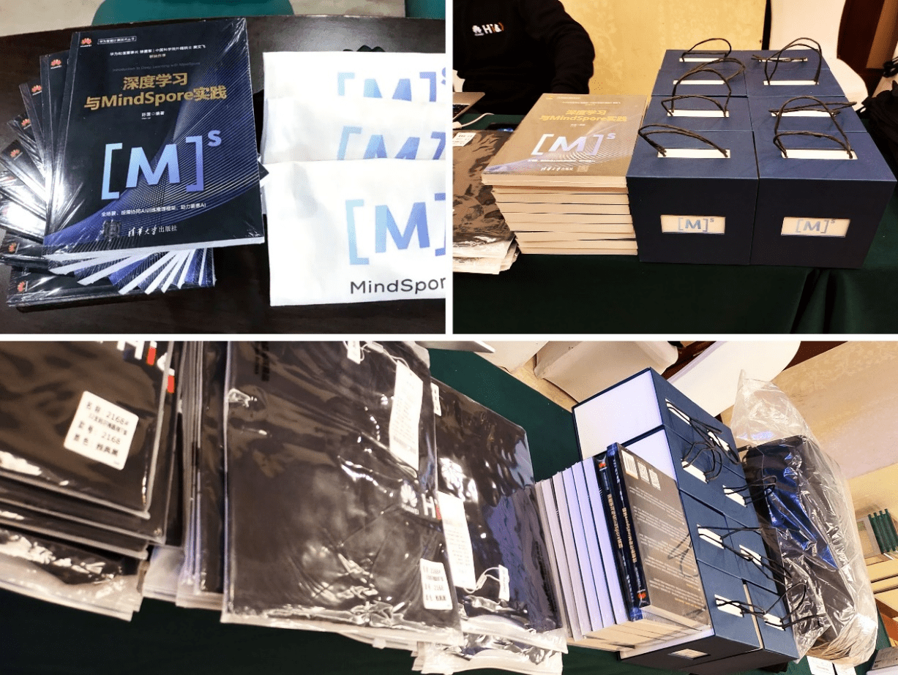

# MindQuantum开源活动指导

- [MindQuantum开源活动指导](#mindquantum开源活动指导)
  - [MindQuantum开发指南](#mindquantum开发指南)
  - [参与开源互动热身](#参与开源互动热身)
    - [参与开源热身（参与线上会议实操互动）](#参与开源热身参与线上会议实操互动)
    - [PR贡献奖（会议中/后）](#pr贡献奖会议中后)
    - [需要大家邮件反馈如下内容](#需要大家邮件反馈如下内容)
  - [部分奖品展示](#部分奖品展示)

## MindQuantum开发指南

包含如下步骤，详见[https://gitee.com/mindspore/mindquantum/blob/research/course/developers_guide.ipynb](https://gitee.com/mindspore/mindquantum/blob/research/course/developers_guide.ipynb)

### 准备MindQuantum代码仓
1. 第一步：登录Gitee官网
2. 第二步：Fork MindQuantum主仓库到个人空间
3. 第三步：复制MindQuantum个人代码仓地址
4. 第四步：欢迎Watch、Star和Fork MindSpore的主仓到个人空间（可选）
### 登录HiQ量子计算云服务
### 创建实例和Notebook
1. 第一步：新建Jupyter Notebook实例
2. 第二步：导入MindQuantum代码仓
3. 第三步：安装mindquantum-master包（可选）
4. 第四步：切换代码分支
5. 第五步：新建Notebook文件
### 量子门编程初体验
1. 量子门简介
2. 导入依赖包
3. 打印量子门矩阵
### 提交代码到代码仓
1. 第一步：提交代码到个人仓库
2. 第二步：提交代码到主仓库

## 参与开源互动热身

### 参与开源热身（参与线上会议实操互动）

### PR贡献奖（会议中/后）

欢迎大家在会上跟专家实操互动。根据提交PR结果，前3名会奖励**高级定制背包**；4~10名会奖励**定制马克杯**; 其他同学提交PR审核通过就会奖励**布袋/书/雨伞**等奖品随机发送。（活动详情会议中会讲解，以上奖品最终以实际库存为准。）
> 注意：大家提交PR后一定要按照下面的要求发邮件反馈基本信息到公共邮箱，才能拿到奖品哦！！！

### 需要大家邮件反馈如下内容

1. 主送邮箱：hiqinfo1@huawei.com
2. 邮件反馈内容

| 主题                | \*\*月\*\*日MindQuantum开源活动体验                                  |
| ------------------- | -------------------------------------------------------------------- |
| PR地址              | https://gitee.com/mindspore/mindquantum/pulls/XXX 下面有详细路径截图 |
| 邮寄地址            |                                                                      |
| 收货人姓名+手机号码 |                                                                      |

上述信息仅用于邮寄奖品，不做其他用途。
PR地址：

## 部分奖品展示

欢迎点击了解更多MindQuantum知识！

MindQuantum官网：[https://www.mindspore.cn/mindquantum](https://www.mindspore.cn/mindquantum)

Gitee代码仓：[https://gitee.com/mindspore/mindquantum](https://gitee.com/mindspore/mindquantum)

**期待您成为新时代的开源社区贡献者，加入MindQuantum的开发者行列，共同携手推进量子计算的发展！**

量子计算小助手微信